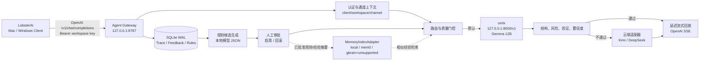
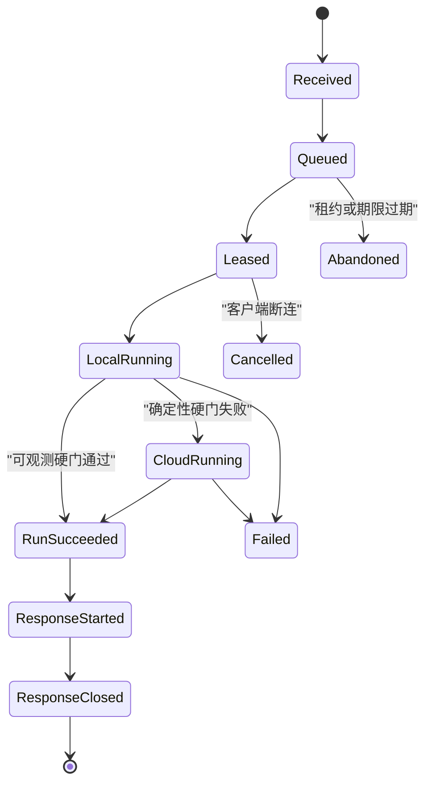
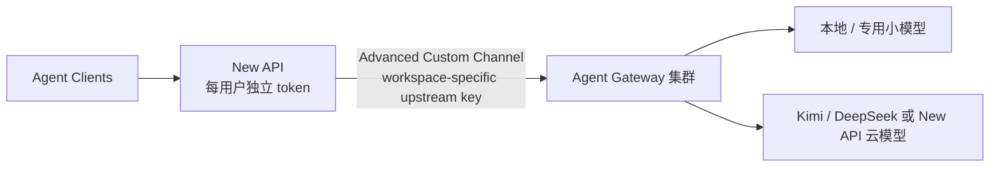

# 本地 Agent 模型网关设计

**日期：** 2026-07-14  
**状态：** Conditional Go；完成兼容探针和 live baseline 后方可实施  
**权威性：** 本文件是唯一规范源；HTML 仅为展示稿，实施计划引用本文需求 ID  
**第一条验证通路：** LobsterAI -> Agent Gateway -> omlx 本地模型 -> 单个已配置云模型

## 0. Agent Team 审阅决议

资深 AI 架构师和资深 Agent/后端工程师完成独立审阅后，原方案被判定为 `No-Go`。本稿按以下约束修订后进入 `Conditional Go`：

| ID | V1 约束 |
| --- | --- |
| `V1-R01` | 先实测 LobsterAI 是否支持任意 Base URL、逻辑模型名、SSE、tool 两轮和稳定关联字段。 |
| `V1-R02` | Gateway 只承诺 request-level trace；没有客户端稳定 ID 时不聚合为任务 trace。 |
| `V1-R03` | 生效门控只使用可机器观测证据；启发式评分先 shadow，不改变答案。 |
| `V1-R04` | 使用版本化 `ChatCompletionEnvelopeV1`，未支持字段明确拒绝，不静默丢弃。 |
| `V1-R05` | tool schema 只校验调用 arguments；tool result 仅按 `tool_call_id` 关联。 |
| `V1-R06` | 云端默认禁用；显式授权后每请求最多调用一个云 provider 一次。 |
| `V1-R07` | 出云前执行 DLP 和原子预算预留；支持可选幂等键和取消传播。 |
| `V1-R08` | trace 状态使用可恢复 lease/version 状态机，不能把 response started 表述为客户端已收到。 |
| `V1-R09` | 自然语言反馈、自动规则抽取、repository/session scope 不进入第一周核心路径。 |
| `V1-R10` | V1 强制单 Gateway worker；不实现空写锁、Redis、对象存储或多实例分支。 |

完整批判意见见 `2026-07-14-agent-gateway-team-review.md`。

## 1. 目标与边界

本项目不是再做一个 Agent Client，而是实现一个位于客户端和模型之间的智能模型网关（下文简称 Agent Gateway）。它对客户端表现为普通的模型服务，对内部负责：

1. 先调用本地小模型，降低云模型成本并保护日常任务的本地性。
2. 用可解释的质量门控判断本地结果是否可信；不可信时升级到云端大模型。
3. 记录一次 HTTP 请求从接收、排队、模型调用到响应关闭的 request trace。
4. 为显式反馈、独立 verification 和待审批规则保留接口；规则学习不进入第一周核心路径。
5. 为后续多客户端、New API 前置、多实例部署和小模型训练保留演进边界。

第一版仅验证单机通路，运行在同一台 Mac mini：

- 客户端：LobsterAI，不改造客户端代码。
- 网关：本地 `127.0.0.1:8787`。
- 本地推理：omlx OpenAI 兼容接口 `http://127.0.0.1:8000/v1`。
- 本地模型：`gemma-4-12b-it-4bit`。
- 云端上游：Kimi 与 DeepSeek adapter 均可配置，但一次请求只选择其中一个。
- 对外协议：第一版实现受限 OpenAI Chat Completions profile；内部 DTO 为版本化 `ChatCompletionEnvelopeV1`。

第一版不做以下内容：

- 不执行客户端本地工具。LobsterAI 继续负责文件、Shell、浏览器等工具的权限确认和执行。
- 不将用户自然语言的正向语气单独视为训练/规则发布授权。
- 不开放局域网或公网，不做远端多租户的强隔离承诺。
- 不直接微调 12B 小模型；先验证可解释规则的收益和风险。
- 不根据“最近 15 分钟请求”自动关联反馈，不承诺任务级 trace。
- 不用模型自报置信度、上下文不足或客户端授权状态驱动生产路由。
- 不让 mem0、gbrain 或其他外部 memory 结果绕过 Gateway 的规则审批、版本和回滚机制直接进入 system context。

## 2. 总体架构



### 2.1 责任边界

| 组件 | 负责 | 不负责 |
| --- | --- | --- |
| LobsterAI | 交互、工作区、工具执行、用户确认 | 模型升级、trace 持久化、规则学习 |
| Agent Gateway | 协议兼容、身份上下文、排队、路由、trace、反馈、规则 | 直接操作客户端文件系统 |
| omlx | 本地模型推理 | 路由决定、长期存储、用户隔离 |
| Kimi/DeepSeek | 高难任务的云端推理 | 客户端身份管理和规则发布 |
| MemoryIndexAdapter | 隔离 local/mem0 与未支持 provider 的差异，索引已脱敏经验和已批准规则 | 作为规则权威源、直接生成 system context、假设未验证 provider 可用 |
| New API（后续） | 外部 token、限额、统一入口、渠道管理 | 智能路由及学习闭环 |

## 3. 对外接口与客户端配置

### 3.1 第一版 API

| 方法 | 路径 | 行为 |
| --- | --- | --- |
| `GET` | `/healthz` | 网关自身、数据库、omlx 可用性摘要 |
| `GET` | `/v1/models` | 返回逻辑模型清单 |
| `POST` | `/v1/chat/completions` | OpenAI Chat Completions，支持普通与 SSE 响应 |
| `POST` | `/internal/v1/feedback` | 供后续管理 UI 或脚本提交明确满意度 |
| `GET` | `/internal/v1/traces/{trace_id}` | 本机管理查询，第一版只允许本地管理 key |
| `GET` | `/internal/v1/rules` | 查看规则候选及已启用规则 |
| `POST` | `/internal/v1/rules/{id}/approve` | 人工批准候选规则 |
| `POST` | `/internal/v1/rules/{id}/rollback` | 关闭一条已启用规则 |

逻辑模型固定为：

- `agent-auto`：默认。本地优先，允许根据质量门控升级云端。
- `agent-local`：只调用 omlx。质量失败时返回明确失败，不允许出云。
- `agent-cloud`：跳过本地，只在明确允许云端的通道使用。

`agent-auto` 是网关虚拟模型名，绝不能作为 Kimi、DeepSeek 或未来 New API 的上游模型名，以避免递归调用和重复计费。

### 3.2 LobsterAI 接入

以下配置是待 `V1-R01` 探针验证的目标合同，不是已确认能力：

```text
Base URL: http://127.0.0.1:8787/v1
API format: OpenAI
API key: agw_local_dev_<随机高熵字符串>
Model: agent-auto
```

LobsterAI 仍显示自己的工具授权界面。Gateway 只能记录后续请求中的 tool message，不能据此证明用户完成了 OS 级授权。若探针证明 LobsterAI 无法配置任意 Base URL 或模型名，停止后续实现并先确定兼容的预置 provider 配置，不假设需要改造客户端。

### 3.3 延迟流式策略

本地模型回答不得一边向客户端流式输出一边决定升级，否则客户端会收到半段答案后被替换。第一版策略为：

1. Gateway 向上游请求完整结果。
2. 执行可观测质量硬门；确定性失败且出云策略允许时，调用选定云 provider 一次。
3. 等待期间发送 SSE comment heartbeat；最终结果确定后，按 OpenAI delta、usage chunk 和 `[DONE]` 合同回放。

这会增加首 content token 延迟，但 heartbeat 防止客户端将连接判死。断连必须取消尚未完成的上游请求并释放本地推理槽位；回放开始后的断连记录为 `response_aborted`。

## 4. 规范化数据模型与通道隔离

网关在协议边缘将 OpenAI 请求转换为版本化 `ChatCompletionEnvelopeV1`。它不是通用 Responses/Anthropic IR：

```python
class ChannelContext(BaseModel):
    client_id: str
    workspace_id: str
    channel_id: str
    api_key_id: str
    allowed_models: set[str]
    cloud_egress_allowed: bool
    monthly_budget_cents: int | None

class ChatCompletionEnvelopeV1(BaseModel):
    trace_id: UUID
    channel: ChannelContext
    model: Literal["agent-auto", "agent-local", "agent-cloud"]
    messages: list[CanonicalMessage]
    tools: list[CanonicalTool] = []
    tool_choice: CanonicalToolChoice | None = None
    temperature: float | None = None
    max_completion_tokens: int | None = None
    stream: bool = False

class ModelResult(BaseModel):
    provider: Literal["omlx", "kimi", "deepseek"]
    provider_model: str
    content: str | None
    tool_calls: list[CanonicalToolCall] = []
    finish_reason: str
    usage: TokenUsage | None = None
    response_digest: str
```

V1 支持文本 `system/user/assistant/tool`、assistant `tool_calls`、tool `tool_call_id`、function tools、`tool_choice`、`stream_options.include_usage`、`temperature` 和单一 max token 字段。多模态、audio、logprobs、legacy functions、未知字段和不支持的 response format 返回 `unsupported_parameter`，不得静默忽略。工具参数 schema 只校验 tool call arguments；tool result 是按 `tool_call_id` 关联的不可信文本。

每个 API key 映射到唯一的 `(client_id, workspace_id, channel_id)`。所有查询都必须附带该三元组，禁止仅按 `trace_id`、`session_id` 或客户端传来的 workspace 名称读取记录。

第一版的隔离是逻辑隔离：同一 macOS 用户运行、同一个 SQLite 文件、同一 omlx 实例。它保证请求上下文、trace、规则查询不跨通道；它不保证恶意本机进程无法读取文件。将来需要对外提供服务时，必须升级为独立 OS 账户/容器或 VM、PostgreSQL 行级策略、TLS 和网络鉴权。

## 5. 路由、质量与升级

### 5.1 请求状态机



### 5.2 质量门控

V1 生效门控只允许可观测证据。任意一项可确定性拒绝本地结果：

- 工具调用 JSON 或参数不符合客户端提供的 schema。
- 结构化输出无法解析，且该任务要求结构化输出。
- 输出为空、上游响应无效、`finish_reason=length` 或 forced tool 未调用。
- 出云内容命中 DLP 或明确安全策略；此时直接阻断，不发送云端。
- 独立 verification API 已记录机器验证失败。

以下启发式分数只在 shadow 模式记录，不得直接改变 V1 生产答案：

```text
escalation_score =
  3 * patch_or_schema_invalid
+ 3 * high_risk_action
+ 2 * verification_failed
+ 2 * cross_module_or_multi_file
+ 2 * context_insufficient
+ 1 * local_model_low_confidence
+ 1 * recent_similar_failure
+ 1 * user_negative_signal
```

决策：

| 得分 | 行为 |
| --- | --- |
| 硬门通过 | 接受本地结果 |
| 可确定性结构/工具失败且允许出云 | 调用选定云 provider 一次 |
| DLP、安全策略或禁云通道 | 阻断出云并返回稳定错误 |
| 仅启发式高分 | 记录 shadow decision；不改变当前结果 |

V1 一次请求上限为本地调用一次和选定云 provider 一次；传输自动重试为 0。自修复在评测证明有效前不进入生产路径。

### 5.3 云端选择

路由器先根据通道策略决定云端是否允许，再根据配置的优先顺序选择：

```yaml
cloud:
  selected_provider: kimi
  automatic_transport_retries: 0
  max_provider_attempts_per_request: 1
```

Kimi 与 DeepSeek 均可实现 adapter，但 V1 每个 channel 明确选择一个，单请求不跨 provider fallback。调用前必须通过显式出云授权、provider capability、上下文上限、DLP 和原子预算预留；调用后按 usage 结算，缺 usage 时使用保守估算并标记 `estimated=true`。

## 6. Trace、反馈与规则学习

### 6.1 Trace 结构

每个请求生成 UUID `trace_id`，并保存下列数据：

```text
RequestExecution
  trace_id, channel tuple, parent_trace_id?, conversation_id?, idempotency_key?
  request_at, state, delivery_status, version, lease_expires_at, request_digest
  normalized_request_redacted, final_provider, final_model, final_result_redacted

ModelRun
  trace_id, sequence, provider, model, started_at, ended_at
  route_reason, quality_score, validation_result, usage, error_redacted

TraceEvent
  trace_id, sequence, type, payload_redacted, created_at
  types: request_received | queued | leased | local_result | verification |
         escalation | cloud_result | response_started | response_closed | feedback
```

原始 API key 永不写入数据库或日志。默认只保存摘要和结构化元数据，正文持久化需显式开启；进入数据库前必须脱敏，出云前另执行 DLP。数据库和 emergency spool 权限为 `0600`，不持久化 provider `raw_response`。trace 默认保留 30 天，清理同时处理子表、WAL checkpoint 和备份策略。

### 6.2 用户反馈

V1 只接受显式携带 `trace_id` 的反馈：`satisfied`、`unsatisfied`、`correction`。禁止按时间窗口自动关联，禁止自然语言情绪自动触发规则。反馈可以保存为分析数据，但在独立 verification 来源建立前不生成规则候选。

### 6.3 规则学习流水线

规则闭环属于核心通路稳定后的 V1.1。它不是把云端模型输出直接塞回小模型，也不是自动微调本地模型，而是把经过验证的成功 trace 转换成可解释、可审批、可回滚的操作规则。

进入规则学习的 trace 必须同时满足：

```text
eligible =
  explicit_feedback in ["satisfied", "correction_accepted"]
  AND verification.status == "passed"
  AND dlp.status == "clean"
  AND scope_key is stable
  AND trace is redacted
```

Gateway 先把原始 trace 压缩成 `LearningPacket`，只包含可学习事实，不包含完整私有正文：

```json
{
  "trace_id": "tr_123",
  "scope": {
    "type": "workspace",
    "key": "mac-mini/lobster/default"
  },
  "task_summary": "用户要求修改 FastAPI 路由并保持测试通过",
  "local_failure": {
    "provider": "omlx",
    "reason": "未运行测试且输出缺少验证步骤"
  },
  "successful_behavior": {
    "provider": "kimi",
    "summary": "先读取相关路由和测试，再修改 schema，最后运行目标 pytest"
  },
  "verification": {
    "kind": "pytest",
    "status": "passed",
    "evidence_digest": "sha256:..."
  },
  "feedback": {
    "label": "satisfied",
    "source": "explicit_api"
  }
}
```

抽取器只能基于 `LearningPacket` 生成受限 DSL 候选：

```json
{
  "title": "修改 FastAPI 路由后运行目标测试",
  "scope_type": "workspace",
  "scope_key": "mac-mini/lobster/default",
  "rule_type": "workflow",
  "trigger": {
    "task_intent": ["modify_api", "modify_schema"],
    "keywords": ["FastAPI", "Pydantic", "route", "schema"],
    "tool_context": ["code_edit"]
  },
  "instruction": "修改 FastAPI 路由或 Pydantic schema 后，先运行相关 pytest；测试失败时不要声明完成。",
  "negative_instruction": "不要仅凭代码看起来正确就结束任务。",
  "validation_hint": "优先运行目标测试，再扩大到相关测试文件。",
  "evidence_trace_id": "tr_123",
  "evidence_digest": "sha256:...",
  "confidence": 0.82,
  "expires_at": "2026-10-15"
}
```

`LearningPacket` 使用规范化 JSON 后计算 `packet_digest`。同一 `(trace_id, packet_digest)` 只允许一个有效的 `RuleExtractionJob` 和一个候选结果；重放请求返回既有候选，不得重复抽取或重复批准。候选默认 `pending`，审批前必须经过 rule lint、冲突检测和安全检查。以下情况直接拒绝：规则过宽、越权要求、包含敏感信息、缺少触发条件、缺少证据、scope 不稳定、与已启用规则冲突、试图把 prompt injection 固化为永久规则。

审批前还必须运行最小离线回放：由脱敏的 fake fixture 验证候选会在正例命中、在反例不命中，且不会生成越权的 system context。`RuleCandidate` 保存 lint、冲突和回放 evaluator 的摘要及 evidence digest，审批界面展示这些证据、证据 trace、verification、token 成本、影响范围和过期时间；不得保存原始 trace 或 provider raw response。

人工批准后创建不可变 `RuleVersion`。回滚不是删除旧记录，而是生成新的 disabled 版本。请求进入路由前，Gateway 只加载当前通道 scope 内已启用规则，按 `safety > user_manual > workspace > repository > session > generated` 和稳定版本顺序排序。V1.1 默认最多注入 5 条规则，总 token 不超过 800，并明确声明规则不能覆盖安全策略、用户意图或工具权限。

注入 system context 的格式固定为：

```text
[Agent Gateway Approved Operational Rules]
These rules are approved workflow guidance for this workspace.
They do not override safety policy, user intent, or tool permission requirements.

- R-20260715-001: 修改 FastAPI 路由或 Pydantic schema 后，先运行相关 pytest；测试失败时不要声明完成。
- R-20260715-004: 当 function tool schema 有 required 字段时，生成 tool_call 前先确认 arguments 包含全部 required 字段。

[End Gateway Rules]
```

每次规则命中写入 `rule_hits`，记录 `trace_id`、`rule_version_id`、匹配分、注入位置和后续 outcome。若命中规则后仍失败，进入复审队列，并可从已脱敏的最小复现夹具创建 `FailureCase`；不得自动删除、自动改写规则，或把生产原始 trace 变成回归样本。

### 6.4 MemoryIndex 兼容层

工程中必须设计 `MemoryIndexAdapter`，把 local、mem0 和未来 provider 的差异隔离在 adapter 后面。Gateway 自己的数据库仍是规则、审批、版本和回滚的权威源；外部 memory 只做索引增强、相似经验检索和候选发现。任何外部检索结果都不能直接进入 system context，必须通过 `rule_id` 回查 Gateway 已启用 `RuleVersion` 后再注入。

核心接口：

```python
class MemoryIndexAdapter(Protocol):
    async def health(self) -> MemoryIndexHealth: ...
    async def upsert_learning_packet(self, packet: LearningPacket) -> None: ...
    async def upsert_rule_version(self, rule: ApprovedRuleVersion) -> None: ...
    async def search_related_rules(
        self, query: MemoryQuery, scope: ScopeFilter, limit: int
    ) -> list[MemoryRuleHit]: ...
    async def search_related_traces(
        self, query: MemoryQuery, scope: ScopeFilter, limit: int
    ) -> list[MemoryTraceHit]: ...
```

兼容层必须统一以下差异：

| 能力 | local | mem0 adapter | gbrain |
| --- | --- | --- | --- |
| 存储形态 | SQLite/FTS5 表 | memory + metadata | `CapabilityUnsupportedAdapter` |
| 范围隔离 | SQL `WHERE` channel tuple | 必须使用等价 channel binding 的 entity filter，并回验 metadata | 不适用，未获得一手协议 |
| 检索 | FTS5 `MATCH`，embedding 可选 | memory search；正文只在 adapter 内部处理 | 不发起外部调用 |
| 返回值 | `rule_id` / `trace_id` | `provider_ref`、score、`rule_id`/`trace_id`、`metadata_digest` | `unsupported` capability |
| 注入权限 | 仅 Gateway DB 启用规则 | 需回查 Gateway DB；不得返回 `memory` 正文 | 无 |

`mem0` 写入和搜索必须携带由完整 `(client_id, workspace_id, channel_id)` 生成的稳定 channel binding；adapter 还必须校验返回 metadata 的同一 binding。若过滤条件不能表达该范围、返回命中缺少 `rule_id`/`trace_id` 或 metadata 回验失败，丢弃命中并 fail closed。adapter 从 mem0 响应中剥离 `memory` 正文字段，只返回 `provider_ref`、score、`rule_id`/`trace_id` 和 `metadata_digest`；带 prompt injection 的正文不得进入日志、数据库、adapter 输出或 system context。

部署时通过配置选择 provider。`disabled` 和 `local` 不依赖外部服务；`mem0` 启用时必须在启动时执行 health check 和 capability check。外部 memory 不可用时，主聊天通路保持可用，但规则外部检索降级为本地 Gateway DB；写入失败记录 event 并进入后台重试，不阻塞请求响应。`gbrain` 尚无可验证的一手 API、仓库或协议，因此只能由 `CapabilityUnsupportedAdapter` 报告 `unsupported`，默认 disabled，且不得发起外部请求。

配置示例：

```toml
[memory_index]
provider = "local" # disabled | local | mem0 | gbrain (unsupported)
enabled = true
write_async = true
read_timeout_ms = 300
max_hits = 5

[memory_index.mem0]
base_url_env = "MEM0_BASE_URL"
api_key_env = "MEM0_API_KEY"
collection = "agent-gateway"

```

写入外部 memory 的内容只能是脱敏后的 `LearningPacket` 摘要和已批准 `RuleVersion` 摘要，不能写入原始 trace、API key、完整工具输出或未审批规则。所有读写都必须携带 `(client_id, workspace_id, channel_id)` 或等价 scope metadata；不同通道间的检索结果不得互相可见。

### 6.5 失败闭环与研究边界

V1 只把生产失败压缩为脱敏的 fake fixture 和 CI 回归夹具，不建设生产 evaluator 平台。至少覆盖 schema invalid、SSE heartbeat、DLP block、budget race、idempotency conflict、lease recovery 和 cross-channel isolation。fixture、数据库、WAL、日志和证据包不得出现 API key、Bearer token、私钥、provider raw response 或私有正文种子；安全扫描应对 `Bearer `、`sk-`、`PRIVATE KEY` 和测试私有种子返回零命中。

MAGE 的 execution state tree 只作为 V1.2 之后的研究性只读派生索引：只有稳定客户端关联字段或人工绑定时才可创建，不能改变 request trace 查询结果，不得进入 prompt、路由或自动任务聚合。SkillDisCo 的 PFSM/skill compiler 同样仅保留为研究注记；本 Gateway 不定义 `CompiledSkill` schema、不生成可执行技能、不执行客户端工具，也不允许 PFSM 绕过 `RuleVersion` 审批和注入边界。

小模型微调和 few-shot 数据集只保留表结构与导出能力。至少积累经过人工抽样复核的成功/失败样本后，才另立训练实验，不得在生产网关中自动更新模型权重。

## 7. 并发、调度与存储

第一版选择 SQLite WAL，原因是单机验证环境零额外运维；数据访问层使用 SQLAlchemy 2.0 和 Alembic，以便把 `DATABASE_URL` 切换到 PostgreSQL 时保持业务代码不变。

调度策略：

- HTTP 请求可以并发接入。
- 完整 `(client_id, workspace_id, channel_id)` 使用有容量、有 deadline 的公平队列；超载返回 429 + `Retry-After`。
- 本地 omlx 默认并发槽位为 `1`，配置项 `LOCAL_MODEL_CONCURRENCY=1`。
- 云端调用配置独立并发上限与超时。
- 客户端断连取消排队/运行任务并释放槽位；V1 用进程锁强制单 Gateway worker。

SQLite 启动强制 WAL、foreign keys、busy timeout 和短事务；网络调用期间不持有事务。多实例阶段另写 ADR 并迁移 PostgreSQL，不在 V1 代码中预埋 Redis、对象存储或一致性哈希分支。

## 8. 安全、配置和可观测性

`config.example.toml` 不含真实 key：

```toml
[server]
host = "127.0.0.1"
port = 8787
admin_key_env = "AGW_ADMIN_KEY"
single_worker_lock = "./var/agent-gateway.lock"

[database]
url = "sqlite+aiosqlite:///./var/agent_gateway.db"

[local_omlx]
base_url = "http://127.0.0.1:8000/v1"
model = "gemma-4-12b-it-4bit"
timeout_seconds = 120
concurrency = 1

[cloud.kimi]
enabled = true
base_url_env = "KIMI_BASE_URL"
api_key_env = "KIMI_API_KEY"
model_env = "KIMI_MODEL"

[cloud.deepseek]
enabled = true
base_url_env = "DEEPSEEK_BASE_URL"
api_key_env = "DEEPSEEK_API_KEY"
model_env = "DEEPSEEK_MODEL"

[routing]
cloud_egress_default = false
selected_cloud_provider = "kimi"
automatic_transport_retries = 0

[memory_index]
provider = "local" # disabled | local | mem0 | gbrain (unsupported)
enabled = true
write_async = true
read_timeout_ms = 300
max_hits = 5

[memory_index.mem0]
base_url_env = "MEM0_BASE_URL"
api_key_env = "MEM0_API_KEY"
collection = "agent-gateway"

```

日志采用 JSON，至少包含 `trace_id`、`channel_id`、路由决定、耗时、模型名、token 用量和错误类别；不得写入原始请求内容、API key 或未脱敏工具输出。`/healthz` 返回服务状态，不返回密钥和对话内容。

当前本机环境中曾观测到 omlx 的 OpenAI 地址为 `http://127.0.0.1:8000/v1`，但构建前必须实际调用 `/v1/models` 验证服务已启动；不得假设截图中的已加载模型一定仍可访问。

## 9. New API 后续接入

本地通路验证通过后，目标拓扑为：



迁移约束：

1. 每个 workspace 在 New API 使用独立外部 token，并配置一个对应的 Gateway 上游 key。
2. Gateway 只信任这个上游 key 映射出的通道身份，不能依赖 New API 静态 header 模板传递任意终端用户身份。
3. 若 Gateway 通过 New API 调云模型，使用内部服务 token 和专用真实模型名，绝不回调 `agent-auto`。
4. 费用以 Gateway trace 为路由事实来源，以 New API usage 为外部账单核对来源。
5. 多实例前迁移 PostgreSQL，且把调度、预算和规则版本状态做成共享存储。

## 10. 第一版验收标准

1. `V1-A01`：完成 LobsterAI capture probe，明确 Base URL/model、SSE、tool 两轮、usage 与关联字段的 observed capability。
2. `V1-A02`：完成 omlx `/v1/models`、Gemma 文本、tool call 和长响应 live baseline；未运行时不得声称支持。
3. `V1-A03`：LobsterAI 以 `agent-auto` 完成普通中文请求，request trace 最终 provider 为 omlx。
4. `V1-A04`：构造无效结构/tool arguments 时，Gateway 记录确定性升级理由并最多调用一个已配置云 provider 一次。
5. `V1-A05`：`stream=true` 期间 heartbeat 保活，客户端只收到最终模型完整 SSE；usage、tool delta、finish reason 和 `[DONE]` 符合合同。
6. `V1-A06`：两把 API key 查询不到彼此 request trace、反馈、预算或规则；同 key 并发请求不超卖预算。
7. `V1-A07`：同幂等 key + 同 digest 重放已保存响应；不同 digest 返回 409；无 key 明确为 at-least-once。
8. `V1-A08`：客户端断开会取消排队/上游并释放推理槽；回放中断只标记 response aborted。
9. `V1-A09`：在四个状态点故障退出并重启后，过期 lease 可恢复为 abandoned，且不自动重复云调用。
10. `V1-A10`：敏感种子内容不能出云或出现在 DB/WAL/log；DB 在调用前失败时 fail closed 并返回稳定错误。
11. `V1-A11`：schema invalid、SSE heartbeat、DLP block、budget race、idempotency conflict、lease recovery 和 cross-channel isolation 均有脱敏 fake fixture；fixture、DB/WAL/log 对 `Bearer `、`sk-`、`PRIVATE KEY` 和私有正文种子扫描为零命中。

规则候选、自然语言反馈分类、repository/session scope 和双云 fallback 不属于上述 V1 验收，进入后续独立 Go Gate。
