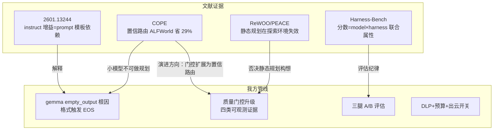

# 文献综述：微调风格差异、agent 选型与 planner-executor 架构（含数据外泄分析）

日期：2026-07-31
作者：kimi
起因：empty_output 根因分析（`doc/design/2026-07-31-agent-server-student-empty-output-analysis.md`）引出的两个追问——①微调风格差异与 agent 长程任务选型；②远端规划+本地执行能否降 token、能否防数据外泄。
方法：6 篇论文下载至 `doc/research/papers/`（PDF + 提取文本），逐篇全文解析；本文所有数字均出自论文原文。

---

## 0. 论文清单

| 论文 | 本地文件 | 主题 |
|---|---|---|
| Do Instruction-Tuned Models Always Perform Better Than Base Models?（2026-01） | `2601.13244.pdf/.txt` | base vs instruct 受控对照（16 模型 × 4 benchmark） |
| Harness-Bench（2026-05） | `2605.27922.pdf/.txt` | harness 对 agent 表现的一阶影响（6 harness × 8 模型，5194 轨迹） |
| COPE: Efficient LLM Collaboration via Planning（2026-01） | `2506.11578.pdf/.txt` | 小大模型置信度级联协作（含 ALFWorld 实测） |
| PEACE: Planner–Executor with Constraint Enforcement（2026-05） | `2606.00104.pdf/.txt` | 单 pass 规划 + 确定性执行 + 有界重规划（UAV） |
| ReWOO: Decoupling Reasoning from Observations（2023-05） | `2305.18323.pdf/.txt` | 静态规划蓝图，token 5× 节省；明确以 ALFWorld 为反例 |
| TRUST: Uncertainty-Aligned RL for Tool-Calling（2026-06） | `2606.06976.html/.txt` | agentic tool-calling 后训练（备选参考） |

补充（TRUST，2026-06，arXiv 2606.06976）：不确定性对齐 RL 专治 tool-calling 决策——对比 turn-level GRPO，Acc Norm 绝对提升 **8.37pp**，幻觉指标（Tool Hallucination + FDAR）从 30.49% 降至 **22.90%**；benchmark 为 When2Call/ToolSandbox/BFCL-V4。对我们的启示：学生模型的"何时调工具/何时输出"决策能力是可以后训练出来的——支持 S4（升级轨迹蒸馏学生）的技术可行性。

## 1. Q1：微调风格差异与 agent 选型

### 1.1 Base vs Instruction-Tuned（2601.13244）

**设计**：16 个开源模型（0.6B-1T，Qwen3/LLaMA3/SmolLM/DeepSeek/Kimi 五家族）base 与 instruct 对照，Pass@20 统一口径，GSM8K/Math-500/Math-Perturb/MedCalc。

**关键数据**：
- GSM8K zero-shot CoT：instruct 大幅落后 base——LLaMA3-70B 58.15% vs 90.82%（-32.67pp）、Kimi-K2 67.63% vs 98.86%（-31.23pp）、Qwen3-14B 67.02% vs 97.72%（-30.70pp）；**8-shot 后差距基本抹平**
- 领域迁移（MedCalc zero-shot）：LLaMA3-3B instruct 28.94% vs base 62.08%（-33.14pp）
- 扰动脆弱：Kimi-K2 Math-500 94.20% → Math-Perturb 76.34%

**结论**：指令微调的优势是 **prompt 模板依赖的表层模式匹配**而非推理增强；小模型增益大、大模型边际；遇非典型 prompt 结构即失效。

**对我们的直接印证**：gemma-4-12B-it 遇 ReAct `>` 转录吐 EOS 正是该失效模式的活体样本——prompt 不在其微调分布内 → 模式匹配失败 → 空响应；27B 免疫对应论文 Finding 1（大模型推理已内生化，对结构不敏感）。

### 1.2 Harness-Bench（2605.27922）

**设计**：106 任务 × 6 harness × 8 模型全因子（5,194 条轨迹），固定任务/预算/评估器，变量只有 harness 与模型。

**关键数据**：
- 同模型池 harness 差距：NanoBot 76.2 vs OpenClaw 52.4（**23.8 分**）
- 失败模式分布：契约/格式违规 **36.4%**、工具/恢复 24.6%、grounding 14.6%、产物未提交 11.1%
- 弱模型跨 harness 方差显著大于强模型；最高分 harness 同时 token 与轮次更低（效率与分数脱钩）

**结论**：agent 表现是 **model–harness 联合属性**，必须按配置报告；失败多为"执行对齐"断裂而非推理错误。

**对我们的意义**：①empty_output 属 36.4% 契约/格式失败的极端形态；②"弱模型对执行基底敏感"解释了 12B 崩/27B 免疫；③**评估纪律**：测"经验注入效果"前必须先固定/修复 harness 层缺陷（prompt 模板），否则测的是 harness 缺陷不是注入。

### 1.3 agent 长程任务选型准则（综合两篇 + 我方实验）

1. 不默认 chat 微调更好——用**真实 prompt 形态探针**验证格式鲁棒性（我方 3 局 bisect 范式）
2. executor 类角色第一约束是**结构化输出可靠性**（tool-call 参数完整、格式不崩），不是推理分数
3. 分数必须按 model–harness 配置报告；过程指标（轨迹级）与最终率同报
4. N 次调用/任务 → 时延与单价是一阶成本；小模型需 agent 专项后训练（通用 chat 微调不足）

## 2. Q2-1：planner-executor 降 token 的真实量级与适用边界

三篇呈能力梯度：

| 架构 | 机制 | ALFWorld 适用性 | token/成本数据 |
|---|---|---|---|
| **ReWOO**（全静态规划） | Planner 一次产蓝图（#E 占位符），Worker 填证据，Solver 综合 | **不适用**（论文局限性章节点名：探索型环境 planner 只能枚举全部可能计划，退化为最坏复杂度） | HotpotQA token 9795→1986（**5×**）；六基准平均降 64% 且准确率 +4.4pp |
| **PEACE**（单 pass + 有界重规划） | 一次 LLM 出完整 typed plan，executor 确定性执行不再调 LLM，仅工具失败时带新快照重规划 | 脆弱（作者自认开环假设在动态场景失效；ALFWorld 的部分可观测会放大） | LLM 调用 N→1（作者自述为行为刻画，无定量基准） |
| **COPE**（每步协作 + 置信路由） | 小模型自规划执行，共识不足逐级升级到大模型 | **实测成功** | ALFWorld：成功率 36.9% vs 纯大 35.0%，成本 $160 vs $225（**省 29%**）；MATH -45%、MBPP -75% |

关键警示（COPE 内部数据）：**小模型做规划会拖累大 executor**（GPT-mini 73.8%→69.6%），小模型只配生成 goal 型粗计划不配 guideline 型细计划——对"12B 学生做规划"是直接反证。

**结论**：在 ALFWorld 这类部分可观测/需探索环境，可行的只有 COPE 式"每步规划 + 置信路由"，token 节省真实但有限（~29%，因历史仍每步重发）；ReWOO/PEACE 式静态规划的 5× 节省以放弃探索能力为代价。

## 3. Q2-2：planner-executor 能否避免数据外泄到云端？

**基于论文证据的回答：不能避免，只能按架构形态递减。**

| 架构 | 云端看到什么 | 外泄面 |
|---|---|---|
| 现状 ReAct（直连老师） | 每步全历史 | 100% |
| COPE（唯一在 ALFWorld 有效的形态） | 云端 planner **每步仍需任务+执行状态** | 调用次数降了，信息量没降多少（省 29% token 即省 29% 外泄面） |
| ReWOO 式（云端只见任务不见观察） | 仅任务描述 | 最小——**但在探索型环境失效**，不可用 |
| 全本地（无云） | 无 | 零——成本是能力上限 |

论文证据链：防外泄要求"云端不见观察"（ReWOO 形态），而该形态被论文亲自证明在 ALFWorld 失效；有效的形态（COPE）云端仍需全程可见执行状态。**探索型环境下，省 token 与防外泄不可兼得**。

**对我们管线的正解**（超出论文、结合既有基建）：数据最小化不靠 planner-executor 结构本身，而靠**路由层脱敏**——
1. 观察/工具输出留本地 executor，云端只收**脱敏摘要**（我们已有产物：ABILITY 经验卡片——天然是轨迹的脱敏蒸馏物）；
2. gateway 已有 DLP 扫描（出云 envelope 命中密钥正则即 403）+ 预算原子预留 + channel 级出云开关——这是论文架构都没有的治理层；
3. 若要求零外泄：唯一选项是全本地（学生换 27B 提升成色，老师退出数据面）。

## 4. 对技术路线的修正建议

1. **放弃"远端静态规划 + 本地全程执行"构想**（ReWOO/PEACE 在探索环境失效，有论文级证据）；
2. **采用 COPE 式置信路由**作为 gateway 的下一演进：本地学生每步先试，置信不足才升级——这正是我们已有的质量门控，把门控从"四类硬证据"扩展到"置信度"即可，token 省 ~29% 且 ALFWorld 实证不降分；
3. **学生规划能力不可依赖**（COPE 数据：小模型 planner 拖累 executor）——规划留在老师侧或升级学生到 27B；
4. **评估纪律**（Harness-Bench）：三腿对照报告必须按 model–harness 配置呈现，并在 L2/L3 前修复 prompt 模板混杂（S1b 的 `>` → `Action:` 或 S1 换型），否则注入效果被 harness 缺陷淹没；
5. 数据外泄治理走"本地执行 + 脱敏摘要上云"路线（复用 DLP + 经验卡片），不寄望于 planner-executor 结构。

## 5. 附：论文与本地方案的映射图

Refer Spec：`doc/design/2026-07-31-agent-server-student-empty-output-analysis.md`（根因分析）；`doc/design/2026-07-30-agent-server-student-teacher-reconnect-changes-and-decisions.md`（链路接回决策）
