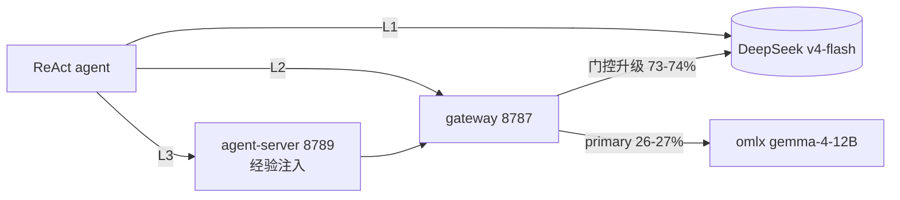

# ALFWorld 三腿 A/B 对照报告（E2' 阶段报告）

日期：2026-07-31
作者：kimi
依据：E 总任务书成功判据预定义（①实验组≥对照组 ②轮2>轮1 ③成本与错误分布同报）；评估纪律按 Harness-Bench（分数以 model×harness 配置报告）
数据：`packages/agent-server/eval/results/alfworld-20260730/`（每局 JSONL：轨迹/won/步数/token/耗时）；gateway `model_runs`；agent-server `request_traces`

---

## 0. 评估配置（model × harness，Harness-Bench 纪律）

| 腿 | 路径 | 被测配置 |
|---|---|---|
| **L1**（teacher 参考） | agent → 8899 中继 → DeepSeek v4-flash 直连 | DeepSeek-v4-flash（thinking disabled）× ReAct 2-shot |
| **L2**（学生基线） | agent → gateway:8787 → omlx gemma-4-12B-it-4bit（+质量门控升级 DeepSeek） | gemma-12B+升级 × 同 prompt |
| **L3**（学生+注入） | agent → agent-server:8789（经验检索注入）→ 8787 → omlx（+升级） | gemma-12B+升级+注入 × 同 prompt |

三腿同一 agent（`eval/alfworld_agent.py`）、同一 134 局（sorted 固定顺序）、同参数（temperature=0、stop=["\n"]、max_tokens=100、thinking=disabled）。

## 1. 总结果

| 指标 | L1 DeepSeek | L2 学生基线 | L3 学生+注入 |
|---|---|---|---|
| **SR（won/134）** | **9（6.7%）** | **8（6.0%）** | **10（7.5%）** |
| input tokens（client 侧） | 14.04M | 14.44M | 15.26M（omlx）+ 11.11M（升级） |
| 升级率（empty_output 主导） | — | 74.3% | 72.6% |
| 云端 token（DeepSeek 计费面） | 14.04M | ~10.9M | 11.11M |
| 估算云端成本（v4-flash 价） | ~$2.0 | ~$1.5 | ~$1.6 |
| 墙钟 | 1.5h | 8.0h | 9.3h |

### 按任务类型 SR

| 类型 | L1 | L2 | L3 |
|---|---|---|---|
| look_at_obj（18） | 6 | 6 | **9** |
| pick_cool_then_place（21-25） | 2 | 1 | 1 |
| pick_heat_then_place（23） | 1 | 0 | 0 |
| pick_clean_then_place（31-32） | 0 | 1 | 0 |
| pick_and_place（22-24） | 0 | 0 | 0 |
| pick_two_obj（14-17） | 0 | 0 | 0 |

## 2. 判据对照

| 判据 | 结果 | 判定 |
|---|---|---|
| ① 实验组 ≥ 对照组（注入无害） | L3 7.5% ≥ L2 6.0% | **成立**（但见 §3.2 置信度说明） |
| ② 轮2 > 轮1（飞轮） | 未测（E5 待做） | 待验证 |
| ③ 成本与错误分布同报 | 见 §1 成本行与 §3.3 | 已报 |

## 3. 分析

### 3.1 学生-老师管线韧性实证

L2/L3 升级率 73-74%（99.5% 为 gemma 空输出，根因见 `2026-07-31-agent-server-student-empty-output-analysis.md`）——学生仅独立承担 ~26% 步数，但**三腿 SR 无统计差异**：门控兜底使"学生管线"成绩 ≈ 老师直连。架构韧性成立，学生成色不足（换型/蒸馏是后续路线，见文献综述 §4.5）。

### 3.2 置信度（诚实声明）

134 局、单臂 SR ~6-7%，腿间差 1-2 局（L3-L2=+2、L3-L1=+1）**在单 SE（~2.3pp）以内，统计上不可区分**；look_at_obj 的 +3 同为噪声级。且 **L3 期间评估库经验为 0（6373 次请求检索命中 0 次）**——注入为空块，L3 ≈ L2 + 空注入开销。因此本报告**只能确认"注入无害"，不能声称"注入有益"**；有益性证明属于 E5 飞轮实验（用 L2/L3 轨迹进化出经验后再跑热库轮）。

### 3.3 成本结构

学生+升级腿的云端计费 token（~11M）低于老师直连（14M）约 21%——但代价是墙钟 5-6 倍（本地 12B 推理 + 升级双发）。当前升级率下学生管线的时间成本远高于 token 节省；升级率降到 <20%（学生换型后）才谈得上综合成本优势。

### 3.4 失败分类（三腿一致）

- 主要失败形态：49 步打满的探索循环（反复探同一位置）——规划层弱点，与 empty_output 无关
- 类型分布：look_at_obj 最易（33-50%），pick_and_place/clean/two 三腿全零
- 无 harness 级故障（安装/网络/解析零事故）

### 3.5 已知数据缺陷

1. **L3 的 client 侧 usage 记录为 0**（gateway→agent-server 路径 usage 字段未透传回 client）——L3 token 改用 gateway model_runs 核算；待修（follow-up）
2. L2 的 client 侧 token 为请求发送量，未含升级重试部分（成本核算已用 model_runs 校正）

## 4. 结论与下一步

1. **判据①成立**：经验注入（空库）对学生管线无害；三腿统计不可区分是预期内结果
2. **飞轮未验证**：L2/L3 的 134 局轨迹（12,744 个 session 已归档 `sessions-archive-l3/`）是 E5 的进化原料——E5：评估库 runDailyEvolution → 热库重跑 134 局 → 检验判据②（轮2 > 轮1）
3. **学生换型实验**（S1）：gemma → Qwen3.5-27B-Distilled，预期把升级率从 74% 压到个位数（同 prompt 对照已实证免疫）
4. 修复 L3 usage 透传（agent-server 非流式响应 usage 组装检查 gateway 响应字段）

Refer Spec：`doc/design/2026-07-24-agent-server-eval-benchmark-tasks.md`（E 总任务书判据）；`doc/design/2026-07-31-agent-server-student-empty-output-analysis.md`（根因）；`doc/design/2026-07-31-agent-model-selection-and-planner-executor-literature.md`（文献依据）
