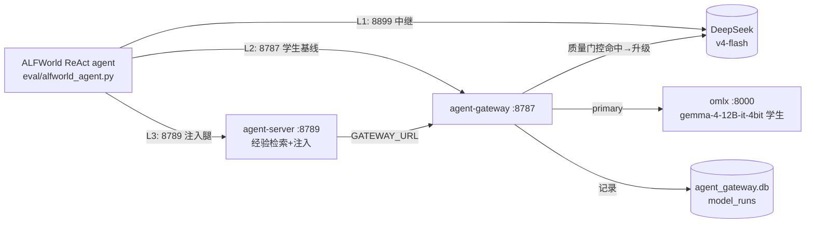
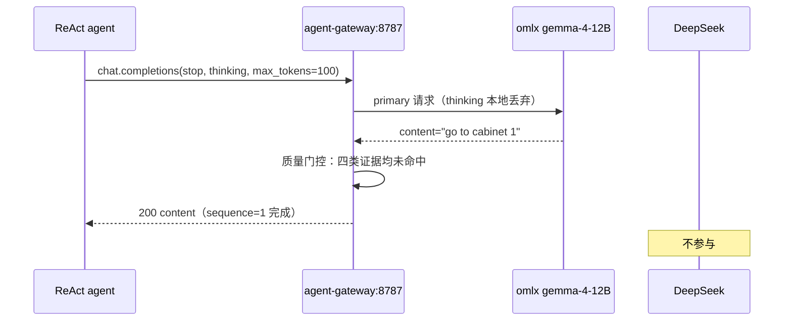
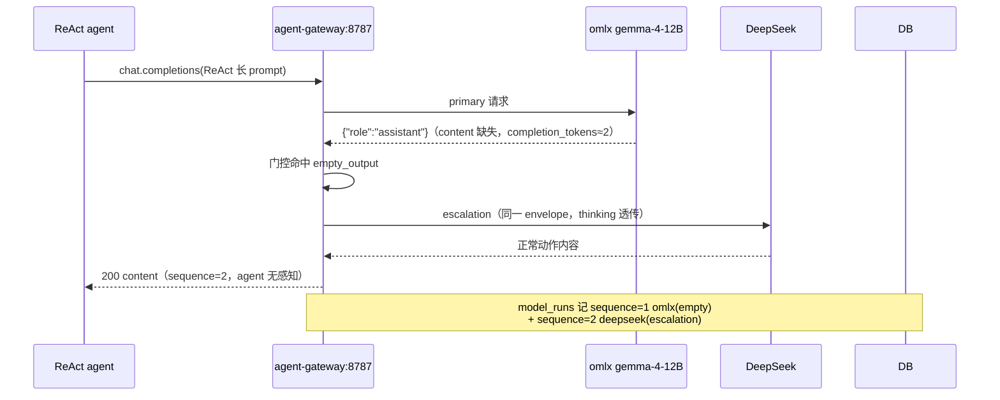

# 分析报告：学生模型 empty_output 高升级率根因定位

日期：2026-07-31
作者：kimi
关联：`doc/design/2026-07-30-agent-server-student-teacher-reconnect-changes-and-decisions.md`（链路接回决策）；`doc/design/2026-07-14-local-agent-model-gateway-design.md`（学生-老师规范源）

---

## 1. 现象描述

### 1.1 系统架构（学生-老师链路，2026-07-30 接回后）



### 1.2 正常调用时序（门控未命中）



### 1.3 异常时序（empty_output 触发升级，L2 期间占 74%）



### 1.4 现象数据

| 指标 | 数值 |
|---|---|
| L2 学生基线 134 局 | primary(omlx) 6500 次，escalation(DeepSeek) 4823 次 = **升级率 74%** |
| 升级原因分布 | **empty_output 4801（99.5%）**、finish_reason_length 7、其他 15 |
| 升级时间分布 | L2 全程 8 小时每小时稳定 ~70%，非突发 |
| 对照成绩 | L2 SR 8/134=6.0% ≈ L1 直连 9/134=6.7%（门控兜底有效） |
| 成本副作用 | 升级步骤 prompt 发两遍 → L2 耗时 8.0h（L1 仅 1.5h）、input token 25.3M（L1 14.0M） |
| 反直觉点 | agent 轨迹中**空动作 0 次**（升级兜底后 agent 永远拿到合法动作），问题对上层完全不可见 |

## 2. 假设清单

| # | 假设 | 预判 |
|---|---|---|
| H1 | `stop=["\n"]` 使 gemma 首字符换行即截断为空 | 高嫌疑（ReAct 协议依赖 stop） |
| H2 | 长 prompt 超出/逼近 gemma 上下文导致空输出 | 中（ALFWorld 累积历史） |
| H3 | omlx 多模型换载（gemma 被 27B 挤出）期间返回空 | 中（omlx 在役 3 模型） |
| H4 | gemma 是 reasoning 模型，输出落在 reasoning_content 被 gateway 丢弃 | 中（与 v4-flash 同型问题） |
| H5 | gateway 链路特有 bug（envelope/解析/并发） | 低（169 pytest 全绿） |
| H6 | 特定历史内容（连续 "Nothing happens."）诱导空输出 | 低 |
| H7 | rapid-fire 请求节奏触发 omlx 竞态 | 低 |

## 3. 验证过程（逐假设实验记录）

### H1 stop 截断 — **排除**
- 实验：直连 omlx，ReAct 完整 prompt（2-shot 范例 + 20 步历史），分别带 `stop:["\n"]`、不带 stop、`stop:["\n\n"]`
- 结果：三种变体**全部返回空**（content 缺失）→ 与 stop 无关

### H2 长 prompt — **排除**
- 测量：25 步历史仅 ~3k 字符（全 prompt 2-8k 字符 ≈ 2-4k tokens），远低于 gemma 262k 上下文；model_runs 统计空响应 input_tokens 中位数 2255、最大 4801，与非空区间重叠

### H3 模型换载 — **排除**
- 实验：先调 Qwen3.5-27B（强制换载），再连续 5 次调 gemma
- 结果：5/5 正常返回 `'1'`（stop 截断正确）

### H4 reasoning 被丢弃 — **排除**
- 实验：直连 omlx 检查**完整原始响应体**（非 gateway 转述）
- 结果：`{"role":"assistant"}`——content 字段整个缺失，也**无 reasoning_content**；completion_tokens=2（≈换行+EOS）。模型是真的什么都没说

### H5 gateway 链路 — **排除**
- 实验：同一 ReAct prompt 分别经 8787、8789 复现
- 结果：均返回正常动作——但注意此时拿到的是**升级后 DeepSeek 的内容**（这是白天复现失败的陷阱：经 gateway 的复现永远被兜底掩盖，只有直连 omlx 才能暴露空响应）

### H6 历史内容诱导 — **排除**
- 实验：构造含连续 10 次 "Nothing happens." 的历史直连 omlx
- 结果：正常返回 think 动作

### H7 rapid-fire — **排除**
- 实验：无间隔连续 20 次直连 omlx
- 结果：0/20 空

### 根因确认实验（决定性）

直连 omlx、**真实 ReAct 完整 prompt**（范例 head + 真实 20 步历史）：
```
请求 → {"role":"assistant"}  （content 字段缺失，completion_tokens=2）
```
对照：同形状但短 prompt（仅任务描述、无范例无历史）→ 正常返回动作。
结论：**gemma-4-12B-it-4bit 在"2-shot ReAct 范例 + 长轨迹历史"的 prompt 形态下立即吐 EOS/空白**，是模型对该 prompt 格式的能力/chat 模板问题。某些任务类型范例（如 heat）比其他的（clean）更容易触发——这解释了为何白天用 clean 范例复现失败、晚上用 heat 范例一击即中。

> **【深化修正 07-31】** 该表述经 §4 消融实验细化：触发器是范例与历史中的**裸 `>` 标记结构**（范例单独即可触发，全局替换为 `Action:` 即恢复），"长轨迹历史"只是增加触发概率的背景而非必要条件；步数扫描证明与推理步数无关。详见 §4。

## 4. 根因深化（2026-07-31 追加实验）

针对两个追问的实证回答：

### 4.1 "gemma4 是否无法持续推理超过 20 步？"——**否**

步数阈值扫描（同一 heat 局、同一 2-shot head，递增历史长度直连 omlx）：

| 历史步数 | 0 | 3 | 5 | 8 | 10 | 12 | 15 | 18 | 20 |
|---|---|---|---|---|---|---|---|---|---|
| 结果 | EMPTY | 正常 | 正常 | EMPTY | 正常 | 正常 | 正常 | 正常 | EMPTY |

空响应沿步数**非单调**出现（0/8/20 空、3-18 正常）——不存在"超过 N 步就崩"的阈值，与推理步数/持续推理能力无关。

### 4.2 问题与什么相关联？——prompt 格式是触发器，模型能力是调节因子，上下文无关

**prompt 消融**（在 steps=20 的 EMPTY 案例上逐一拆除变量）：

| 变体 | 结果 | 含义 |
|---|---|---|
| 原始（范例 head + 历史，含 `>` 标记） | EMPTY | 基线 |
| 去范例（仅历史） | 正常（65 tok） | 范例是必要触发条件 |
| 仅范例（无历史） | EMPTY | **范例单独即可触发** |
| 仅尾部 `>` 改 `Action:` | EMPTY | 历史中的 `>` 序列也参与触发 |
| 全部 `>` 改 `Action:` | 正常（36 tok） | **确认触发器 = ReAct 文本中的裸 `>` 标记结构** |

**27B 对照**：同一 EMPTY prompt 换 Qwen3.5-27B-Distilled → 正常应答。

**三维归因结论**：

| 候选因子 | 判定 | 证据 |
|---|---|---|
| 上下文长度不足 | **无关** | prompt 仅 2-4k tokens，模型上限 262k（差两个数量级） |
| prompt 格式（completion 风格裸 `>` 转录塞进 chat user 消息） | **触发器** | 消融实验：范例中的 `>` 序列单独可触发；全局替换为 `Action:` 即恢复 |
| 模型参量/能力（12B-4bit） | **调节因子** | 同 prompt 27B 免疫；量化小模型对格式异常更敏感，chat 微调使其把 `>` 转录误判为"对话已结束"而立即吐 EOS |

机制解释：gemma-4-12B-it 是 chat 微调模型，ReAct 的 `>` 标记原始转录（completion 时代协议）在其 chat 模板先验下近似"轮到对方说话/无话可说"，于是以 ~2 个 token（换行 + EOS）结束响应。27B 的更强指令先验能穿透该格式异常。

### 4.3 对处置建议的影响

- S1（学生换 27B）依据从"推测"升级为"实证"：同 prompt 对照已证明 27B 免疫；
- 新增备选 S1b：**协议级 prompt 适配**——双臂统一把 ReAct 转录的 `>` 改为 `Action:`（对 DeepSeek 无影响，对 gemma 是修复），代价是偏离 ReAct 论文原始 prompt 形态（需在报告声明）。S1 与 S1b 可独立或组合采用。

## 4.4 机制详述：为什么空输出是"微调分布失配"而非规模宿命（2026-08-04 追加）

**生成机制**：所谓空输出，精确含义是模型把最高概率质量分配给 EOS 作为第一个生成 token（实测 completion_tokens≈2 ≈ 换行+EOS）——不是"答不出来"，而是"判断此刻最该输出的是结束"。

**chat 微调的先验重塑**：预训练模型对 `>` 无特殊判断（语料中它是邮件引用/shell/转录标记，后面永远有下文）；指令微调+对齐后，模型学到①自己回合的形状与 EOS 的"交还话语权"语义，②（隐式）什么形状的输入需要回答——SFT 里的 user 消息几乎全是清晰指令，从不含"看似已完成的多轮转录"。

**触发机制**：2-shot 范例 + 长历史 + 裸 `>` 结尾的 ReAct prompt 塞进单条 user 消息后，其文本形态是"多轮交叉且每步已有回应的转录"——chat 先验判为**成品文档**，"没有要我做的事"→ 最可能应答 = 立即 EOS。类比：把填完的表格递给人说"继续"，他耸肩还回。temperature=0 使该判断确定性化（同 prompt 恒空）。

**免疫机制**：agent/长程后训练把"system=agent 指令 + user=带 `>` 转录 → assistant=下一动作"的样本大量补进微调分布，`>` 转录从陌生形状变为熟悉输入并关联"输出下一动作"——chat 模型读出"对话结束"，agent 模型读出"该出招了"。27B-Distilled 免疫同理：Claude 蒸馏数据天然覆盖 agent 工作轨迹，**与参数量无必然关系**。

**量化的放大作用**：4bit 压缩先丢低幅度细粒度权重方向（"任务框架 vs 成品文档"的微妙区分），模型退回最粗糙的 chat 轮次模板——故 12B-4bit 更易触发。量化是风，格式异常是火星。

**证据强度与边界**：与全部 8 组对照实验一致的行为级机制模型 + 文献（2601.13244 的负例样本、Harness-Bench 36.4% 格式失败）。无法做权重级因果验证（无 gemma 训练数据与激活工具）；omlx 服务层因素已部分排除但未完全排除。最终判别实验：agent 后训练同级模型跑同一批 EMPTY prompt（prompt 集现存可复用）。

## 5. 结论

1. **根因**：gemma-4-12B-it-4bit 学生模型对 ReAct 协议 prompt（多范例 + 长历史）产出空响应（immediate EOS），非任何基础设施缺陷。gateway、agent-server、omlx、agent 四者均无 bug。
2. **架构表现符合设计**：质量门控（empty_output 可观测证据）100% 兜住空响应并升级 DeepSeek，agent 层零感知，L2 SR 6.0% ≈ L1 6.7% 未塌。学生-老师机制的价值（韧性）被实证。
3. **代价**：74% 升级率下学生仅独立承担 26% 步数，且升级步骤 prompt 双发，token/耗时反超纯老师直连（25.3M vs 14.0M、8h vs 1.5h）——**当前学生模型成色不足以体现成本优势**。
4. **方法论教训**：经 gateway 的复现测试会被升级兜底掩盖真实行为，定位学生侧问题必须**直连 omlx + 完整真实 prompt + 检查原始响应全字段**。

## 5. 建议

| # | 建议 | 预期效果 | 成本 |
|---|---|---|---|
| S1 | **学生换型 Qwen3.5-27B-Claude-4.6-Opus-Distilled**（omlx 已在役）→ 3 局 bisect 测升级率 | Claude 蒸馏的指令遵循大概率把 empty 率压到个位数；学生成色真实化 | config.toml 一行 + 半天验证 |
| S2 | 升级率纳入观察周报（model_runs 按 purpose/provider 聚合已有数据基础） | 学生成色的长期度量 | 小 |
| S3 | L3 跑完后出三腿报告；若 S1 验证通过，用新学生重跑 L2/L3（判据①以新学生为准） | 实验结论建立在有区分度的学生上 | L2+L3 各 ~3h（升级率低时速度接近 L1） |
| S4 | 中期：把升级轨迹（escalation 的 prompt+DeepSeek 应答对）沉淀为学生蒸馏训练集（原始 spec §5 小模型训练边界） | 升级率随时间下降，成本闭环 | 单独立项 |
