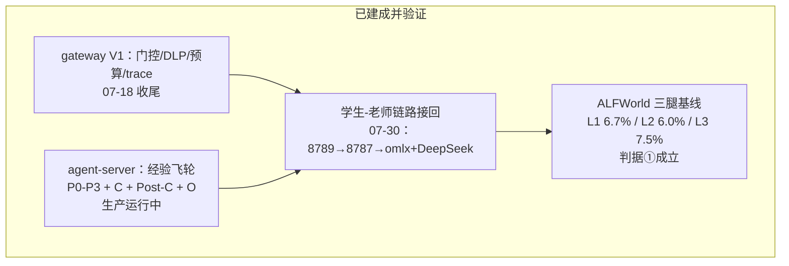
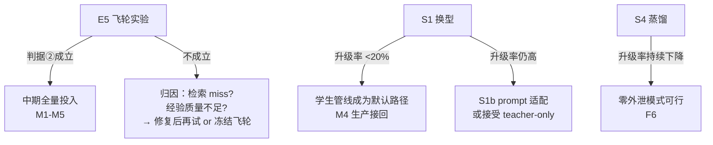

# 开发路线（2026-07-31 版）

作者：kimi
依据：doc/design/ 全部决策史（INDEX 时间线 P0→阶段 9 + living decisions + 【留】遗留项）、三腿 A/B 报告、empty_output 根因分析、9 篇文献（doc/research/papers/）、07-14 规范源
定位：本文件是后续开发的优先级排序与依赖图；各阶段立项时再出任务书

---

## 0. 现状盘点（已落地）

- **判据状态**：①注入无害 ✅（空库）；②飞轮有效 ❓（E5）；③成本同报 ✅
- **核心矛盾**：学生成色不足（gemma 74% 空输出，格式敏感）→ 升级率高 → 成本优势未显
- **原料就绪**：12,744 个真实 session 已归档（E5 进化原料）；9 篇论文方法已解析

## 1. 近期（第 1-2 周）：E 评估收口——拿到判决性证据

| 序 | 任务 | 依赖 | 预期产出 |
|---|---|---|---|
| R1 | **E5 飞轮实验**（决定性） | 6372 sessions 已归档 | 评估库 runDailyEvolution → 热库重跑 134 → 判据②（轮2>轮1）。若成立，经验飞轮价值首次被数据证明；若不成立，按 E4 预注册路径分析（检索 miss vs 经验质量） |
| R2 | **S1 学生换型** Qwen3.5-27B-Distilled | 同 prompt 已实证免疫 | 3 局 bisect 验证升级率（74%→预期 <10%）→ 重跑 L2/L3 → 有区分度的学生基线 |
| R3 | L3 usage 透传修复 | — | gateway→agent-server 路径 usage 回传（小改动 + TDD） |
| R4 | P2 QwenClawBench 100×2 | R1 后 | 第二 benchmark 交叉验证（hybrid 评分，judge=v4-pro） |
| R5 | P3 Claw-Eval 文本子集 199×2 | R4 后 | 第三 benchmark（三维评分：completion/safety/robustness） |

排序逻辑：R1 回答"飞轮值不值得继续投入"，是后续一切的 Go/No-Go；R2 解锁"有区分度的学生"，R4/R5 的解读质量都依赖它。

## 2. 中期（第 3-6 周）：学生成色与成本闭环

| 序 | 任务 | 依据 | 预期产出 |
|---|---|---|---|
| M1 | **置信路由**（门控从四类硬证据扩展为置信度） | COPE：ALFWorld 省 29% 不降分 | gateway 门控 v2；升级率 ↓ 同时保持 SR |
| M2 | **S4 学生蒸馏**（升级轨迹 → SFT 学生） | Specializing（混排防崩塌）+ CoT 三因素（粒度配 ZPD/格式朴素/难度过滤）+ TRUST（tool-calling 可后训练） | 升级轨迹数据集 → 学生微调 → 升级率持续下降；**成本闭环的核心** |
| M3 | **卡片侧增强** | Skill-DISCO 三借鉴 | ①卡片跨轨迹聚类去重（防碎片化）②入库前回放验证（门控前移）③SOP 类过程知识编译为可执行代码（执行错误率 75.3%→0 的论文证据） |
| M4 | **S7 生产 8788 接回** | R1+R2 结论 | 学生承担生产负荷；gateway host=0.0.0.0 + compose 重建 |
| M5 | 技术债清理 | INDEX【留】【观】 | FTS 拉丁正文不可检索修复；rescore 超时治理（dormant 积压触发时）；SOP quality=1.0 占位改真评分；verifier 回退粒度细化 |

依赖：M1 与 M2 并行可；M4 必须在 R1（飞轮证明有效）之后，否则生产接回没有意义。

## 3. 远期（第 2-3 月）：spec 遗留 Go Gates（07-14 规范源推迟项）

| 序 | 任务 | 规范源出处 | 前置 |
|---|---|---|---|
| F1 | **规则学习**（候选→受限 DSL→人工审批→启用/回滚） | review P0-07 + design §6 | 经验飞轮稳定后；注入攻击防护已预设计 |
| F2 | 自然语言反馈分类 | design §3.1 `/internal/v1/feedback`（接口已留） | F1 共用 verification 来源 |
| F3 | repository/session scope（多项目隔离） | review P0-01（等稳定关联键） | 客户端关联字段实测 |
| F4 | New API 前置（外部 token/限额/渠道） | design §9 | 多客户端需求出现时 |
| F5 | 双云 fallback | design §5.3（V1 禁跨 provider，留演进） | 老师单点故障成为现实风险时 |
| F6 | 数据治理深化：脱敏摘要上云 + 零外泄模式（全本地） | 文献综述 §3 | M2 学生成色足够时 |

## 4. 关键决策点（Go/No-Go gates）

## 5. 不变量（任何阶段不得违反）

1. 通用约束：改动仅限工程内、omlx 不可动、commit 格式（COMPLETED/TODO/Refer Spec + conventional）
2. 测试纪律：生产代码 TDD；验收不采信文档数字、直查原始数据
3. 评估纪律：分数按 model×harness 配置报告；判据预注册，不按结果改判据；成本与错误分布同报
4. 架构红线：门控只用可观测证据（置信路由作为"证据"需先 shadow 验证）；出云必过 DLP+预算；升级最多一次；学生能力边界内不让学生做规划（COPE 反证）

## 6. 一句话路线

**E5 证明飞轮（R1）→ 换型解锁学生（R2）→ 置信路由+蒸馏压升级率（M1/M2）→ 生产接回（M4）→ 规则学习与数据治理（F1-F6）**——每一步都有 Go/No-Go 门，证据不足即停。

Refer Spec：`doc/design/INDEX.md`（决策时间线）；`doc/design/2026-07-14-local-agent-model-gateway-design.md`（规范源）；`doc/design/2026-07-31-agent-server-alfworld-three-leg-report.md`（三腿数据）；`doc/design/2026-07-31-agent-model-selection-and-planner-executor-literature.md`（文献）；`doc/design/2026-07-31-agent-server-student-empty-output-analysis.md`（根因）
