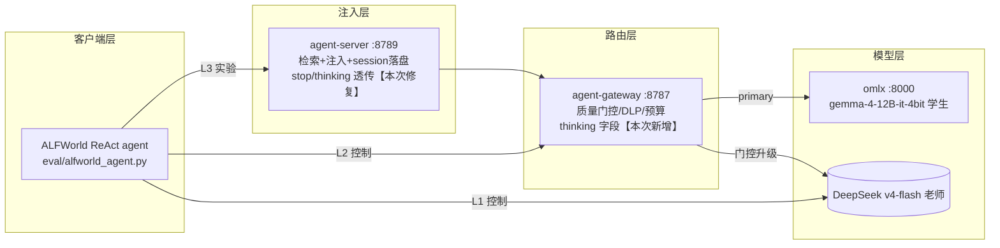
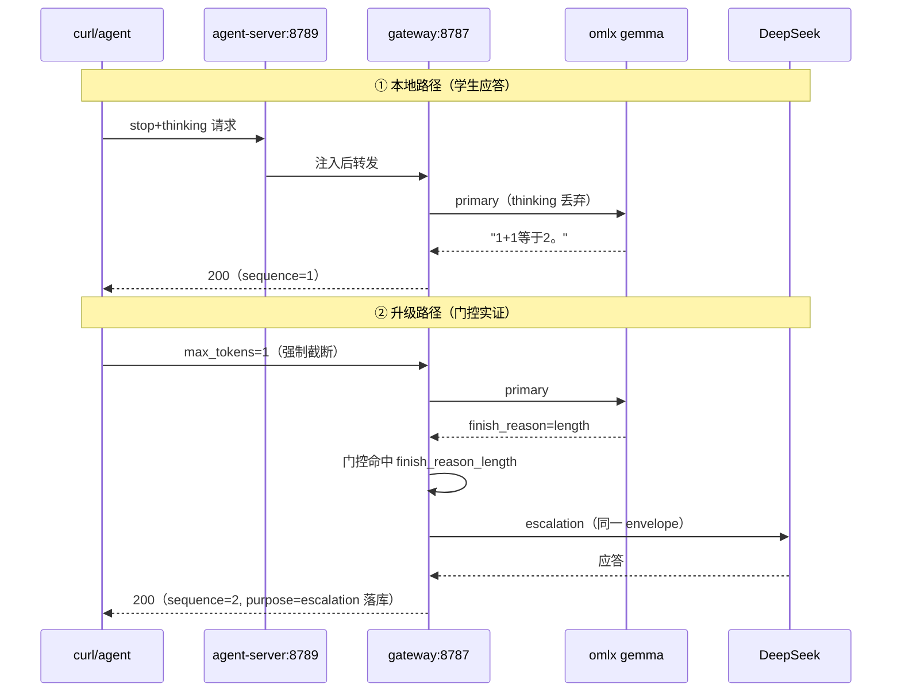

# 学生-老师链路接回与 ALFWorld 三腿验证——实现结果详细报告

日期：2026-07-31
作者：kimi
范围：2026-07-30 ~ 07-31 实现工作全量（链路接回工程 + 三腿评估基础设施 + 根因研究）
相关：`2026-07-30-agent-server-student-teacher-reconnect-changes-and-decisions.md`（决策）、`2026-07-31-agent-server-alfworld-three-leg-report.md`（数据报告）、`2026-07-31-agent-server-student-empty-output-analysis.md`（根因）

---

## 1. 实现总览

本次实现把 v1 设计的"本地学生优先 + 质量门控云升级"从旁路状态（omlx 零负荷、全量直连 DeepSeek）恢复为数据面主路径，并用 ALFWorld 三腿实验完成首轮实证。

## 2. 工程变更明细（全部 TDD，双语言测试基线）

### 2.1 agent-gateway（Python，packages/agent-gateway）

| 变更 | 文件 | 内容 | 验证 |
|---|---|---|---|
| envelope 新增 `thinking` 字段 | `src/agent_gateway/envelope.py` | 显式接受（原 forbid 400）；注释声明语义 | 3 新用例 |
| 本地丢弃/云透传 | `providers/base.py` `build_chat_request(forward_thinking=)` | 默认不转发；云 provider 调用点传 True | 用例：本地无、云有 |
| 云透传接线 | `providers/kimi.py`（DeepSeek 共用 adapter） | complete() 传 forward_thinking=True | 169 pytest 全绿 |
| 配置（gitignored config.toml） | `[cloud.deepseek] enabled=true` + env 名；`routing.selected_cloud_provider="deepseek"`；`lobster-local-key` channel 出云开启 + `allowed_models` 补 `deepseek-v4-flash` | DeepSeek 成为升级 target（纯配置，零代码） | live 三验证 |

### 2.2 agent-server（TypeScript，packages/agent-server）

| 变更 | 文件 | 内容 | 验证 |
|---|---|---|---|
| `stop` 透传 | `types.ts`/`proxy-handler.ts`/`gateway-client.ts`/`server.ts` | OpenAI stop 序列全链路转发到上游 | +2 TDD 用例；live：`stop:["\n"]` 生效 |
| 流式路径补 temperature/max_tokens | `server.ts` | 顺带修复的潜在 bug（流式原本丢采样参数） | 同上 |
| `thinking` 透传 | 同四文件 | vendor 字段 `{type:"disabled"}` 透传 | 254 vitest 全绿 |

### 2.3 评估基础设施（packages/agent-server/eval）

| 组件 | 说明 |
|---|---|
| `alfworld_agent.py`（~150 行） | 忠实 ReAct 论文协议（2-shot/49 步/stop/temp=0）+ chat 适配（system 指令约束命令格式、`>` 前缀剥离、thinking=disabled、确定性游戏顺序、JSONL 全量落盘） |
| `deepseek_relay.mjs`（8899） | HTTP→HTTPS 哑中继（L1 控制腿直连等价物） |
| `host_forward_proxy.mjs`（8898） | CONNECT+HTTP 正向代理（容器外网走宿主，TB 遗产复用） |
| ALFWorld 环境 | alfworld 0.4.2 --no-deps + textworld 1.6.2rc5（arm64 wheel）+ fast-downward（python shim 修复）+ 134 局数据 |

## 3. 验证记录（逐层实证）

### 3.1 链路验证

实测：gemma 中文应答正确、forced tool call 正确发起（学生合格项）、升级 trace `sequence=1 omlx → sequence=2 deepseek` 完整落库。

### 3.2 三腿实验结果（134 局 × 3）

| 指标 | L1 DeepSeek | L2 学生基线 | L3 学生+注入 |
|---|---|---|---|
| SR | 9/134（6.7%） | 8/134（6.0%） | 10/134（7.5%） |
| 升级率 | — | 74.3% | 72.6% |
| 云端 token | 14.0M | ~10.9M | 11.1M |
| 墙钟 | 1.5h | 8.0h | 9.3h |

- **判据①（注入无害）成立**；腿间差 1-2 局在噪声内；L3 注入为空块（评估库经验=0，6373 请求 0 命中），有益性待 E5 热库轮
- **学生负荷实证**：学生-老师架构恢复数据面（本次实现前 omlx 零负荷）

### 3.3 根因研究（empty_output 74% 升级率）

- 7 假设逐一排除（stop/长 prompt/换载/reasoning 丢弃/gateway bug/历史诱导/rapid-fire）
- 决定性复现（直连 omlx + 真实 ReAct prompt）：gemma 立即吐 EOS（content 缺失，completion_tokens≈2）
- 深化三组实验：步数扫描（非单调，否掉"超 20 步崩"）、prompt 消融（**触发器=裸 `>` 标记结构**，范例单独可触发，全局改 `Action:` 即恢复）、27B 对照（免疫）
- 三维归因：格式=触发器、模型参量=调节因子、上下文=无关

## 4. 文献 grounding（9 篇，本地全文解析）

`doc/research/papers/`：微调风格差异（2601.13244、Harness-Bench）、planner-executor（COPE/PEACE/ReWOO/TRUST）、工程基础（Specializing/Skill-DISCO/CoT 蒸馏因素）。结论摘要：instruct 增益=prompt 模板依赖；分数=model×harness 联合属性；静态规划在探索环境失效（论文点名 ALFWorld）；置信路由省 29% 可用；planner-executor 不能防外泄（正解=本地执行+脱敏摘要+DLP）；小模型窄域特化可行但须防通用性崩塌；蒸馏数据三旋钮（粒度配 ZPD/格式朴素/teacher 不必最强）。

## 5. 问题与已知限制

| # | 问题 | 状态 | 处置 |
|---|---|---|---|
| 1 | gemma 学生 74% 空输出（格式敏感） | 根因已定位 | S1 换 27B（实证免疫）/ S1b prompt 适配（`>`→`Action:`）——待拍板 |
| 2 | L3 client 侧 usage=0 | 未修 | gateway→agent-server 路径 usage 未透传回 client，follow-up |
| 3 | 注入有益性未证 | 预期内 | E5 飞轮（冷库轨迹已归档 6372 sessions 备用） |
| 4 | 生产 8788 仍直连 DeepSeek | 未动 | S7 待评估结论后接回 |
| 5 | 升级步骤 prompt 双发 | by design 副作用 | 升级率降下来后自然缓解 |

## 6. commit 序列（10 个，全部带决策记录）

`9d71c35b`（链路接回+三腿设计）→ `870adf31`（经验注入工程文档）→ `081bbfb4`（根因报告）→ `5862c4de`（根因深化）→ `6d314036`+`c8c434a2`（文献综述）→ `65eaa0f7`（工程基础三论文）→ `52bd1256`（三腿数据报告）→ `32a46959`（stop 透传修复，时序在前）

测试基线全程：254 vitest（agent-server）+ 169 pytest（agent-gateway）全绿；npm run check 干净。

## 7. 后续路线（按优先级）

1. **E5 飞轮实验**：评估库 runDailyEvolution → 热库重跑 134 → 验判据②（轮2>轮1）——注入有益性的决定性实验
2. **S1 学生换型** Qwen3.5-27B-Distilled（同 prompt 已实证免疫）→ 3 局 bisect 验证升级率 → 重跑 L2/L3
3. **置信路由**（COPE 式）：门控从四类硬证据扩展为置信度路由，ALFWorld 实证省 29%（E5 后立项）
4. **S4 学生蒸馏**：升级轨迹 + CoT 蒸馏三旋钮（粒度配 ZPD/格式朴素/难度过滤）
5. P2 QwenClawBench、P3 Claw-Eval（学生路径适配已就绪）
6. S7 生产 8788 接回（评估结论后）

Refer Spec：`doc/design/2026-07-14-local-agent-model-gateway-design.md`（规范源）；`doc/design/2026-07-31-agent-server-alfworld-three-leg-report.md`（数据）；`doc/design/2026-07-31-agent-model-selection-and-planner-executor-literature.md`（文献）
