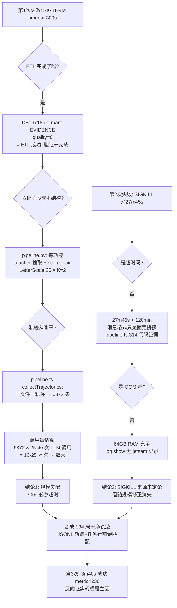

# 分析报告：E5 进化管线连续失败（超时/SIGKILL）根因定位

日期：2026-08-03
作者：kimi
格式：①遇到的问题 → ②结论 → ③定位过程与证据链
关联：`doc/design/2026-08-03-agent-server-e5-flywheel-changes-and-decisions.md`（E5 决策记录）

---

## 1. 遇到的问题

E5 飞轮实验的进化阶段（`runDailyEvolution`，输入=L3 冷库轮的 6372 个 session 文件）**连续两次失败**，第三次改输入后成功：

| 运行 | 配置 | 结果 | 耗时 |
|---|---|---|---|
| 第 1 次 | 默认 pipeline 超时 300s | `verification_selection.pipeline killed by SIGTERM (timeout 300000ms)` | 6m49s |
| 第 2 次 | 超时提至 7200000ms（2h） | `killed by SIGKILL (timeout 7200000ms)`——**但实际只跑了 27m45s，与 2h 超时矛盾** | 27m45s |
| 第 3 次 | 输入改为合成的 134 局干净轨迹 | **成功**，checkpoint metric=238 | **3m40s** |

二次失败伴随数据污染：评估库被写入 9718 条 quality=0 的 dormant EVIDENCE（ETL 完成但验证未完成）。

## 2. 结论

1. **主因（已证实）：输入规模失配。** 在线落盘的 session 是"每 LLM 请求一文件"（无会话亲和），`collectTrajectories()` 又按"一文件一轨迹"处理 → 6372 条"轨迹"且每条都含全量重复历史。验证阶段每条轨迹需要"teacher 抽取 + LetterScale(20)×K=2 打分"约 25-40 次 LLM 调用 → 总调用量 ~16-25 万次，以串行速率需**数天**，任何小时级超时都会命中。第 1 次失败是真实的超时。
2. **第 2 次 SIGKILL 的来源未能定论（诚实声明）。** 报错文本中的 "(timeout 7200000ms)" 只是固定消息格式（代码级证据，见 §3-E4），实际运行 27m45s < 120min，说明不是超时触发。排除了 OOM（64GB RAM 充足、无 jetsam 日志）。最可能是 Python 子进程在超大输入下的内部崩溃以外部信号 9 呈现，但**未复现、无直接证据**——因输入规模修正后问题消失，该悬案不影响结论。
3. **架构层教训：在线 session 形态与离线进化输入期望存在阻抗失配。** 正确的进化原料是"一局一条完整轨迹"（134 条），不是"一请求一文件"（6372 条）。本次用合成轨迹绕过，**根治方案**是给 agent-server 加会话亲和（同一任务/游戏共享 session id），使在线落盘天然就是任务级轨迹（已列入后续路线）。

## 3. 定位过程与证据链

### 证据明细（每条可复核）

- **E2（数据污染证明 ETL/验证断点）**：`var/eval/experience.db` 在第 1 次失败后有 9718 行 `status=dormant, type=EVIDENCE, quality=0`——ETL 插入完成、verifier 未打分未晋升，断点精确定位在验证阶段。
- **E4（验证成本）**：`python/verification_selection/pipeline.py:130-144`（`select_best`/`score_pair`）+ `:291`（`Verifier(student, scale=LetterScale(20), K=2)`）——每条轨迹含 teacher 抽取调用 + 最多 20 级字母标度 × K=2 的成对偏好评分调用。
- **E5/E6（轨迹来源）**：`src/offline/pipeline.ts:193-204`——`collectTrajectories()` 对 inputDir 每个 `.jsonl` 文件产出一条 trajectory；在线侧每请求写一个 session 文件（ALFWorld ReAct 无 session 亲和），故 6372 文件 = 6372 轨迹，且历史全文重复。
- **E9（超时证伪）**：`src/offline/pipeline.ts:308-315`——`close` 事件只要带 signal 就拼 `killed by <signal> (timeout <timeoutMs>ms)`；消息中的数字恒等于配置值，与真实死因无关。运行时长 27m45s（任务系统记录）≠ 120min。
- **E11（OOM 证伪）**：`sysctl hw.memsize` = 64GB；`log show --predicate 'eventMessage CONTAINS "jetsam"'` 无相关记录。
- **V（反证）**：输入从 6372 条换成 134 条（-98%），总耗时从 >2h（失败）降到 3m40s（成功）——规模是支配变量。

### 合成轨迹的构造方法（复用备查）

1. L3 的 `experiment-full.jsonl` 每局含完整 action/obs 轨迹与 gamefile；
2. 任务文本从 session 找回：按"Here is the task." 之后的 `> action` 行序列对 134 局做前缀匹配（6235/6372 命中、132/134 局覆盖），2 个未覆盖局（step-1 即胜、无历史）用未匹配 session 的任务行补全；
3. 合成 pi v3 session（header + user 任务消息 + assistant 轨迹消息）至 `var/eval/sessions-r1/`。

## 4. 后续动作（已入路线）

| # | 动作 | 性质 |
|---|---|---|
| 1 | 进化前重置评估库为干净备份（清除 9718 污染行） | 已执行（E5-D2） |
| 2 | 合成任务级轨迹作为进化标准输入 | 已执行（E5-D1），方法写入 progress 交接 |
| 3 | **根治：agent-server 会话亲和**（同一任务共享 session id，在线落盘即任务级轨迹） | 路线新增项，列入中期 M5 技术债 |
| 4 | 管线报错消息改进：区分"超时杀"与"外部信号杀"（记录实际运行时长） | 小改进，同 M5 |

Refer Spec：`doc/design/2026-08-03-agent-server-e5-flywheel-changes-and-decisions.md`；`packages/agent-server/src/offline/pipeline.ts`；`packages/agent-server/python/verification_selection/pipeline.py`
