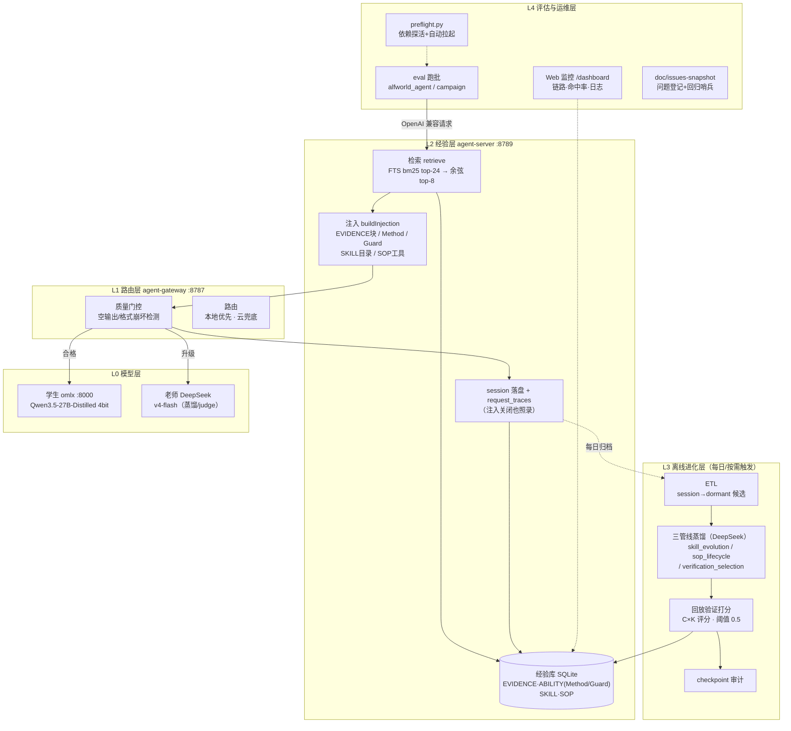
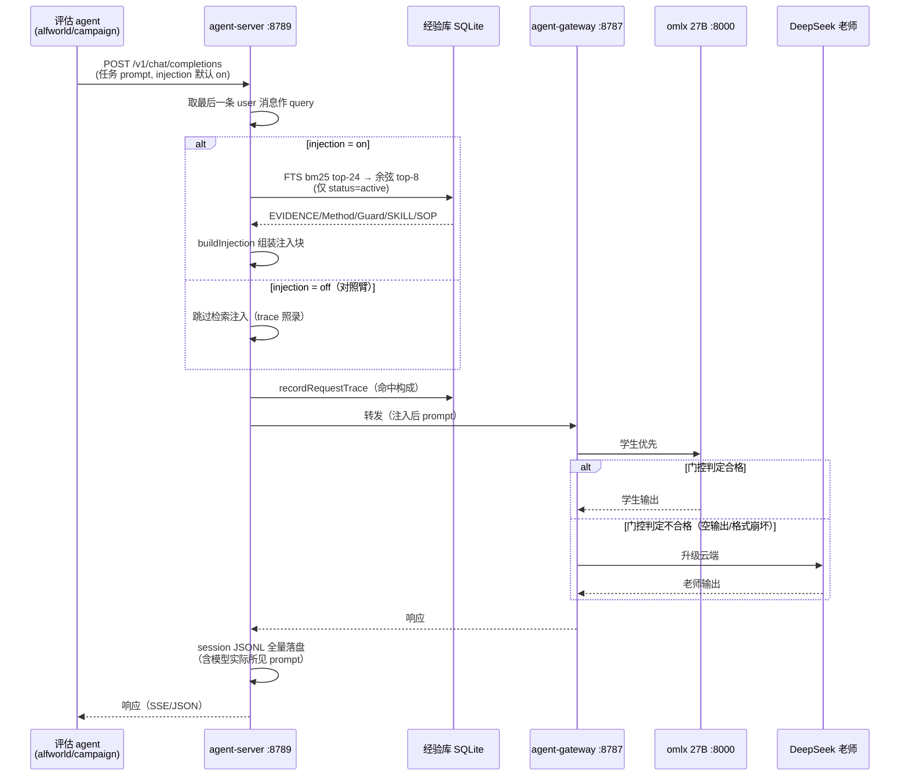
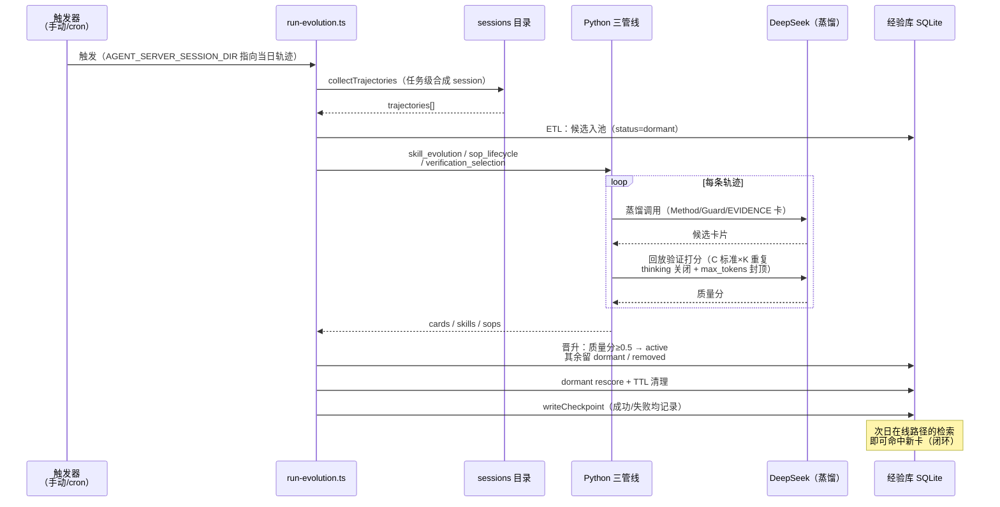

# 2026-08-07 经验生产线：分层架构与时序

状态：现役系统描述（B 阶段热库轮运行中）。本文是经验生产线的标准参照文档——描述**已实现并验证运行**的形态，未验证的效用判读见各阶段实验报告。

## 1. 生产线总述

经验生产线 = 一条"执行 → 记录 → 蒸馏 → 验证 → 回流"的闭环流水线：

```
在线执行（学生模型跑任务，经验注入辅助）
    ↓ 全量落盘（session JSONL + request_traces）
离线蒸馏（老师模型把轨迹提炼成卡片）
    ↓ 质量闸门（回放验证打分 ≥0.5）
经验库（active 卡片）
    ↓ 检索注入（次日/下轮执行时回流到 prompt）
在线执行（带经验的下一次执行）—— 闭环
```

四条红线（不可违反）：
1. 原始轨迹**从不直接注入**——只有蒸馏+验证后的卡片能进入 prompt（C 决策 3）
2. 失败轨迹不直接入库——只作离线归因输入，教训以程序化提取的 Guard 卡形式沉淀（2605.29463 红线）
3. 晋升阈值 0.5 统一，dormant 永不可见（SQL 层硬过滤 `status='active'`）
4. 评估库与生产库物理隔离（`var/eval/` 独立实例）

## 2. 分层架构图



各层职责一句话：

| 层 | 职责 | 关键不变量 |
|---|---|---|
| L0 模型 | 执行与教学的算力 | 学生本地、老师云端，物理可断 |
| L1 路由 | 质量门控+升级 | 无状态，可独立替换 |
| L2 经验 | 检索、注入、记录 | 注入可关（injection=false），记录不可关 |
| L3 进化 | 轨迹→卡片的转化 | dormant→active 唯一通道是验证打分 |
| L4 运维 | 跑批、监控、问题追溯 | preflight 不过不起跑 |

## 3. 时序图

### 3.1 在线路径（每次请求）



### 3.2 离线路径（每日进化）



## 4. 当前实证状态（08-07）

| 环节 | 状态 |
|---|---|
| 在线记录 | 已验证（session/trace 全量，含 injection=off 对照臂） |
| ETL→候选池 | 已验证（15,069 dormant，幂等） |
| 蒸馏产卡 | **已验证破零：41 Method + 62 Guard + 130 EVIDENCE active**（E5 为 0 程序级卡） |
| 验证闸门预测力 | ⏳ 检验中（B 热库轮：自评通过的卡是否有真实效用） |
| 回流增效 | ⏳ 检验中（热库 vs 冷库 15.7% 基线，8/9 出数） |

Refer Spec：2026-07-18-agent-server-experience-replay-spec.md（§5.1/§6）；2026-08-04-agent-server-c3-amendment-and-r2-evolution-input-changes-and-decisions.md（三层化）；2026-08-05-agent-server-injection-toggle-and-eval-preflight-changes-and-decisions.md（开关与同路径对照）
