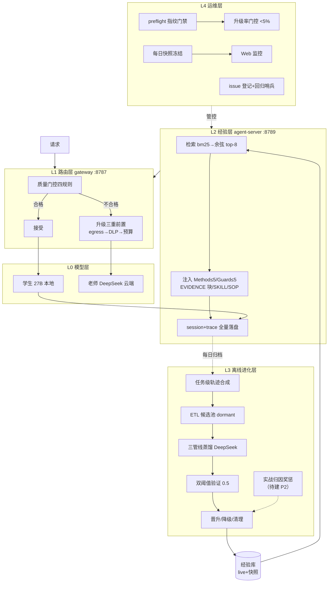

# 经验学习系统概要设计（v2）

日期：2026-08-13 ｜ 状态：现役系统 + 已确认演进方向 ｜ 取代：08-07 生产线文档（细节参照 08-13 系统设计文档）

## 1. 设计目标

验证并落地：**本地学生模型（Qwen3.5-27B-4bit）+ 经验学习 harness，在办公自动化域经教师少量指导后逐步独立**——重复任务升级率趋近 0，新任务升级率 <20%。

非目标：token 级 RL/权重更新（与本地 4-bit 部署不兼容）；原始轨迹在线回放（安全红线）。

## 2. 总体架构（五层）

## 3. 核心机制（现役 → 待建）

### 3.1 质量门控（现役，有已知缺陷）

四规则顺序判定（invalid_tool_schema / finish_reason_length / empty_output / forced_tool_missing），升级仅一次、三重前置、云结果不再二次门控。x-gateway 标记与 model_runs 双印证。
**缺陷**：length 规则对叙述型模型+小 max_tokens 系统性误杀（issue-003）→ 演进方案④。

### 3.2 经验卡机制（现役，有已知缺陷）

五类卡片（EVIDENCE/Method/Guard/SKILL/SOP）+ 三态生命周期（dormant→active→removed）。
硬约束：active-only 检索、原始轨迹永不注入、失败经验三层化、双阈值 0.5。
**缺陷**：卡片缺交付物维度、闸门不验交付产出（issue-010）→ 演进方案①。

### 3.3 生命周期管理（现役）

晋升阈值（准入奖励）→ dormant 留观（拒绝）→ rescore 降级（惩罚）→ TTL 30 天/cap 10000（淘汰）。
当前 quality = 裁判自评点估计。

### 3.4 检索与注入（现役）

bm25 top-24 → 余弦 top-8，无语义层。注入开关服务级+请求级；同路径对照（对照臂 injection off，trace 照录）。
**缺口**：无情景维度（物理分库承担）→ 演进方案③。

### 3.5 学习回路触发（现役）

局级胜负触发（门控触发器已迁移）；R2 三路进料（学生轨迹+老师胜局+败局对照）；C campaign 每日批次全量进化。

### 3.6 奖惩机制（待建，方案②）

| 层面 | 现役 | 待建 |
|---|---|---|
| 经验卡 | 晋升/留观/降级/淘汰 | **实战结果归因**：卡×结果 join，高分加分/连fail降权，最小样本阈值防误杀，对照臂因果校准 |
| 元数据 | quality 点估计 | **quality+confidence 二元组**，置信度随证据累积 |
| 行为层 | 无 | 不做（token 级 RL 排除） |

## 4. 关键数据流

**在线**：请求 → query 提取 → 检索（快照）→ 注入组装 → 门控 → 学生/老师 → 标记+落盘。
**离线（每日）**：归档 → 任务级合成 → ETL → 蒸馏 → 双阈值验证 → 晋升 → rescore/清理 → checkpoint → 次日快照换载。
**归因（待建）**：trace.retrievedIds × 任务分数 → 卡奖惩 → 质量分更新 → 影响次日检索排序。

## 5. 已确认演进方案（C 完成后逐案请示启动）

| # | 方案 | 解决 | 预估 |
|---|---|---|---|
| ① | 卡片交付物维度修复 | issue-010：照卡执行挤占交付 | 1-1.5 天 |
| ② | 实战归因奖惩 + 置信度 | 闸门自评与实效脱钩；EWC 重要性/不确定性映射 | 1-2 天 |
| ③ | 情景标签（domain/task_pattern） | 跨域串扰风险；检索无情景边界 | 0.5-1 天 |
| ④ | B' 重跑（纯 27B 基线） | issue-003：混合体污染，四项结论待重测 | pilot 0.5 天 + 2-4 天 |
| ⑤ | 管线断点持久化 | issue-002 余留：失败全量重跑放大器（附降级备选） | 1 天 |

EWC 借鉴的采纳边界（issue-012）：采纳重要性加权/合并蒸馏/双时间尺度/不确定性；不采纳原位修正、HMM 情境推断、原始层在线检索（违红线）、token 级 RL。

## 6. 设计红线（不可违反）

1. 原始轨迹从不直接注入——只有蒸馏+验证后的卡可进 prompt
2. 失败文本不入库——三层化：归因输入/程序化 Guard 卡
3. 晋升阈值 0.5 统一，dormant SQL 层不可见
4. 评估库与生产库物理隔离
5. 批次层异常隔离：局部失败降级为观察，永不穿透批次层
6. 升级率/命中率等核心指标以 model_runs/request_traces 全量为准，拒绝小样本外推

## 7. 问题台账摘要（详见 issues-snapshot）

- **待解决**：issue-003（方案④）、issue-010（方案①②）、issue-002 余留（方案⑤）
- **fixed 待观察**：001/004/005/006/007/008/009/011（回归哨兵值守）
- **设计评审**：issue-012（EWC 七方案采纳结论）

Refer：2026-08-13-agent-server-system-design-and-issue-inventory.md（详细架构/时序/call graph）；doc/design/plans/2026-08-13-plan-*.md（五方案）；doc/issues-snapshot/
