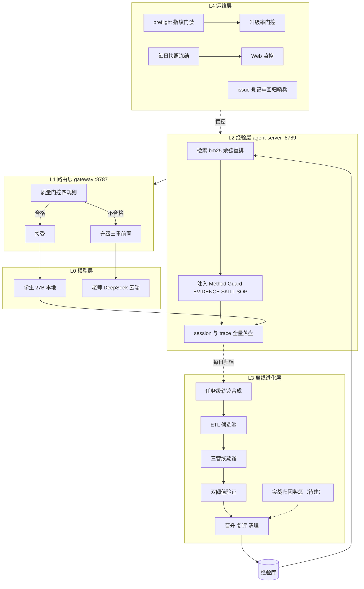
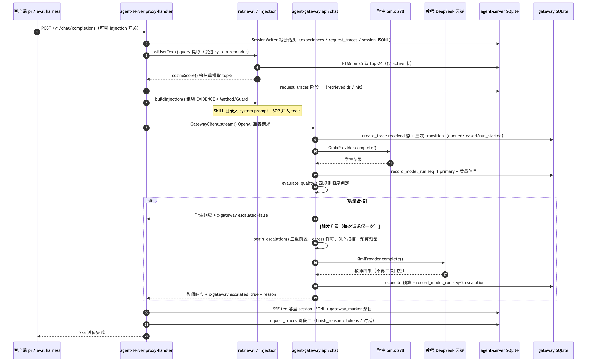
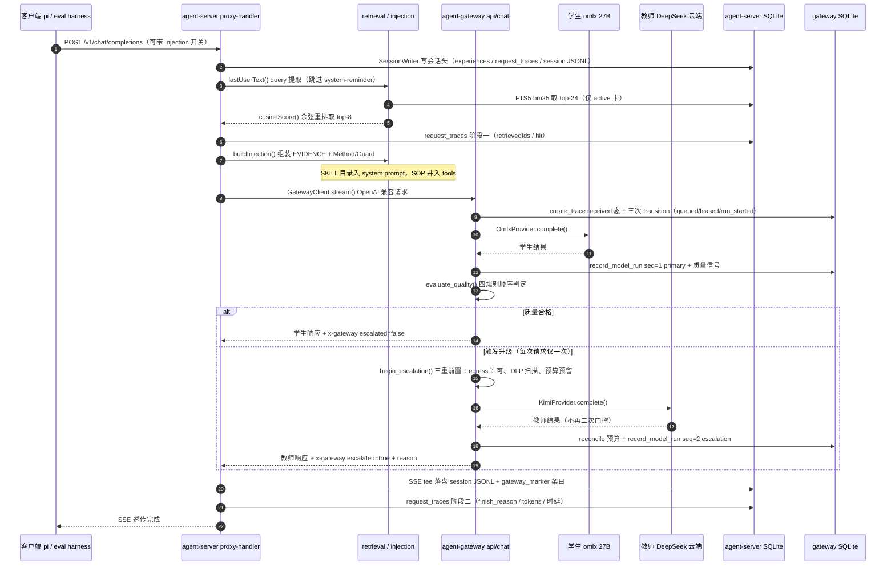
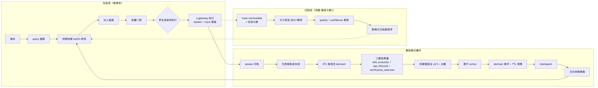
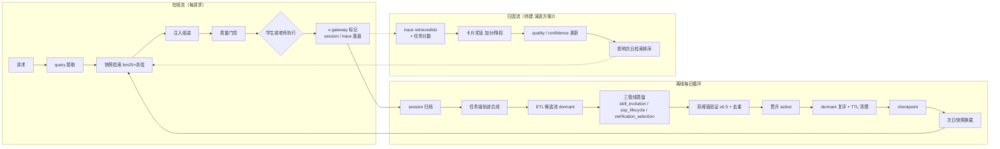
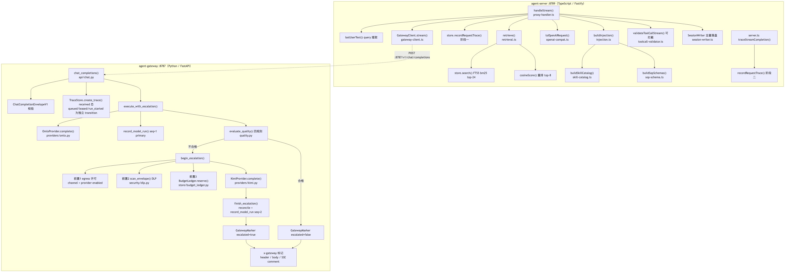
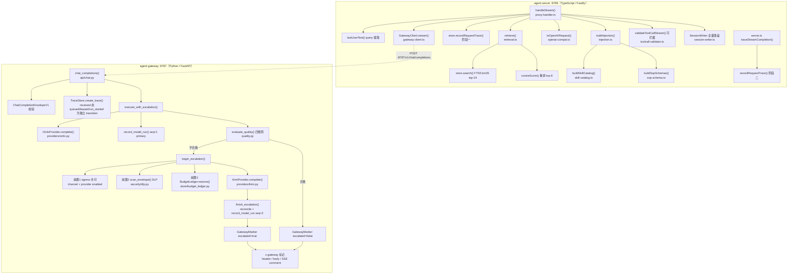
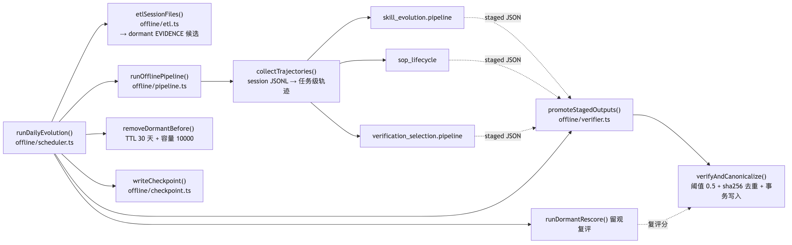
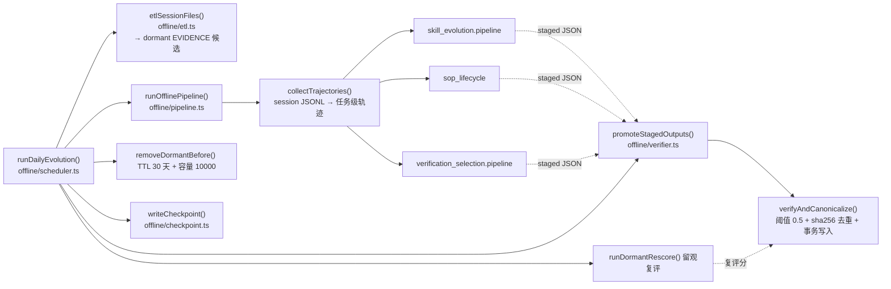

# 经验学习系统概要设计（v2）

日期：2026-08-13（架构图拆分与核心机制扩充：2026-08-13）

## 1. 设计目标

验证并落地：本地学生模型 Qwen3.5-27B-4bit 加经验学习 harness，在办公自动化域经教师少量指导后逐步独立——重复任务升级率趋近 0，新任务升级率低于 20%。

指标口径：升级率为 per-任务日二元口径（D7 重复集 n=20，任一请求升级即记 1），属绝对阈值验收而非统计推断，不附显著性检验；小样本（n=20）下 5pp 分辨力有限，核算与报告仍以 model_runs / request_traces 全量为准（红线 6）。判定细则见 campaign 设计文档。已知混淆因子：门控参数漂移、注入修格式收益、教师兜底掩盖；新任务判据无冷库基线，由演进方案 4（纯 27B 基线重跑）补齐。"教师少量指导"的实现形态 = 升级单步混入 transcript + 教师担任裁判/蒸馏器，非整局示范。

非目标：token 级 RL 与权重更新；原始轨迹在线回放。

## 2. 总体架构

总体架构拆分为四个视角：分层架构（2.1）、时序交互（2.2）、数据流（2.3）、调用图与模块职责（2.4）。

### 2.1 模块分层架构图

mermaid 源码（支持 mermaid 的查看器可直接渲染；修改图后需重新生成上方 SVG）

层次职责：L0 只出模型能力，不含任何学习逻辑；L1 决定"这次回答由谁产出"并保证升级安全合规；L2 决定"给模型看什么经验"并完整记录现场；L3 决定"哪些经验值得留下"；L4 保证整个系统可观测、批次可重跑、可归因。

口径说明：agent-server :8789 为评估实例口径（`PORT` 环境变量覆盖），代码默认 8788；gateway :8787 为配置确定值。L4 "可回滚"当前仅有 checkpoint 幂等重跑，快照回滚能力待建（见 §7 台账）。升级率门控为批前放行检查，运行时无熔断/自动降级，失控靠预算 cap 与事后人工复盘。

### 2.2 时序交互图（在线请求全链路）

mermaid 源码（支持 mermaid 的查看器可直接渲染；修改图后需重新生成上方 SVG）

要点：升级决策完全收敛在 gateway 内部，agent-server 只消费 x-gateway 标记；session 与 trace 无论命中与否、开关与否全量落盘，保证对照臂轨迹同样进入学习回路。落盘与响应强耦合是刻意取舍（宁失败不漏录）：session/trace 写盘失败会使请求整体失败而非静默漏录；但 ETL 当前无 session 完整性校验，半截 session 会被摄入（§7 台账项 7），红线目标需完整性校验配合方成立。gateway 不可用时请求 fail-fast，无直连学生的降级路径。

### 2.3 数据流图

mermaid 源码（支持 mermaid 的查看器可直接渲染；修改图后需重新生成上方 SVG）

三条流共用一份 SQLite 经验库：在线只读快照（写走 live 库），离线写 live 库并在 checkpoint 后换载新快照，归因只改元数据不改内容。换载为重启式（非热切换），每日存在短暂停机窗口；新快照生成失败时沿用旧快照。注意：归因流为待建（演进方案 2），当前 retrievedIds 仅落盘不回写。

### 2.4 调用图与模块职责

在线与升级链路（函数级 call graph）：

mermaid 源码（支持 mermaid 的查看器可直接渲染；修改图后需重新生成上方 SVG）

离线进化链路（每日批次）：

mermaid 源码（支持 mermaid 的查看器可直接渲染；修改图后需重新生成上方 SVG）

模块职责一览：

| 模块 | 所在 | 职责 |
|---|---|---|
| proxy-handler | agent-server | 在线管线编排：query → 检索 → 注入 → gateway → 落盘 |
| retrieval | agent-server | FTS5 bm25 召回 top-24，余弦重排 top-8，仅 active 卡 |
| injection / skill-catalog / sop-schema | agent-server | 五类卡片组装进 prompt：EVIDENCE+Method/Guard 合成用户消息，SKILL 入 system，SOP 入 tools |
| gateway-client / openai-compat | agent-server | OpenAI 兼容请求构造与 SSE 流式转发 |
| session-writer / experience-store / observability | agent-server | session JSONL、experiences+FTS5、request_traces、trace 日志、快照只读检索 |
| toolcall-validator | agent-server | 工具调用白名单校验：/v1 透传路径仅观察不拦截；/api/stream 路径（validateToolCallStream）会整批拒绝非法 toolCall |
| offline/scheduler + pipeline + etl | agent-server | 每日进化批次：ETL、任务级轨迹合成、三 Python 蒸馏子进程、dormant 复评与 TTL 清理（各阶段为 runDailyEvolution 的平级顺序调用） |
| offline/verifier + canonicalize + checkpoint | agent-server | 0.5 双阈值晋升、确定性去重、幂等 checkpoint |
| api/chat + quality + routing | agent-gateway | 请求入口、四规则质量判定、本地/云端路由决策 |
| security/dlp + budget_ledger | agent-gateway | 升级前置：DLP 扫描与月度预算原子预留 |
| providers/omlx + providers/kimi | agent-gateway | 本地学生与云端教师适配器（DeepSeek 复用 KimiProvider） |
| trace_store + statemachine | agent-gateway | 请求状态机、model_runs 双印证、幂等与租约恢复 |
| eval/preflight + snapshot_store + dashboard | 运维件 | 依赖链探活拉起、每日快照冻结、Web 监控与升级率门控 |

## 3. 核心机制

每个机制按"模块构成 / 运行方式 / 有效作用"说明。

### 3.1 质量门控

- **模块构成**：agent-gateway 侧 `execute_with_escalation()`（api/chat.py）编排，`evaluate_quality()`（quality.py）判定，`begin_escalation()` 执行三重前置（egress 许可、security/dlp.py 扫描、BudgetLedger.reserve() 预算原子预留），`GatewayMarker` 生成 x-gateway 标记，`TraceStore.record_model_run()` 落 model_runs。
- **运行方式**：四条规则顺序判定——invalid_tool_schema → finish_reason_length → empty_output → forced_tool_missing，命中即升级且每次请求仅升级一次；前置检查依次失败分别返回 422/403/429；云端结果不再二次门控（仅记录 cloud_finish_reason 告警）；x-gateway 标记与 model_runs（seq=1 primary / seq=2 escalation）双侧全量落库。
- **有效作用**：本地优先、云端兜底；升级率是衡量学生独立性的核心指标口径。边界声明：(1) 前置失败统一 fail-closed（丢弃本地结果），403 为安全阻断、422/429 为配置/配额问题，是否对后者降级回本地待议；(2) DLP 默认仅 3 条密钥模式且只扫 messages 内容，不扫 tools[]（SOP schema 出网为其盲区），经验卡含办公域内容，部署方有扩展模式集义务；(3) 成本可控依赖显式配置月度预算，默认无上限时预算闸不生效；(4) "双印证"当前无跨库关联键（x-gateway 标记不含 trace_id），逐请求对账待建（§7 台账）。

### 3.2 经验卡机制

- **模块构成**：`ExperienceStore`（experience-store.ts）承载 experiences 表 + FTS5 索引；五类卡片 EVIDENCE、Method、Guard、SKILL、SOP（SKILL/SOP/EVIDENCE 为独立类型，Method/Guard 归入 ABILITY 载荷）；状态字段三态 dormant、active、removed。
- **运行方式**：仅 active 可被检索（dormant 在 SQL 层不可见）；原始轨迹永不注入；失败经验三层化——原文不入库、败局仅作归因输入、教训以程序化提取的 Guard 卡沉淀；晋升统一双阈值 0.5（新候选与 dormant 复评同一阈值）。
- **有效作用**：把"经验"从原始对话压缩为可检索、可计量、可淘汰的结构化资产；状态机保证未经验证的候选零风险留观，入库内容永远经过验证。

### 3.3 生命周期管理

- **模块构成**：`verifyAndCanonicalize()` 与 `PROMOTION_THRESHOLD=0.5`（offline/verifier.ts）管晋升，`runDormantRescore()`（offline/pipeline.ts）管复评，`removeDormantBefore()` 管 TTL 与容量淘汰，`writeCheckpoint()`（offline/checkpoint.ts）管幂等落账。
- **运行方式**：晋升阈值为准入奖励（≥0.5 且 sha256 去重后事务写入）；dormant 为留观（每批次最老 200 条复评，过线原地晋升，不过线留待下批）；TTL 30 天与容量上限 10000 为淘汰（仅作用于 dormant）；quality 当前为裁判自评点估计，随归因机制演进。
- **有效作用**：经验库有入有出、规模有界；checkpoint 幂等（ckpt-sha256[:16]）保证批次失败可安全重跑。局限声明：(1) 晋升统一过验证闸（红线 3 修订，台账 5 闭环）——EVIDENCE/ABILITY 0.5 闸（ABILITY 另含 F1 交付物检查 + F2 实战归因 confidence 信号），SOP 生命周期管线预验证 quality=1（语义 = 预验证通过标记，非绕过闸门的直通），SKILL 暂缓入库（utility 无验证对象，待 utility→可验证任务映射建立后解除）；(2) "rescore 降级"未实现：现役 rescore 仅复评 dormant，active 卡无降级/淘汰通道，一旦晋升即长期滞留（§7 台账）；(3) 晋升闸门对单轨迹任务是对硬编码参照轨迹的偏好概率，不验任务成败与交付物（issue-010 根因，随演进 2 修复）。

### 3.4 检索与注入

- **模块构成**：`retrieve()` + `buildFtsQuery()` + `cosineScore()`（retrieval.ts），`buildInjection()`（injection.ts），`buildSkillCatalog()`（skill-catalog.ts），`buildSopSchemas()`（sop-schema.ts）；注入开关在 server 级（AGENT_SERVER_INJECTION）与请求级（options.injection）双层覆盖。
- **运行方式**：bm25 取 top-24 候选，余弦重排取 top-8，无语义解析层；EVIDENCE（受 top-8 总量约束，无单独条数上限）与 Method/Guard（各上限 5 条）合成用户消息插在最后用户消息之前，SKILL 目录（top-10）入 system prompt，SOP（top-15）转为工具 schema 并入 tools；对照臂关闭注入但轨迹照录，双臂走完全相同代码路径，session 以 `disabled:true` 区分"关"与"未命中"。
- **有效作用**：经验以最小侵入方式进入上下文；同路径对照保证 A/B 差值可归因于注入本身，而非代码分叉。边界声明：(1) SKILL/SOP 为全局 top-N 恒定注入（通用能力语义，非任务相关检索）；(2) SOP 是参考性流程 schema，无服务端执行器，模型是否调用属观察对象，重名时请求侧工具胜出；(3) EVIDENCE 以 user 角色注入存在角色错配风险（E5 已观察到位置碎片的正负对冲）；(4) 空库/空注入时双臂输出相同，仅 `disabled:true` 可区分；SKILL 当前无 benchmark 恒为空；(5) 字面匹配对措辞差异不敏感，判据②的泛化测量受此约束，语义检索为演进方向；(6) 低 QPS eval 场景定位，数千级 active 下检索注入为毫秒级，active 涨至万级需复测 tail latency。

### 3.5 学习回路触发

- **模块构成**：`runDailyEvolution()`（offline/scheduler.ts）六阶段编排，`run-evolution.ts` 提供单次/常驻循环/状态三命令，cron/launchd（offline/schedule.ts）外部触发，`collectTrajectories()`（offline/pipeline.ts）做任务级轨迹合成。
- **运行方式（现役）**：外部 cron/launchd 触发每日批次全量进化（`runDailyEvolution` 对全部 session 无差别处理，不消费胜负信号）；失败写失败 checkpoint 且不产出成功 checkpoint。
- **设计意图（未落地）**：触发器迁移到局级胜负（解决 27B 升级率 0% 导致门控断粮的问题）、进化进料三路合并（学生轨迹、同局老师胜局、败局对照）为 R2 设计，现役代码无胜负过滤与三路分流；"局"定义与胜负阈值随落地时定义。
- **有效作用**：每日全量进化保证无论门控是否触发都有进料；"败局对照提取差在哪"的作用当前不成立（败局在打分中被参照轨迹替代），随三路合并落地生效。已知瑕疵：蒸馏提取 prompt 按"successful trajectory"措辞，与失败轨迹输入错配（§7 台账）。

### 3.6 奖惩机制

- **模块构成**：卡片层依托 verifier/rescore/TTL（见 3.3）；实战归因依托 request_traces.retrievedIds 与任务分数关联；元数据层为 quality/confidence 二元组。
- **运行方式与有效作用**：

| 层面 | 设计 |
|---|---|
| 经验卡 | 晋升、留观、淘汰（降级未实现，见 §3.3 局限与 §7 台账） |
| 实战归因（待建，演进方案 2） | 卡片与任务结果关联，高分任务注入卡加分，连续失败任务注入卡降权；设最小样本阈值防误杀；对照臂差值做因果校准。前置问题：多卡共注入的 credit assignment、对照校准统计功效、最小样本阈值取值、任务分数与 quality 来源独立性 |
| 元数据（待建） | quality 与 confidence 二元组，置信度随实战证据累积调整（当前仅 quality 单字段，无 confidence 列） |
| 行为层 | 不做 token 级奖惩 |

## 4. 关键数据流

在线：请求、query 提取、快照检索、注入组装、门控、学生或老师执行、标记与落盘（图见 2.3 在线流）。
离线每日循环：归档、任务级合成、ETL、蒸馏、双阈值验证、晋升、rescore 清理、checkpoint、次日快照换载（图见 2.3 离线每日循环）。
归因（待建，演进方案 2）：trace 中 retrievedIds 与任务分数关联、卡片奖惩、质量分更新、影响次日检索排序（图见 2.3 归因流）。

## 5. 演进方案

C 阶段完成后逐案请示启动。

| # | 方案 | 目标 | 预估 |
|---|---|---|---|
| 1 | 卡片交付物维度修复 | 消除照卡执行挤占交付本能 | 1-1.5 天 |
| 2 | 实战归因奖惩与置信度 | 消除闸门自评与实效脱钩 | 1-2 天 |
| 3 | 情景标签与检索过滤 | 消除跨域串扰风险 | 0.5-1 天 |
| 4 | 纯 27B 基线重跑 | 获得未被门控污染的能力基线 | 2-4 天 |
| 5 | 管线断点持久化 | 消除失败全量重跑放大器 | 1 天 |
| 6 | 库版本交叉评估臂 | 分离库演进效应与即时注入效应（冻结库 × 当日库 × 注入开关），回应审查乙-F2 | 0.5-1 天 |

EWC 借鉴的采纳边界：采纳重要性加权、合并蒸馏、双时间尺度、不确定性标注；不采纳原位修正、HMM 情境推断、原始层在线检索、token 级 RL。

## 6. 设计红线

1. 原始轨迹从不直接注入，只有蒸馏并验证后的卡片可进入 prompt。
2. 失败文本不入库，失败轨迹仅作离线归因输入，教训以程序化提取的 Guard 卡沉淀。
3. 晋升统一过验证闸（F4，2026-08-14 修订）：每类卡晋升必须过"与任务结果挂钩的可执行验证判据"，阈值/尺度可按类标定，但不存在绕过验证的通道——EVIDENCE/ABILITY 过 0.5 闸（ABILITY 另含 F1 交付物检查与 F2 实战归因信号）；SOP 以生命周期管线预验证通过标记（quality=1）准入；SKILL 暂缓入库直至 utility 分有可验证任务映射；dormant 在 SQL 层不可见。
4. 评估库与生产库物理隔离。
5. 批次层异常隔离：局部失败降级为观察，永不穿透批次层。
6. 核心指标以 model_runs 与 request_traces 全量为准，拒绝小样本外推。

## 7. 问题台账摘要

待解决三项：门控 length 缺陷、卡片交付物缺陷、管线断点。对应演进方案 4、1 与 2、5。
已解决八项均有回归哨兵值守，一个发布周期无复发后关闭。

2026-08-13 对抗式审查新增登记（详见 doc/design/reviews/2026-08-13-v2-adversarial/）：

1. active 卡无降级/淘汰通道（rescore 仅复评 dormant；TTL/容量仅约束 dormant；active 无上限，removed 行与 FTS 索引永不物理清理）——误晋升卡滞留并可经"误赞→更多失败→再误赞"正反馈放大。
2. 双印证无跨库关联键（x-gateway 标记不含 trace_id），逐请求对账不可行。
3. DLP 不扫 tools[]（SOP schema 出网盲区），默认 3 条模式与办公域敏感面不匹配。
4. 快照每日覆盖无留存，"回滚到昨日 active 集"无实现与 runbook 步骤。
5. SOP/SKILL 绕过 0.5 晋升闸（quality=1 / utility 尺度），是否统一收编待用户裁决。
6. 判据小样本（n=20）无 CI/功效分析；蒸馏提取 prompt 与失败轨迹输入错配。
7. ETL 无 session 完整性校验：落盘失败产生的半截 session 仍被摄入蒸馏（malformed 行仅跳过），"宁失败不漏录"红线需完整性校验配合方成立。
8. 前置失败（422/429）请求的指标口径未预注册：剔除出分母会系统性压低升级率，可产出"学生零升级"假象批次；preflight 未校验 egress/预算配置。
9. 教师升级步骤在蒸馏输入中无 provider 标注（parseSessionFile 不消费 gateway_marker），是三路合并（胜局/败局分流）的先决缺口。
10. 晋升闸门 0.5 阈值未经校准数据验证，鉴别轴（对参照轨迹的偏好概率）与任务成败正交的风险（issue-010 关联，随演进方案 2 修复）。

Refer：doc/design/2026-08-13-agent-server-system-design-and-issue-inventory.md；doc/design/plans/；doc/issues-snapshot/
