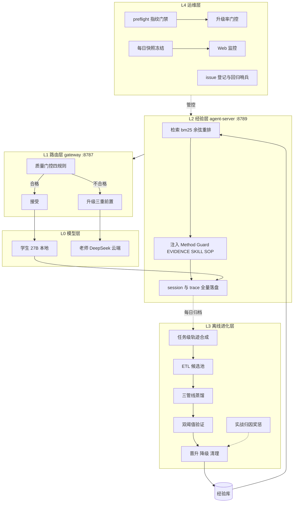

# 经验学习系统概要设计（v2）

日期：2026-08-13

## 1. 设计目标

验证并落地：本地学生模型 Qwen3.5-27B-4bit 加经验学习 harness，在办公自动化域经教师少量指导后逐步独立——重复任务升级率趋近 0，新任务升级率低于 20%。

非目标：token 级 RL 与权重更新；原始轨迹在线回放。

## 2. 总体架构

## 3. 核心机制

### 3.1 质量门控

四条规则顺序判定：invalid_tool_schema、finish_reason_length、empty_output、forced_tool_missing。升级仅执行一次，前置检查依次为 egress 许可、DLP 扫描、预算预留。云端结果不再二次门控。x-gateway 标记与 model_runs 落库双印证。

### 3.2 经验卡机制

五类卡片：EVIDENCE、Method、Guard、SKILL、SOP。生命周期三态：dormant、active、removed。
硬约束：仅 active 可被检索、原始轨迹永不注入、失败经验三层化、晋升双阈值 0.5。

### 3.3 生命周期管理

晋升阈值为准入奖励，dormant 为留观，rescore 降级为惩罚，TTL 与容量上限为淘汰。quality 当前为裁判自评点估计。

### 3.4 检索与注入

bm25 取 top-24，余弦重排取 top-8，无语义解析层。注入开关支持服务级与请求级覆盖。对照臂关闭注入但轨迹照录，双臂走完全相同代码路径。

### 3.5 学习回路触发

触发器为局级胜负。进化进料三路合并：学生轨迹、同局老师胜局、败局对照。C campaign 执行每日批次全量进化。

### 3.6 奖惩机制

| 层面 | 设计 |
|---|---|
| 经验卡 | 晋升、留观、降级、淘汰 |
| 实战归因 | 卡片与任务结果关联，高分任务注入卡加分，连续失败任务注入卡降权；设最小样本阈值防误杀；对照臂差值做因果校准 |
| 元数据 | quality 与 confidence 二元组，置信度随实战证据累积调整 |
| 行为层 | 不做 token 级奖惩 |

## 4. 关键数据流

在线：请求、query 提取、快照检索、注入组装、门控、学生或老师执行、标记与落盘。
离线每日循环：归档、任务级合成、ETL、蒸馏、双阈值验证、晋升、rescore 清理、checkpoint、次日快照换载。
归因：trace 中 retrievedIds 与任务分数关联、卡片奖惩、质量分更新、影响次日检索排序。

## 5. 演进方案

C 阶段完成后逐案请示启动。

| # | 方案 | 目标 | 预估 |
|---|---|---|---|
| 1 | 卡片交付物维度修复 | 消除照卡执行挤占交付本能 | 1-1.5 天 |
| 2 | 实战归因奖惩与置信度 | 消除闸门自评与实效脱钩 | 1-2 天 |
| 3 | 情景标签与检索过滤 | 消除跨域串扰风险 | 0.5-1 天 |
| 4 | 纯 27B 基线重跑 | 获得未被门控污染的能力基线 | 2-4 天 |
| 5 | 管线断点持久化 | 消除失败全量重跑放大器 | 1 天 |

EWC 借鉴的采纳边界：采纳重要性加权、合并蒸馏、双时间尺度、不确定性标注；不采纳原位修正、HMM 情境推断、原始层在线检索、token 级 RL。

## 6. 设计红线

1. 原始轨迹从不直接注入，只有蒸馏并验证后的卡片可进入 prompt。
2. 失败文本不入库，失败轨迹仅作离线归因输入，教训以程序化提取的 Guard 卡沉淀。
3. 晋升阈值 0.5 统一，dormant 在 SQL 层不可见。
4. 评估库与生产库物理隔离。
5. 批次层异常隔离：局部失败降级为观察，永不穿透批次层。
6. 核心指标以 model_runs 与 request_traces 全量为准，拒绝小样本外推。

## 7. 问题台账摘要

待解决三项：门控 length 缺陷、卡片交付物缺陷、管线断点。对应演进方案 4、1 与 2、5。
已解决八项均有回归哨兵值守，一个发布周期无复发后关闭。

Refer：doc/design/2026-08-13-agent-server-system-design-and-issue-inventory.md；doc/design/plans/；doc/issues-snapshot/
