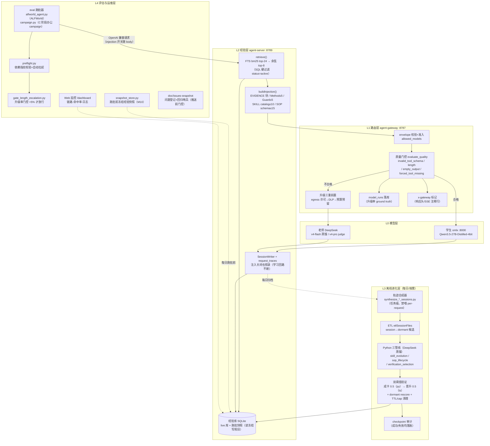
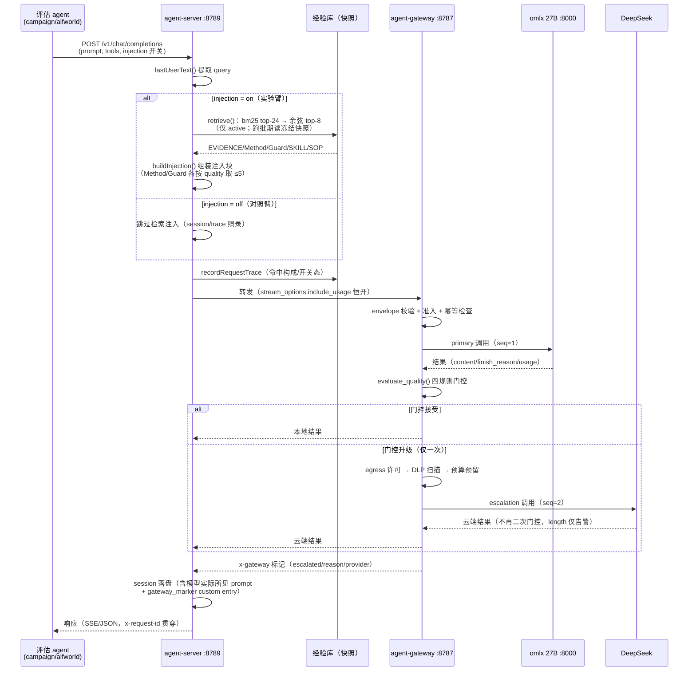
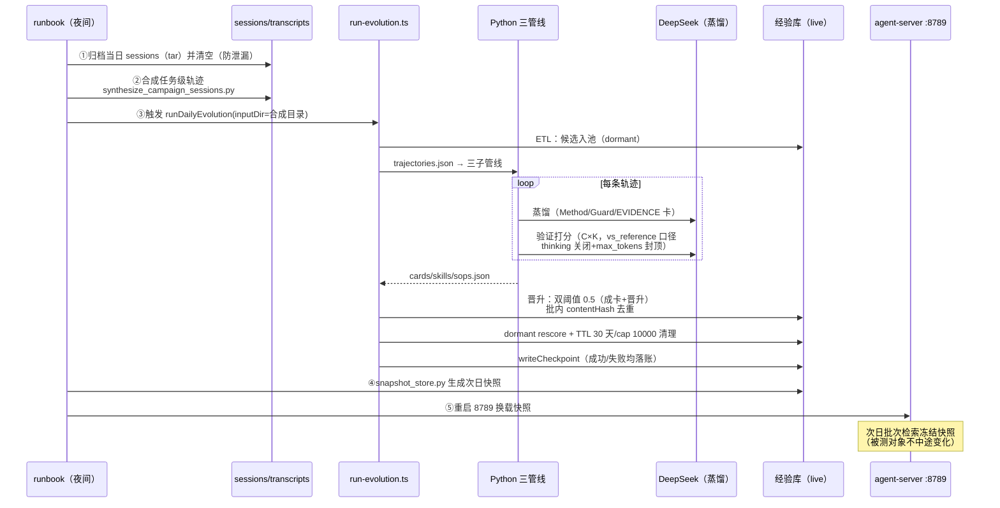

# 2026-08-13 经验学习系统：分层架构 / 时序 / 调用链 / 问题台账

状态：现役系统全量描述（C campaign D6 运行中）。本文取代 08-07 生产线文档成为**标准参照**。
素材来源：`doc/issues-snapshot/`（issue-001~011）、08 月决策记录、函数级代码调研（08-13）。

## 1. 系统总览

本系统验证的命题：**本地学生模型（Qwen3.5-27B）+ 经验学习 harness，能否在办公自动化域经教师少量指导后逐步独立，重复任务升级率趋近 0**。

核心机制闭环：在线执行（经验注入辅助）→ 全量记录（session+trace）→ 离线蒸馏（轨迹→卡片）→ 验证晋升（≥0.5 闸门）→ 回流注入。

四条红线：①原始轨迹从不直接注入 ②失败文本不入库（三层化：归因输入/程序化提取 Guard 卡）③晋升阈值 0.5 统一，dormant 永不可见 ④评估库与生产库物理隔离。

## 2. 分层架构图



层职责与不变量：

| 层 | 职责 | 关键不变量 |
|---|---|---|
| L0 模型 | 执行/教学算力 | 学生本地、老师云端；学生可独立断云运行 |
| L1 路由 | 门控+升级+计量 | 无状态；升级仅一次；云结果不再二次门控（C4） |
| L2 经验 | 检索/注入/记录 | 注入可关（injection=false），记录不可关 |
| L3 进化 | 轨迹→卡片转化 | dormant→active 唯一通道=双阈值验证；输入必须任务级 |
| L4 运维 | 跑批/监控/追溯 | preflight 不过不起跑；升级率门控 <5% 不放行；issue 必带回归哨兵 |

## 3. 时序交互图

### 3.1 在线路径（每次请求，含门控与标记）



### 3.2 离线路径（C campaign 每日夜间循环）



## 4. Call Graph（函数级调用链）

### 4.1 在线请求链（agent-server）

```
server.ts: createServer()
├─ POST /api/stream → handleStream()                    proxy-handler.ts:47
└─ POST /v1/chat/completions                            server.ts:157
     ├─ stream=true：内联管线（retrieve→buildInjection→toOpenAIRequest
     │   →GatewayClient.stream→teeOpenAISSEWithSession→traceStreamCompletion）
     └─ stream=false：handleStream() 收干 SSE 聚合 JSON

handleStream()                                          proxy-handler.ts:47
├─ SessionWriter.writeSessionHeader()                   session-writer.ts:33
├─【分支】injection 开关：body.options?.injection ?? opts.injection ?? true
├─ lastUserText()                                       proxy-handler.ts:130
├─ retrieve(store, query, 8)                            retrieval.ts:12
│   ├─ buildFtsQuery()（CJK 字+bigram）                 retrieval.ts:31
│   ├─ store.search()（FTS5 bm25，status='active'）     experience-store.ts:330
│   └─ cosineScore() 重排 top-8                         retrieval.ts:53
├─ store.recordRequestTrace()                           experience-store.ts:385
├─ logTrace()（stdout + 文件 sink）                     observability.ts:58
├─ buildInjection(context, retrieved, {store})          injection.ts:27
│   ├─【阈值】METHOD_LIMIT=5 / GUARD_LIMIT=5（quality 排序截断）
│   ├─ evidence/Method/Guard 合成块插入最后 user 消息前
│   ├─ buildSkillCatalog(store, 10)                     skill-catalog.ts:9
│   └─ buildSopSchemas(store, 15)（重名请求侧胜出）     sop-schema.ts:8
├─ toGatewayRequest()→toOpenAIRequest()（include_usage 恒开） openai-compat.ts:40
├─ GatewayClient.stream()                               gateway-client.ts:46
├─ validateToolCallStream()（对合并 tools 出站校验）    toolcall-validator.ts:212
├─ recordStreamEvent()（done 时 buildAssistantMessage 回写）
└─ teeWithSessionClose()（终态恰好一次关闭）
```

### 4.2 gateway 路由链

```
api/chat.py: chat_completions()  POST /v1/chat/completions    :751
├─ ChatCompletionEnvelopeV1.model_validate()
├─【分支】model ∉ allowed_models → 403
├─ select_provider() → RouteDecision("omlx")（V1 恒本地优先）  routing.py:26
├─【分支】Idempotency-Key 命中 → 直接回放                     :708
├─ store.create_trace()（queued→leased→run_started）          store/trace_store.py
├─ stream=true → stream_traced_events()                       :567
└─ stream=false → execute_with_escalation()                   :512
     ├─ OmlxProvider.complete()（semaphore 并发闸+httpx）     providers/omlx.py:58
     ├─ record_succeeded_run(seq=1, purpose=primary)          → model_runs 落库
     ├─【分支】evaluate_quality()                             quality.py:86
     │   四规则：invalid_tool_schema / finish_reason_length
     │           / empty_output / forced_tool_missing
     │   escalate=False → ACCEPT 返回
     └─ escalate=True → escalate_to_cloud()（仅一次）         :448
          └─ begin_escalation()                               :321
               ├─ egress 不允许 → 422 local_quality_rejected
               ├─ scan_envelope() DLP 命中 → 403              security/dlp.py
               ├─ BudgetLedger.reserve() 超 cap → 429         store/budget_ledger.py
               └─ KimiProvider.complete()（OpenAI 兼容云端）  providers/kimi.py:69
          └─ finish_escalation()：ledger.reconcile()
               + record_succeeded_run(seq=2, purpose=escalation)
               （C4：云结果不再二次门控，length 仅告警+落库）
└─ 响应：build_openai_response() + x-gateway 标记             :120
```

### 4.3 离线进化链

```
run-evolution.ts: cmdRun()                                   :99
└─ runDailyEvolution(store, {inputDir})                      scheduler.ts:81
   ① etlSessionFiles()（session→dormant 候选）              etl.ts:38
   ② runOfflinePipeline(inputDir, outputDir)                 pipeline.ts:78
      ├─ collectTrajectories()→parseSessionFile()            pipeline.ts:193/206
      ├─ a) skill_evolution.pipeline（无 --benchmark 输出 []）
      │     EvolutionRunner：Analyzer/Retriever/Allocator/Proposer/Evolver
      ├─ b) sop_lifecycle.main()（CONSTRUCTOR→MERGER，epochs=1）
      └─ c) verification_selection.pipeline._cli()           pipeline.py:244
            └─ select_experiences()                          pipeline.py:102
                 ├─ 多轨迹同 task → Verifier.select_best()（PPT 锦标赛）
                 ├─ 单轨迹 → score_pair(vs REFERENCE)（Bradley-Terry）
                 ├─【阈值】quality≥0.5 才 _extract_card()
                 └─ canonicalize(theta=0.82) 入库
   ③ promoteStagedOutputs()                                  verifier.ts:237
      └─ verifyAndCanonicalize()【晋升阈值 0.5】             verifier.ts:58/30
   ④ dormant rescore（--rescore CLI，同口径重打分）
   ⑤ removeDormantBefore()（TTL 30 天 / cap 10000）
   ⑥ writeCheckpoint()（失败时 cmdRun 捕获写 metric=0 失败 ckpt）
```

## 5. 问题台账（issue-001~011）

### 5.1 待解决（open）

| # | 问题 | 根因 | 解决方案 | 状态 |
|---|---|---|---|---|
| 003 | 门控 length 缺陷致 B 阶段两臂 84-87% 误升级 DeepSeek，纯 27B 从未被测 | alfworld max_tokens=200 × 27B 叙述截断 × `finish_reason_length` 无条件升级（quality.py:90） | **重跑方案 A（推荐）**：max_tokens 800 双臂重跑（~4 天）；B：混合口径（0 成本）；C：仅冷库（~2 天）。P0 可观测性修复已落地（x-gateway 标记/门控脚本/指纹校验） | **待解决——等用户拍板方案** |
| 010 | 照卡执行挤占交付本能：注入卡片致重复集分数下滑（0.567→0.378 后回升 0.467） | 蒸馏模板缺"交付物"维度；验证闸门只验程序合理性不验交付产出 | 预列 4 项：①蒸馏模板加 deliverables 字段 ②闸门加交付物产出检查 ③存量卡重蒸馏 ④补"无交付轨迹拦截"回归测试 | **待解决——C 完成后统一修复（用户指令）** |
| 002 余留 | 管线分阶段断点持久化 | 任意阶段失败全量重跑（2-4h/次放大器） | 立项做断点持久化，或降级为已知风险/关闭 | **待解决——C 收口后用户决策** |

### 5.2 已解决（fixed，均带回归哨兵，一个发布周期无复发后转 closed）

| # | 问题 | 修复 | 回归测试 |
|---|---|---|---|
| 001 | Web 命中率 NaN%（snake_case↔camelCase 失配） | 页面字段名修正 | `test/regressions/issue-001` |
| 002 | 进化管线 logprobs 截断/缺 choices（三连故障） | 双 llm_client 重试 + 打分调用 thinking 关闭+max_tokens 封顶（提速 40-100×） | `python/tests/test_issue002_pipeline_resilience.py` |
| 004 | 非流式升级标记双层断裂（假绿） | body 内嵌 x_gateway + 非流式透传 | `test/regressions/issue-004` |
| 005 | 门控脚本无时间窗（永远 FAIL） | `--since`/`--last-hours` JOIN 窗口过滤 | `test_campaign.py` 2 例 |
| 006 | 快照模式写侧去重漏重 | 写路径查询改回 live 库 | `test/regressions/issue-006` |
| 007 | alfworld max_tokens 默认 200（缺陷原值） | 参数改 required（机制性防回退） | `test_alfworld_agent.py` |
| 008 | 单请求超时杀死批次（950s>300s） | timeout 1800s + 4 次退避重试 + 断点续跑 | `test_campaign.py` 3 例 |
| 009 | 工具超时未捕获杀死批次 | TimeoutExpired 转 toolResult 观察 | `test_campaign.py` 1 例 |
| 011 | QCB 评分脚本崩溃杀死批次 | safe_grade 降级 grading_error 行 | `test_campaign.py` 1 例 |

### 5.3 故障模式归纳（台账的元教训）

1. **局部异常穿透批次层**（008/009/011 三例同源）：原则已定——任何局部失败降级为观察，永不穿透批次层。
2. **小样本外推失真**（003 的 147 请求 bisect vs 全量 84%）：升级率必须 model_runs 全量口径核验。
3. **自评通过 ≠ 行为效用**（010）：验证闸门需要面向交付物的 outcome 检查。
4. **观测缺口即盲区**（004/005）：标记断裂造成假绿——标记与 model_runs 互为印证、拒绝只信其一（决议 M1/C2）。

## 6. 当前生效决议摘要（详见各决策记录）

- **失败经验三层化**（08-04）：原始失败文本不入库；败局作归因输入；Guard 卡程序化提取+回放验证（≤5）
- **注入开关与同路径对照**（08-05）：双臂同走 8789，对照臂 injection off；DeepSeek 直连臂例外
- **preflight 门禁 + 指纹校验**（08-05/M11）：跑批必过，模型列表/injection 标志精确匹配
- **C 判据预注册**（08-05）：重复任务升级率 D7≤5%、新任务 <20%，绝对阈值不可后改
- **快照纪律**（M10）：跑批全程检索冻结快照，写照走 live 库
- **门控只观测不改策略**（C4）：云结果不再二次门控，length 规则讨论留 P2
- **升级率全量口径**（08-09）：model_runs 为 ground truth，标记互为印证

Refer Spec：2026-07-18-agent-server-experience-replay-spec.md；2026-08-04-c3-amendment；2026-08-05-injection-toggle/web-monitor/c-campaign-design；2026-08-09-p0-fixes/27b-b-round-findings；doc/issues-snapshot/
