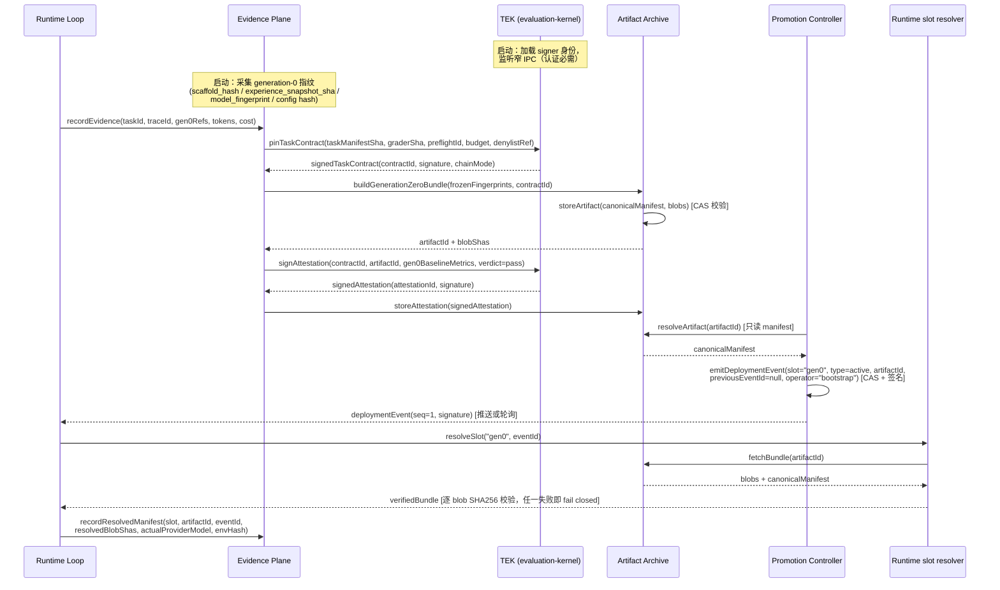

# Phase 0a 架构设计：冻结原则与 fail-closed 合同

日期：2026-08-28
状态：**设计草案（Phase 0a 细化），未授权代码实施、配置切换或真实跑批**
上游：`plans/2026-08-27-self-evolving-engineering-design-plan.md`（§11 Phase 0a 范围、§6 目标架构、§7 核心数据模型、§12.1 合同测试）、`2026-08-28-self-evolving-engineering-design-adversarial-review.md`（最终共识）、`AGENTS.md`（工程约束）
关联前置：`plans/2026-08-27-post-d-adversarial-experiment-redesign-plan.md`（E0/E1、canonical request hash、workspace 树哈希、确认集封存）、`doc/issues-snapshot/issue-023-judge-402-infinite-backoff-stall.md`（账户类错误快速失败）

注：`doc/design/progress/2026-08-28-existing-modules-survey.md` 尚未创建，本文件对现有代码的引用基于直接阅读源码核实的路径与钩子。

---

## 1. 设计目标与范围

### 1.1 目标（Phase 0a 交付）

本阶段只做一件事：把 V3 §11 Phase 0a 的六条要求固化为**可机械验证的架构合同**，不启动任何进化行为。

| # | V3 §11 Phase 0a 条目 | 本阶段交付物 |
|---|---|---|
| P0a-1 | 冻结 M0 不可变面和路径 denylist | M0 清单 + denylist 的机器可读定义；候选进程写入 M0 路径被 OS/容器 capability 拒绝的验证测试 |
| P0a-2 | 定义四个 schema | `artifact_immutable_manifests` / `evaluation_attestations` / `deployment_event_stream` / `runtime_resolved_manifests` 建表 SQL + 约束测试（见 §6） |
| P0a-3 | 固定 TEK 独立私有包/进程/OS 身份/凭据与窄 IPC 边界 | `packages/evaluation-kernel` 包边界、独立进程与 OS 身份、凭据分离、窄 IPC 契约（见 §3、§7） |
| P0a-4 | 定义 bundle builder/registry 合同，机械构建并加载一个 generation-0 bundle | bundle 格式、内容寻址 registry、CAS 拒绝规则、机械构建/加载脚本与验证（见 §3.3、§8 A6） |
| P0a-5 | 把 post-D 的 workspace、trace、确认集、真实 token、issue-023 要求纳入 TEK | 冻结 schema 字段 + TEK 合同字段（见 §6、§8 A10） |
| P0a-6 | 固化当前 active experience/scaffold/model/config 指纹为 generation 0 | 指纹采集脚本、generation-0 基线 bundle、全链可重建验收（见 §8 A7） |

### 1.2 非目标（明确不交付）

- 不实现证据平面的真实采集（Phase 1）；本阶段只冻结其写入 schema 与记录接口。
- 不实现经验候选生成、shadow 评估或任何 operator（Phase 2+）。
- 不实现 scaffold 版本化运行时切换（Phase 3）。
- 不实现 TEK 的 grader/runner 执行能力；TEK 在本阶段只做**合同固定、bundle 验证、attestation 签发与 M0 策略暴露**，评估执行是后续阶段。
- 不裁决任何数值参数（密钥轮换周期、TTL、预算额度等）：全部列为 Phase 0b 预注册项（见 §9）。
- 不修改现有在线行为：`packages/agent/src/agent-loop.ts`、`packages/agent-server/src/retrieval.ts`、`injection.ts` 等现有逻辑在本阶段零改动，只在其旁新增证据/合同写入路径。
- 不建设生产 WORM/KMS 主体；只定义链模式标记与本地诊断链，生产锚定是 0b 项。

### 1.3 与相邻阶段的切分

- **与 Phase 0b**：0a 冻结 schema 与 fail-closed 原则；0b 确认所有运营/数据参数。0a 的 generation-0 基线构建允许使用 `pending_0b` 占位策略引用（§6.1），但**占位本身必须显式出现在 bundle 内**，不得假装已裁决。
- **与 Phase 1**：0a 只定义 `recordEvidence` / `recordResolvedManifest` 的写入合同与表结构；Phase 1 才实现 session/tool event 的结构化采集与对账。
- **与 Phase 3**：统计预注册（效应量、功效、多重比较控制）不在 0b 范围，属 Phase 3 前置；§9 只建台账，不拍数值。

### 1.4 本文件的架构决策（供任务书确认）

| 决策 | 内容 | 依据 |
|---|---|---|
| D1 | 进化控制面数据落独立 `evolution.db`（SQLite，agent-server 数据目录），不写入 `experience-store.ts` 现有库 | V3 §7 建议；现有库（`experiences`/`checkpoints`/`request_traces`，见 `packages/agent-server/src/experience-store.ts`）是经验数据面，控制面与其分离 |
| D2 | TEK 为独立私有包 `packages/evaluation-kernel` + 独立进程 + 独立 OS 身份 + 独立凭据目录；窄 IPC 为本地 Unix domain socket + 每调用认证 | V3 §6.1、§10.2 与对抗审核第 5 轮收口 |
| D3 | bundle = blob 集 + canonical manifest + 签发；`artifact_id = sha256(canonical_manifest + blob_hashes)`；registry 对同 ID 不同内容无条件拒绝（CAS） | V3 §7.1、§8.4、§12.1 |
| D4 | 部署状态一律派生：slot 当前值 = `deployment_event_stream` 按 slot 分组取最大 seq；verdict = attestation 与 revocation 事件派生；任何表不设可变 `status` 列 | 对抗审核第 1 轮必改项 3 |
| D5 | generation-0 使用 `operator='draft'`、`parent_ids=[]`，`evidence_refs` 指向本文件与冻结决策记录 | V3 §7.1 枚举；gen0 无父代 |
| D6 | 每条签名输出（合同/attestation/事件）携带 `chain_mode ∈ {local_diagnostic, worm_anchored}`；本地链不得在任何报告/UI 中宣称防重写 | 对抗审核第 3 轮、V3 §12.1 |

---

## 2. 模块分层架构

### 2.1 层次总图

```text
┌──────────────────────────────────────────────────────────────────────┐
│ M0 不可变面 —— 冻结，任何候选（M1/M2/M3）不得修改                      │
│                                                                      │
│  ┌─────────────────────┐   ┌──────────────────────────────────────┐  │
│  │ TEK                 │   │ 冻结材料（只读挂载 + denylist 强制）   │  │
│  │ packages/           │   │ task manifests · graders · preflight │  │
│  │ evaluation-kernel   │   │ DLP 规则 · budget 定义 · runner       │  │
│  │ 独立进程/OS 身份/    │   │ denylist · M0 路径 denylist           │  │
│  │ 凭据；只开放窄 IPC   │   └──────────────────────────────────────┘  │
│  └─────────┬───────────┘                                              │
│            │ signed attestation / signed contract                     │
│  ┌─────────▼───────────┐   ┌──────────────────────────────────────┐  │
│  │ Promotion Controller│   │ bundle-builder + artifact-registry   │  │
│  │ （audit_writer 凭据）│   │ （对候选只读；CAS 拒绝同 ID 不同内容） │  │
│  └─────────┬───────────┘   └──────────────────────────────────────┘  │
│            │ deployment events（只追加、签名）                         │
├────────────┼─────────────────────────────────────────────────────────┤
│            │ 槽位解析（内容寻址 bundle，禁止从共享工作树加载）           │
│  ┌─────────▼──────────────────────────────────────────────────────┐  │
│  │ 在线执行域                                                      │  │
│  │ Runtime Loop（agent-loop / agent-session / agent-server）       │  │
│  │   ├─ 只消费 slot 解析出的不可变 bundle                           │  │
│  │   └─ 证据单向上送 Evidence Plane（记录，不裁决）                  │  │
│  └─────────┬──────────────────────────────────────────────────────┘  │
│            │ 结构化证据（只追加）                                      │
│  ┌─────────▼──────────────────────────────────────────────────────┐  │
│  │ Evidence Plane                                                 │  │
│  │ session/tool event · 产物哈希 · grader outcome · 真实 token/    │  │
│  │ 成本 · 用户纠正 · 升级事件 · runtime_resolved_manifests          │  │
│  └─────────┬──────────────────────────────────────────────────────┘  │
├────────────┼─────────────────────────────────────────────────────────┤
│            │ 失败簇摘要（最小必要反馈）                                 │
│  ┌─────────▼──────────────────────────────────────────────────────┐  │
│  │ 进化控制域                                                      │  │
│  │ Evolution Controller（packages/agent-server/src/evolution/）    │  │
│  │ 失败簇选择 / 父代选择 / operator / 预算队列 —— 无 TEK 凭据        │  │
│  └─────────┬──────────────────────────────────────────────────────┘  │
│            │ 候选（仅 M1/M2/M3 面）                                    │
│  ┌─────────▼──────────────────────────────────────────────────────┐  │
│  │ Artifact Archive（存储域）                                      │  │
│  │ 内容寻址 blobs + lineage + evolution.db（4 张冻结表 + journal）  │  │
│  └────────────────────────────────────────────────────────────────┘  │
└──────────────────────────────────────────────────────────────────────┘
```

### 2.2 M0/M1/M2/M3 变异面边界

| 面 | 可变对象 | 自动化上限（V3 §6.2） | 0a 阶段的表现形式 | 0a 强制方式 |
|---|---|---|---|---|
| **M0** | TEK、task manifest、grader、preflight、DLP、budget、promotion controller、bundle-builder/registry 写面、路径 denylist | 永久冻结 | 全部进入 denylist；`packages/evaluation-kernel/`、`manifests/`、`graders/` 等路径对候选进程只读 | 独立 OS 身份 + 只读挂载 + capability 拒绝；denylist/静态扫描仅纵深防御（V3 §6.2） |
| **M1** | 经验数据（cards/skills/SOP/检索先验） | 经 TEK attestation 后可自动进严格 shadow，不得自动替换 active | 运行时经 slot 加载快照；0a 只冻结其 gen0 快照指纹 | 快照 SHA 进 generation-0 bundle；写 active 需 deployment event |
| **M2** | scaffold 配置（prompt 片段/检索注入参数/工具启用/compaction/retry） | 自动生成与评估；人工批准 canary/active | 0a 只冻结 scaffold v1 指纹采集范围（§9 P7） | 解析后 canonical 快照，不直接读变化中的文件（V3 §10.3） |
| **M3** | 源码（capability-limited candidate extension / patch） | 仅隔离生成；人工批准每次 canary/merge | 0a 不开放任何源码候选面；denylist 含 `packages/agent/src/agent-loop.ts` 等路径 | 无 M3 通道即无 M3 风险面；后续 Phase 5 单独 Go Gate |

### 2.3 层间单向性

- 在线执行域 → Evidence Plane：**只上送、只追加**；执行域无裁决权。
- Evidence Plane → Evolution Controller：只暴露失败簇**摘要与最小聚合 verdict**（V3 §9.3），不暴露 confirmation 任务内容。
- Evolution Controller → Artifact Archive：只写候选 artifact（M1/M2/M3 面）；对 M0 面（registry 的冻结材料区、TEK）不可达。
- TEK → 一切：只出签名对象（contract / attestation / verification）与 M0 策略快照；不入 controller 进程、不共享内存与凭据。

---

## 3. 部署架构

### 3.1 进程 / 身份 / 凭据图

```text
┌────────────────────────── 宿主机（生产：多租户容器；本地：单机 dev） ──────────────────────────┐
│                                                                                              │
│  OS 用户 pi-run（agent-server / coding-agent 进程）        OS 用户 pi-evo（离线控制器进程）     │
│  ┌──────────────────────────────┐                        ┌──────────────────────────────┐    │
│  │ Runtime Loop                 │   evidence（只追加）   │ Evolution Controller         │    │
│  │ agent-loop / agent-session / │ ───────────────────▶  │ packages/agent-server/       │    │
│  │ agent-server                 │                        │ src/evolution/              │    │
│  │                              │                        │ 无 TEK 凭据；无 M0 写权限    │    │
│  │ slot 解析 → bundle 加载       │                        └──────────────┬───────────────┘    │
│  └──────────────┬───────────────┘                                       │ 窄 IPC（认证）      │
│                 │ resolveSlot / fetchBundle                              │ 仅 6 个方法         │
│                 │ (HTTP/SQLite 只读)                                     ▼                    │
│                 ▼                                      ┌──────────────────────────────────┐  │
│  ┌──────────────────────────────┐   Unix socket       │ OS 用户 pi-tek（独立身份）         │  │
│  │ Artifact Archive             │   mode 0600 + 令牌  │ packages/evaluation-kernel        │  │
│  │ blob store（内容寻址，只读面） │ ◀────────────────── │  ├─ evaluation signer 私钥        │  │
│  │ evolution.db（4 表 + journal）│                     │  ├─ M0 策略/denylist（只读挂载）   │  │
│  │ bundle-builder（写面：仅      │                     │  └─ ipc-server（唯一入口）        │  │
│  │  已批准 manifest 可触发）     │                     └──────────────────────────────────┘  │
│  └──────────────────────────────┘                                          │                │
│                                                                             │ 签名            │
│  ┌──────────────────────────────┐                       ┌──────────────────▼───────────────┐  │
│  │ OS 用户 pi-audit              │                       │ audit writer（独立凭据）         │  │
│  │ deployment_event_stream 写面  │◀──────────────────────│ Promotion Controller             │  │
│  │ （只追加、签名事件、CAS）      │                       └──────────────────────────────────┘  │
│  └──────────────────────────────┘                                                          │
└──────────────────────────────────────────────────────────────────────────────────────────────┘
```

要点：

- **TEK 独立三要素**（对抗审核第 5 轮收口 1）：独立私有包（不进发布集）、独立进程（`ipc-server.ts` 常驻）、独立 OS 身份 `pi-tek` 与独立凭据目录（evaluation signer 私钥只在该目录，`pi-evo`/`pi-run`/`pi-audit` 均无读权限）。
- **evaluation signer 与 audit writer 分权**（V3 §7.7）：前者只签 evaluation attestation，后者只签 deployment/lineage 事件；密钥、权限、轮换、吊销策略分离（轮换参数见 §9 P1）。
- **Evolution Controller 不链接 TEK**：只能经窄 IPC 调用；静态检查（无 `import` 引用 evaluation-kernel 内部符号）与 runtime capability 审计双覆盖（V3 §12.1）。
- **bundle-builder 触发权**：只接受已批准 manifest/blob（本阶段批准人 = 冻结流程脚本）；registry 以内容寻址方式拒绝同 ID 不同内容。

### 3.2 TEK 窄 IPC 边界

- 传输：本地 Unix domain socket（`mode 0600`，属组白名单），生产可换为容器网络内 mTLS 端点；两者接口契约一致（§7）。
- 认证：每次调用携带调用方身份令牌（短期签发，按 OS 身份绑定）；拒绝未认证调用、未知方法、超长载荷。
- 进程内无动态加载、无反射、无内省方法；`ipc-server.ts` 只分发 §7 所列 6 个方法。

### 3.3 bundle builder / registry 内容寻址合同

- **bundle 结构**：`bundle = { blobs[], canonical_manifest.json, signature }`；`artifact_id = sha256(canonical_manifest + blob_hashes)`，`canonical_manifest` 为稳定序列化（键排序、无随机字段）。
- **registry 写入**：`storeArtifact(manifest, blobs)` 先重算 `artifact_id` 并与 manifest 声明比对；存在同 ID 记录时逐 blob 哈希比对，任何不一致即 CAS 冲突 → 拒绝写入并记录冲突事件（V3 §12.1）。
- **registry 读取**：`fetchBundle(artifactId)` 返回 blobs + canonical manifest；加载端（§4 第 17 步）逐 blob 校验 SHA256 后才允许激活。
- **运行时禁止**：从共享工作树解析 active 版本；slot 只指向内容寻址 bundle（对抗审核必改项 4）。
- **generation-0 bundle 内容**：scaffold 指纹、experience 快照 SHA、model_fingerprint、config 指纹、M0 denylist 版本、retention 占位策略引用、`chain_mode` 标记（D6）。

### 3.4 本地开发与生产 WORM 锚定的区别

| 维度 | 本地开发 | 生产 |
|---|---|---|
| 链存储 | `evolution.db` 本地哈希链（seq + 前向哈希） | 事件链 + 周期性锚定到外部 WORM/只读审计域 |
| 签名密钥 | 开发用本地密钥（key_id 前缀 `dev-`） | 独立 KMS/HSM 签发的 evaluation signer / audit writer 密钥 |
| 链模式标记 | `chain_mode = local_diagnostic` | `chain_mode = worm_anchored` |
| 语义承诺 | 只用于断链诊断；**不得**宣称防重写 | 锚定后断链检测才具备防重写语义 |
| 报告约束 | 任何报告/UI 必须携带 chain_mode，禁止本地链冒充生产链（V3 §12.1、对抗审核第 3 轮） | 锚定频率、主体由 Phase 0b 确认（§9 P2） |

---

## 4. 模块时序交互（generation-0 bootstrap）

以下时序对应 V3 §11 Phase 0a 验收场景：一次 generation-0 请求从证据记录到 slot 加载的完整链条。bootstrap 只执行一次；稳态请求只走第 2、14–18 步（slot 解析有缓存，但 resolved manifest 每次如实记录）。



时序要点：

1. 证据记录（第 2 步）在合同固定之前发生：请求先用启动期采集的 gen0 指纹标记自身，证明"该请求属于哪一代合同"（V3 §10.1）。
2. 任务合同（第 3–4 步）由 TEK 固定：task manifest / grader / preflight / budget / denylist 的 SHA 由 TEK 持有并签名，调用方参数不被信任（TEK 自行校验）。
3. 不可变 manifest（第 5–7 步）：bundle-builder 只接受冻结指纹输入；registry CAS 校验后返回内容寻址 `artifactId`。
4. attestation（第 8–10 步）：TEK evaluation signer 对 gen0 基线签发 pass attestation，随 bundle 入库。
5. deployment event（第 11–13 步）：audit writer 独立凭据签发 `active` 事件；`previousEventId=null` 仅允许事件流首事件；slot 状态自此由事件流派生。
6. 加载（第 14–17 步）：runtime 只从 registry 取内容寻址 bundle；blob 校验失败 → 拒绝加载，进程保持上一已加载版本（本场景无上一版本 → 拒绝启动，fail closed）。
7. 真值记录（第 18 步）：实际加载的 blob SHA、实际 provider/model/API 标识、环境快照与对应 event 写入 `runtime_resolved_manifests`，供"slot 声称 vs 进程实际"对账（V3 §7.6）。

---

## 5. 核心调用链说明

| # | 调用链 | 调用方 | 被调用方 | 接口（建议名） | 关键入参 | 关键出参 | 信任边界 |
|---|---|---|---|---|---|---|---|
| C1 | 证据记录 | Runtime Loop（`agent-server` 代理路径） | Evidence Plane（`evolution/evidence-writer`） | `recordEvidence()` | taskId, traceId, artifactRefs(gen0), toolEvents 摘要, tokens, cost, outcome | evidenceId | pi-run → 追加写面；单向只追加，运行域无裁决权 |
| C2 | 任务合同固定 | Evidence Plane（bootstrap 脚本） | TEK `ipc-server` | `pinTaskContract()` | taskManifestSha, graderSha, preflightId, budget{cap}, denylistRef | signedTaskContract{contractId, signature, chainMode} | 跨信任边界：仅窄 IPC；TEK 不信任调用方参数 |
| C3 | generation-0 bundle 构建 | Evidence Plane（bootstrap 脚本） | `evolution/bundle-builder` | `buildGenerationZeroBundle()` | frozenFingerprints, contractId | bundleDescriptor{artifactRefs, blobShas} | builder 只接受已批准 manifest；冻结材料只读 |
| C4 | artifact 存储 | bundle-builder | `evolution/artifact-registry` | `storeArtifact()` | canonicalManifest, blobs | artifactId | 内容寻址：CAS 同 ID 不同内容拒绝；无 status 写入 |
| C5 | attestation 签发 | Evidence Plane（bootstrap 脚本） | TEK evaluation signer | `signAttestation()` | contractId, artifactId, baselineMetrics, verdict | signedAttestation{attestationId, signature} | signer 私钥仅在 pi-tek 凭据目录；controller/run 进程不可达 |
| C6 | deployment event 写入 | Promotion Controller | audit writer（`evolution/promotion-controller` 内） | `emitDeploymentEvent()` | slot, eventType, artifactId, previousEventId, operator, reason | signedEvent{seq, eventId, signature} | audit writer 独立凭据；CAS 对 previousEventId；只追加 |
| C7 | slot 解析 | Runtime Loop | Artifact Archive（只读面） | `resolveSlot()` | slot, eventId | bundleDescriptor + event 派生状态 | 只解析内容寻址 bundle；禁共享工作树（对抗审核必改项 4） |
| C8 | runtime resolved 记录 | Runtime Loop | Evidence Plane | `recordResolvedManifest()` | slot, artifactId, eventId, resolvedBlobShas, actualProviderModel, envHash | resolvedId | 真值来源，与 C1 同域；加载了什么必须如实记录 |

信任边界总则：C2/C5 跨入 M0（TEK 域），其余调用在 M0 的审计/存储设施与运行/控制域之间；任何跨域调用的入参都不得包含凭据、密钥材料或 M0 路径写意图。

---

## 6. 核心数据模型

存储位置：`evolution.db`（独立 SQLite，V3 §7）。时间一律 `INTEGER` epoch ms；数组一律 TEXT JSON（与 `packages/agent-server/src/experience-store.ts` 现有约定一致，如 `retrieved_ids TEXT NOT NULL DEFAULT '[]'`）。四张冻结表 + 两张辅助表（journal、revocation）均为**只追加**：SQLite trigger 拒绝 `UPDATE`/`DELETE`，应用层只暴露 append 方法。

### 6.1 `artifact_immutable_manifests`

| 字段 | 类型 | 约束 | 说明 |
|---|---|---|---|
| `artifact_id` | TEXT | PRIMARY KEY | `sha256(canonical_manifest + blob_hashes)`；内容变化即新 ID |
| `kind` | TEXT | NOT NULL, CHECK IN (`experience_snapshot`,`scaffold_config`,`source_patch`,`composite`) | 变异面对应类型 |
| `parent_ids` | TEXT | NOT NULL DEFAULT `'[]'` | JSON 数组；improve/debug=1 个，crossover≥2；generation-0=`[]` |
| `operator` | TEXT | NOT NULL, CHECK IN (`draft`,`improve`,`debug`,`crossover`,`consolidate`,`rollback`) | D5：gen0=`draft` |
| `scope` | TEXT | NOT NULL | JSON 白名单（允许修改的文件/字段）；gen0 指向冻结路径清单 |
| `evidence_refs` | TEXT | NOT NULL DEFAULT `'[]'` | JSON 数组；失败簇/issue/trace/task ID；gen0=冻结决策记录引用 |
| `scaffold_hash` | TEXT | NOT NULL | system prompt/tools/extensions/settings/code commit 组合哈希 |
| `model_fingerprint` | TEXT | NOT NULL | JSON：生成模型 + 采样合同 |
| `data_class` | TEXT | NOT NULL, CHECK IN (`diagnostic_ops`,`user_content`,`aggregate_only`) | 0a 先冻结最小枚举；gen0 归属与完整枚举集见 §9 P3 |
| `retention_policy_ref` | TEXT | NOT NULL | 指向 bundle 内策略文件；未裁决期间必须指向 `pending_0b` 占位策略（内容自述"未裁决，仅本地保留"） |
| `blob_hashes` | TEXT | NOT NULL | JSON 数组：构成 bundle 的各 blob SHA256（artifact_id 计算输入） |
| `canonical_manifest` | TEXT | NOT NULL | canonical JSON（artifact_id 重建输入，全链可重建的锚点） |
| `created_at` | INTEGER | NOT NULL | epoch ms |

不变性：全表不可 UPDATE/DELETE；无 `status` 列（D4）。同 ID 不同内容由 registry 层 CAS 拒绝（C4）。

### 6.2 `evaluation_attestations` + `attestation_revocations`

`evaluation_attestations`：

| 字段 | 类型 | 约束 | 说明 |
|---|---|---|---|
| `attestation_id` | TEXT | PRIMARY KEY | `sha256(canonical attestation payload)` |
| `artifact_id` | TEXT | NOT NULL, FK → `artifact_immutable_manifests(artifact_id)` | 被评估 artifact |
| `contract_id` | TEXT | NOT NULL | TEK 签发任务合同的 ID（合同本体在 TEK 侧/冻结材料区） |
| `baseline_artifact_id` | TEXT | NULL, FK → 同表 | 配对基线；gen0 为 NULL |
| `task_manifest_sha` | TEXT | NOT NULL | post-D 确认集/任务清单 SHA（V3 §9.3） |
| `grader_sha` | TEXT | NOT NULL | grader 实现 SHA |
| `workspace_tree_sha` | TEXT | NOT NULL | 初始工作树哈希（post-D E0.2；V3 §12.1 worktree 校验） |
| `environment_fingerprint` | TEXT | NOT NULL | 容器/OS/lockfile 组合 SHA |
| `provider_model` | TEXT | NOT NULL | provider/model 标识 |
| `sampling_contract` | TEXT | NOT NULL | JSON：采样参数 canonical（post-D canonical request hash 要求） |
| `metrics_hash` | TEXT | NOT NULL | 机械指标哈希：成功/交付完整性/测试通过/灾难/工具失败/步数/延迟/token/成本/DLP/纠正 |
| `verdict` | TEXT | NOT NULL, CHECK IN (`pass`,`reject`,`quarantine`,`inconclusive`) | 无 `revoked`：撤销走 revocation 事件（V3 §7.2） |
| `real_tokens` | INTEGER | NOT NULL | 真实 token（非估计） |
| `cost_micros` | INTEGER | NOT NULL | 成本（微元） |
| `trace_ref` | TEXT | NOT NULL | 运行 trace 引用 |
| `failure_classification` | TEXT | NOT NULL | 失败分类（unknown 允许） |
| `signer_key_id` | TEXT | NOT NULL | evaluation signer 密钥 ID |
| `signature` | TEXT | NOT NULL | base64 签名 |
| `attested_at` | INTEGER | NOT NULL | epoch ms |

`attestation_revocations`（辅助表，V3 §7.2"撤销旧裁决必须另发 revocation event"）：

| 字段 | 类型 | 约束 | 说明 |
|---|---|---|---|
| `attestation_id` | TEXT | PRIMARY KEY, FK → `evaluation_attestations` | 被撤销的 attestation（一条 attestation 至多一次撤销，重复撤销拒绝） |
| `reason` | TEXT | NOT NULL | 撤销原因 |
| `revoker_key_id` | TEXT | NOT NULL | 撤销主体密钥 ID |
| `signature` | TEXT | NOT NULL | base64 签名 |
| `revoked_at` | INTEGER | NOT NULL | epoch ms |

裁决派生规则：`verdict_effective(attestation) = revoked ? "revoked" : verdict`；任何读取路径必须实现该派生，禁止改历史行。

### 6.3 `deployment_event_stream`

| 字段 | 类型 | 约束 | 说明 |
|---|---|---|---|
| `event_id` | TEXT | PRIMARY KEY | `sha256(canonical event payload)` |
| `seq` | INTEGER | NOT NULL, UNIQUE | 全局单调序号；断号=断链（fail closed，§10） |
| `slot` | TEXT | NOT NULL | 如 `experience.active` / `scaffold.canary` |
| `event_type` | TEXT | NOT NULL, CHECK IN (`shadow`,`canary_pending_approval`,`canary`,`active_pending_approval`,`active`,`rollback`,`quarantine`,`reject`) | V3 §8.4 状态机 |
| `artifact_id` | TEXT | NOT NULL, FK → `artifact_immutable_manifests` | 事件目标 |
| `previous_event_id` | TEXT | NULL, FK → 本表 | CAS 比较对象；NULL 仅允许 `seq=1` |
| `previous_artifact_id` | TEXT | NULL | 上一 artifact（冗余，便于派生比对） |
| `operator` | TEXT | NOT NULL | 操作者（`bootstrap` / controller 身份 / `human:<id>`） |
| `reason` | TEXT | NOT NULL | 原因（引用决策记录或批准包） |
| `key_id` | TEXT | NOT NULL | audit writer 密钥 ID |
| `signature` | TEXT | NOT NULL | base64 签名 |
| `occurred_at` | INTEGER | NOT NULL | epoch ms |

约束：只追加；**slot 当前状态 = 按 slot 分组取最大 seq 的事件**（派生视图，D4）；写入须 CAS 匹配 `previous_event_id`（首个事件必须 `previous_event_id IS NULL`）；状态机非法跳转（如无 shadow 直接 active）由 promotion 状态机拒绝（V3 §12.1）。

### 6.4 `runtime_resolved_manifests`

| 字段 | 类型 | 约束 | 说明 |
|---|---|---|---|
| `resolved_id` | TEXT | PRIMARY KEY | `sha256(task_id + slot + resolved_at)` |
| `task_id` | TEXT | NOT NULL | 任务 ID |
| `slot` | TEXT | NOT NULL | 加载的槽位 |
| `artifact_id` | TEXT | NOT NULL, FK → `artifact_immutable_manifests` | slot 声称的 artifact |
| `deployment_event_id` | TEXT | NOT NULL, FK → `deployment_event_stream` | 对应部署事件 |
| `resolved_blob_shas` | TEXT | NOT NULL | JSON 数组：实际加载 blob 的 SHA256（逐 blob 校验后记录） |
| `resolved_scaffold_hash` | TEXT | NOT NULL | 实际解析出的 scaffold 哈希 |
| `actual_provider_model` | TEXT | NOT NULL | 实际 provider/model 标识（与 manifest 声明可不同） |
| `actual_api_identifier` | TEXT | NOT NULL | 端点指纹；provider 不暴露版本时标记 `external_drift/unknown`（V3 §8.3） |
| `env_snapshot_hash` | TEXT | NOT NULL | 环境快照哈希 |
| `drift_flag` | TEXT | NOT NULL, CHECK IN (`none`,`external_drift_unknown`,`external_drift_non_reproducible`,`slot_mismatch`) | 对账标记；`slot_mismatch` 由对账查询派生写入 |
| `resolved_at` | INTEGER | NOT NULL | epoch ms |

索引：`UNIQUE(task_id, slot, resolved_at)`；对账查询：按 `(task_id, slot)` 联查 deployment_event_stream，`artifact_id` 不一致即 `slot_mismatch` 告警（V3 §7.6）。

### 6.5 `evolution_journal`（操作辅助表，crash 恢复）

| 字段 | 类型 | 约束 | 说明 |
|---|---|---|---|
| `journal_id` | INTEGER | PRIMARY KEY AUTOINCREMENT | 顺序号 |
| `operation` | TEXT | NOT NULL | 操作名（store_artifact / emit_event / record_resolved ...） |
| `payload_hash` | TEXT | NOT NULL | 操作载荷哈希 |
| `state` | TEXT | NOT NULL, CHECK IN (`written`,`committed`) | `written`=半截，不得视为成功（V3 §12.1） |
| `created_at` | INTEGER | NOT NULL | epoch ms |

恢复规则：启动时扫描 `state='written'` 记录 → 回放或丢弃（按操作幂等规则）；任何恢复路径不得把 `written` 当 `committed`。

---

## 7. TEK 窄 IPC/API 契约草案

以下为接口契约（TypeScript 风格签名，非实现）。传输层见 §3.2；所有方法均要求认证，入参缺任一必填字段即拒绝（fail closed）。

```ts
// packages/evaluation-kernel/src/ipc/contract.ts（草案）
// 本文件是 TEK 对外唯一接口面；evaluation-kernel 其余模块不对外。

type ArtifactId = string;      // sha256 hex
type SlotName = string;        // 如 "experience.active"
type KeyId = string;
type Signature = string;       // base64
type ChainMode = "local_diagnostic" | "worm_anchored";

interface Budget {
  tokensCap: number;           // 上限值由 Phase 0b 预注册，0a 只固定字段
  costCapMicros: number;
  wallTimeCapMs: number;
}

interface PinTaskContractRequest {
  taskManifestSha: string;     // 任务清单 SHA（含确认集 denylist 引用，post-D）
  graderSha: string;           // grader 实现 SHA
  preflightId: string;         // preflight 清单版本（含余额检查项，issue-023）
  budget: Budget;
  denylistRef: string;         // runner denylist / M0 路径 denylist 版本
}

interface SignedTaskContract {
  contractId: string;          // sha256(canonical contract payload)
  payload: string;             // canonical JSON（全链重建输入）
  signerKeyId: KeyId;
  signature: Signature;
  chainMode: ChainMode;
}

interface VerifyBundleRequest {
  artifactId: ArtifactId;
  blobShas: string[];          // 实际持有 blob 的 SHA256 列表
  manifest: string;            // canonical manifest JSON
}

interface BundleVerification {
  verified: boolean;
  checks: {
    blobs: boolean;            // blobShas 与 manifest 声明一致
    manifestId: boolean;       // 重算 artifact_id 与声明一致
    m0Denylist: boolean;       // manifest 无 M0 路径/字段触碰
    signature: boolean;        // bundle 签名有效
  };
  failReason?: "hash_mismatch" | "id_mismatch" | "denylist_hit"
    | "signature_invalid" | "missing_field";
}

interface SignAttestationRequest {
  contractId: string;
  artifactId: ArtifactId;
  baselineArtifactId?: ArtifactId;   // gen0 缺省
  workspaceTreeSha: string;          // post-D E0.2
  metrics: {
    success: number;
    deliveryCompleteness: number;
    disaster: number;                // 灾难率（含零事件上界标记）
    toolFailures: number;
    realTokens: number;              // 真实 token
    costMicros: number;
  };
  traceRef: string;
  failureClassification: string;
  verdict: "pass" | "reject" | "quarantine" | "inconclusive";
}

interface SignedAttestation {
  attestationId: string;
  payload: string;
  signerKeyId: KeyId;
  signature: Signature;
  chainMode: ChainMode;
}

interface VerifyAttestationRequest {
  attestationId: string;
  payload: string;
  signature: Signature;
  signerKeyId: KeyId;
}

interface VerificationResult {
  valid: boolean;
  reason?: "bad_signature" | "unknown_key" | "revoked"
    | "chain_break" | "ok";
}

interface M0PolicySnapshot {
  policyVersion: string;
  denylistSha: string;
  immutablePaths: string[];    // M0 路径清单（只读挂载 + capability 拒绝）
  chainMode: ChainMode;
}

interface TekHealth {
  status: "ok";
  ipcVersion: number;          // 契约版本；不匹配的调用方拒绝
  signerKeyId: KeyId;
  chainMode: ChainMode;
}

interface TekApi {
  health(): Promise<TekHealth>;
  pinTaskContract(req: PinTaskContractRequest): Promise<SignedTaskContract>;
  verifyBundle(req: VerifyBundleRequest): Promise<BundleVerification>;
  signAttestation(req: SignAttestationRequest): Promise<SignedAttestation>;
  verifyAttestation(req: VerifyAttestationRequest): Promise<VerificationResult>;
  getM0Policy(): Promise<M0PolicySnapshot>;
}
```

契约规则：

- 无批量、无分页、无内省方法；每次调用独立认证，无长会话状态。
- `ipcVersion` 不匹配 → 调用方必须拒绝连接（fail closed），防止新旧契约混跑。
- 所有 `chainMode` 输出随签名对象传递；消费方展示/报告必须透传该标记（D6）。
- 本阶段不暴露 grader 执行、runner 或候选生成接口——那些是后续阶段的横向扩展，需重新评审契约。

---

## 8. Phase 0a 验收标准

对齐 V3 §11 Phase 0a 六条交付与 §12.1 合同测试；每条可机械验证。

| # | 验收项 | 对应要求 | 验证方式 |
|---|---|---|---|
| A1 | M0 冻结生效 | §11 P0a-1 | 测试：以 M1/M2/M3 候选身份运行的进程对 `packages/evaluation-kernel/`、`manifests/`、`graders/`、`preflight/`、DLP/budget 定义、promotion controller 源码的写被 OS 身份/capability 拒绝；静态 import 扫描确认 controller 不引用 kernel 内部符号；两项同时通过才算过（V3 §12.1 双覆盖） |
| A2 | 四 schema 冻结 | §11 P0a-2 | `evolution.db` 建表脚本 + 约束测试：NOT NULL/CHECK/FK/UNIQUE 生效；`UPDATE`/`DELETE` 被 trigger 拒绝；缺任一必填字段的写入返回明确拒绝原因 |
| A3 | canonical 哈希 | §12.1 | 单元测试：同内容同 `artifact_id`；任一语义字段变化（含 `scope`、`model_fingerprint`、blob 内容）hash 必变；canonical 序列化稳定（键排序、无时间戳噪声） |
| A4 | TEK 独立与分权 | §11 P0a-3、§12.1 | 进程测试：kernel 以独立 OS 身份 `pi-tek` 启动；`pi-evo`/`pi-run` 无凭据目录读权限；evaluation signer 与 audit writer 密钥目录分离；controller 进程无 kernel 内存/密钥可达路径 |
| A5 | 窄 IPC 生效 | §11 P0a-3 | 契约测试：未认证调用拒绝；未知方法拒绝；`ipcVersion` 不匹配拒绝；`PinTaskContractRequest` 缺任一字段返回 `missing_field` |
| A6 | bundle builder/registry | §11 P0a-4、§12.1 | 机械脚本：一条命令完成"冻结指纹 → generation-0 bundle 构建 → registry 存储 → 加载校验"；CAS 测试：同 ID 不同 blob 内容写入被拒并留冲突事件；加载端 blob 校验失败拒绝激活 |
| A7 | generation-0 全链重建 | §11 验收原文 | 端到端测试：给定一次 generation-0 请求的 `task_id`，机械重建完整合同——`artifact_id`、`scaffold_hash`、experience 快照 SHA、task manifest SHA、grader SHA、budget、deployment event、resolved manifest 逐项对账一致；任何缺字段 fail closed |
| A8 | 部署状态机与 CAS | §12.1 | 测试：slot 状态仅从事件流最大 seq 派生；无 `shadow` 直接 `active` 被拒；`previous_event_id` 不匹配被拒；重复 `seq` 被拒；`seq` 断号被检出并置 fail-closed 状态 |
| A9 | 链语义诚实 | §12.1 | 测试：本地开发链产物 `chain_mode=local_diagnostic`；任何报告/导出路径不得声称 WORM 防重写；轮换后旧 key 事件仍可验证或被显式吊销 |
| A10 | post-D / issue-023 纳入 | §11 P0a-5 | 检查：`workspace_tree_sha`、`trace_ref`、确认集 denylist 引用、`real_tokens`/`cost_micros` 在冻结 schema 内；`PinTaskContractRequest.preflightId` 指向含余额检查与账户类错误快速失败条目的 preflight 清单（对照 `doc/issues-snapshot/issue-023-judge-402-infinite-backoff-stall.md` 待修清单前两项；数值参数见 §9 P8） |
| A11 | crash 恢复 | §12.1 | 测试：写入中途 kill 进程，重启后 `state='written'` 记录不被当作成功；幂等重放后状态一致；`state='committed'` 记录不重复写入 |

## 9. Phase 0b 待预注册参数清单

以下参数**全部需要责任人确认**，本阶段不拍数值。每项给出确认前的 fail-closed 默认行为（= 未裁决则该能力不可用，且不冒充已冻结）。

| # | 参数 | 需要确认的内容 | 出处 | 确认前 fail-closed 默认 |
|---|---|---|---|---|
| P1 | 签名密钥运营 | evaluation signer / audit writer 的轮换周期、吊销传播、旧 key 事件验证窗口 | V3 §11 Phase 0b、§18.7 | 密钥不轮换（单 key 持续有效）；吊销仅支持显式 revocation 事件 |
| P2 | 生产 WORM 主体 | 运营主体、锚定频率、锚定存储选型 | 对抗审核第 3 轮、V3 §11 Phase 0b | `chain_mode` 恒为 `local_diagnostic`；不宣称生产锚定 |
| P3 | data class | 完整枚举集、各类 TTL/legal hold 依据/erasure/tombstone/聚合粒度/冷存；generation-0 的 class 归属 | 对抗审核第 4 轮、V3 §7.7 | gen0 的 `retention_policy_ref` 指向 `pending_0b` 占位策略（仅本地保留）；不删除、不外发 |
| P4 | shadow 预算 | 按 artifact 类的 token/金额/wall-time/worker 上限、耗尽动作（暂停/拒绝）、扩额人与流程 | V3 §11 Phase 0b、§13 | 无预配置预算 = 无 shadow 运行；任何耗尽可能使评估终止而非挂起（issue-023 教训） |
| P5 | 构建/运行例外 | signed dependency exception manifest 审批人、有效期限；内部镜像清单；运行端点清单；短期 capability 白名单 | V3 §11 Phase 0b、§13、对抗审核第 5 轮收口 2 | 默认 hermetic；无签名例外 = 禁止新增依赖/端点/能力 |
| P6 | candidate ABI 扩大 | capability 扩大顺序、每类批准人、每次 Go Gate 的证据要求 | V3 §11 Phase 0b、对抗审核第 4 轮 | 0a 无任何 M3 通道；不扩大即不开放 |
| P7 | generation-0 指纹范围 | 指纹采集清单确认：配置文件集合、`experience.db` 快照范围（active 全量 vs 仅 active）、extensions/skills 是否纳入 `scaffold_hash` | V3 §11 P0a-6 | 采集范围 = bootstrap 脚本默认清单；未列入清单的路径不进 gen0 指纹，报告如实标注覆盖范围 |
| P8 | issue-023 数值 | 账户类错误（402/401/403）快速失败判定、退避上限、preflight 余额阈值、停滞告警阈值 | `doc/issues-snapshot/issue-023-*.md` 待修清单 | 余额未知 = preflight 拒绝开跑；账户类错误单次失败即终止并告警，不重试 |
| P9 | 确认集表达粒度 | post-D 已封存的 20 个从未执行任务清单 + SHA256 在 TEK 合同中的表达粒度（denylist 生效范围） | post-D 计划 §154–155、V3 §11 P0a-5 | 确认集引用进 `PinTaskContractRequest.taskManifestSha`；denylist 未冻结前不得声明确认集受保护 |
| P10 | 统计参数台账 | 最小实用收益/非劣界/灾难率上界、功效与样本量（Phase 3 预注册用） | V3 §9.2、§18.5 | 本阶段只建台账；任何 attestation 的 `metrics` 不得被解释为统计结论 |

登记规则：P1–P9 为 Phase 0b 阻塞项（未确认前进入 0b 不结束）；P10 为跨阶段台账项。任何未裁决项不得被计入 generation-0 已冻结合同（V3 §11 Phase 0b 验收）。

---

## 10. 风险与 fail-closed 行为

### 10.1 核心调用链的失败模式（C1–C8 对应 §5）

| 调用链 | 缺字段 | 签名失败 | CAS 冲突 | 断链 |
|---|---|---|---|---|
| C1 证据记录 | 拒绝写入，返回字段级错误；请求继续但该任务无证据可对账 | 不适用（记录域无签名） | 不适用；同 `resolved_id` 重复写入拒绝（幂等） | 不适用；journal `written` 半截记录恢复时丢弃 |
| C2 合同固定 | TEK 返回 `missing_field`，不签发 | 签发失败→调用方拒绝使用该合同；无合同=无 attestation 资格 | 不适用 | 不适用（合同是单对象，非链） |
| C3/C4 bundle 构建/存储 | bundle-builder 拒绝构建，列出缺失指纹 | bundle 签名无效 → registry 拒收 | **同 ID 不同内容 → 拒绝写入 + 冲突事件入库**；加载端发现已存内容与声明不符 → 拒绝加载 | 不适用 |
| C5 attestation 签发 | 拒绝签发；gen0 缺 `baselineArtifactId` 允许（NULL 合法） | 签名无效 → attestation 不入库；伪造/错 key 的 attestation 被 `verifyAttestation` 拒绝 | 不适用；同一 payload 幂等（同 `attestation_id`） | 不适用；吊销事件缺失不算断链，但 `verdict_effective` 必须派生 |
| C6 deployment event | 拒绝写入；`previous_event_id` 缺省仅限 `seq=1` | 签名无效 → 事件不入库；事件流整体不可用时不产生"无签名激活"回退 | **`previous_event_id` 不匹配 → 拒绝（并发写者互斥）**；同 `seq` 重复写入拒绝 | **`seq` 断号 → 派生视图标记 fail-closed**：该 slot 视为未知状态，不允许基于该 slot 做任何晋升裁决 |
| C7 slot 解析 | 事件缺 artifact 引用 → 解析失败，保持上一版本 | bundle 签名校验失败 → 拒绝加载 | 见 C3/C4 | 事件流断链时 slot 状态未知 → 拒绝加载新版本（保留已加载版本） |
| C8 resolved 记录 | 拒绝写入；缺 `actual_provider_model` 等任一字段 → 该任务 resolved 对账不可用，标记 `slot_mismatch` 候选 | 不适用 | 不适用；`UNIQUE(task_id, slot, resolved_at)` 幂等 | 引用不存在的 `deployment_event_id` → FK 拒绝，fail closed |

### 10.2 全局 fail-closed 规则

| 风险 | 触发 | 行为 |
|---|---|---|
| TEK 进程不可用 | `health()` 无响应/认证失败 | 控制器与 bootstrap 全部暂停：不生成、不签发、不晋升；**无任何降级到"无签名继续"的路径** |
| 预算耗尽（issue-023 教训） | 余额/预算达到上限 | 评估终止并响亮告警；不无限退避、不静默挂起；`preflightId` 对应清单含余额检查项（§8 A10） |
| 工作树漂移 | `workspace_tree_sha` 与启动时初始树不一致 | 评估拒绝开始（V3 §12.1）；运行时从不从工作树解析 slot |
| 本地链误报 | 消费方未透传 `chain_mode` | 所有签名对象携带 `chain_mode`；显示层缺失标记视为展示错误（A9 测试覆盖） |
| 状态机非法跳转 | 无前置事件直接 `active` 等 | 写入被拒（§6.3 CHECK + 状态机校验） |
| 外部漂移 | provider 不暴露版本 | `drift_flag=external_drift_unknown`；不得宣称复现成功（V3 §8.3） |
| 半截写入 | 进程中断 | journal 恢复，`written` 不算成功（A11） |
| 多写者竞态 | 两个控制器同时写同一 slot | CAS（`previous_event_id`）拒绝后写者；事件流 seq 单调保证单一事实 |

---

## 附：引用文件

现有代码（已核实路径）：

- `packages/agent/src/agent-loop.ts`：在线双层 loop；turn hooks（`prepareNextTurn` / `transformContext` / `beforeToolCall` / `afterToolCall` / `shouldStopAfterTurn`）为 Phase 1 证据采集接入点，0a 不修改。
- `packages/agent/src/harness/agent-harness.ts`：context/tool/session hooks 与 turn refresh。
- `packages/coding-agent/src/core/agent-session.ts`：session 持久化、extension、compaction、retry。
- `packages/agent-server/src/experience-store.ts`：现有经验库（`experiences` / `checkpoints` / `request_traces` 表）与 SQLite 用法；`evolution.db` 独立于它（D1）。
- `packages/agent-server/src/offline/scheduler.ts`、`offline/pipeline.ts`、`offline/verifier.ts`、`offline/checkpoint.ts`：离线进化管线，Phase 2 接为 M1 candidate generator；0a 只冻结其输出进入 artifact 的合同。
- `packages/agent-server/src/retrieval.ts`、`injection.ts`：在线检索/注入（M2 面对象）；0a 只采集其参数指纹。

设计文档：

- `doc/design/plans/2026-08-27-self-evolving-engineering-design-plan.md`（V3；§11 Phase 0a/0b、§6、§7、§12.1、§18）
- `doc/design/2026-08-28-self-evolving-engineering-design-adversarial-review.md`（对抗审核；最终共识与残余参数）
- `doc/design/plans/2026-08-27-post-d-adversarial-experiment-redesign-plan.md`（post-D；E0.2 workspace 树哈希、canonical request hash、确认集封存 §154–155）
- `doc/issues-snapshot/issue-023-judge-402-infinite-backoff-stall.md`（余额耗尽/无上限退避教训；待修清单）
- `doc/design/plans/2026-07-31-agent-self-evolution-roadmap.md`、`plans/2026-08-11-self-improve-skill-plan.md`（上游路线图）

说明：按 `doc/design/plans/` 目录规范，本文件应与 `doc/design/INDEX.md` 登记同 commit；本次仅输出本文件，INDEX.md 登记与后续 commit 由用户决定。
