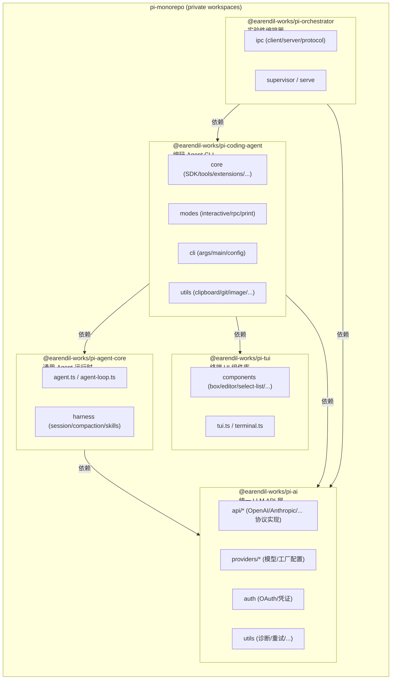
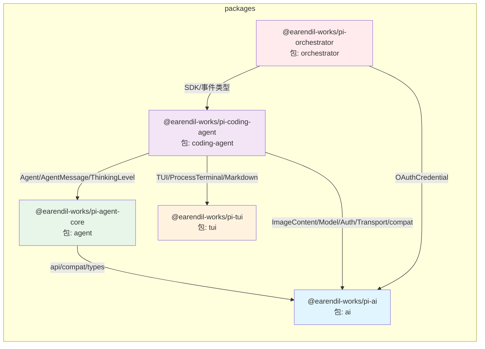
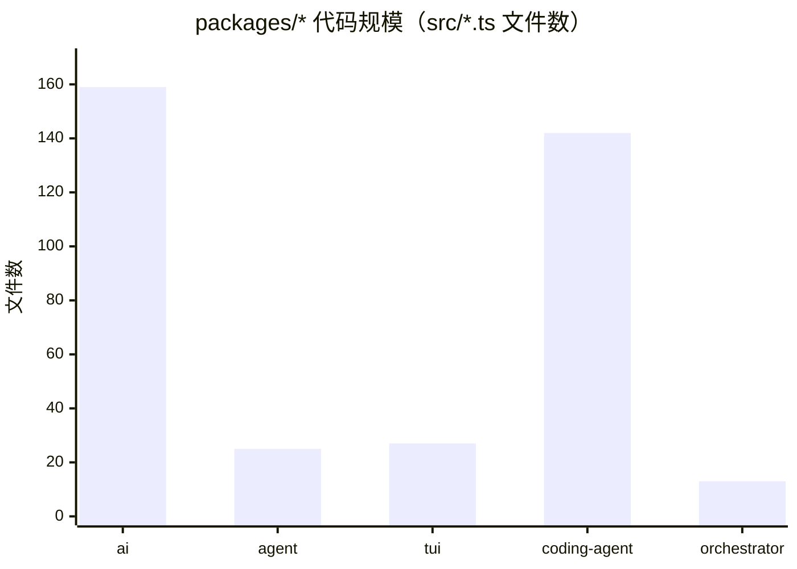
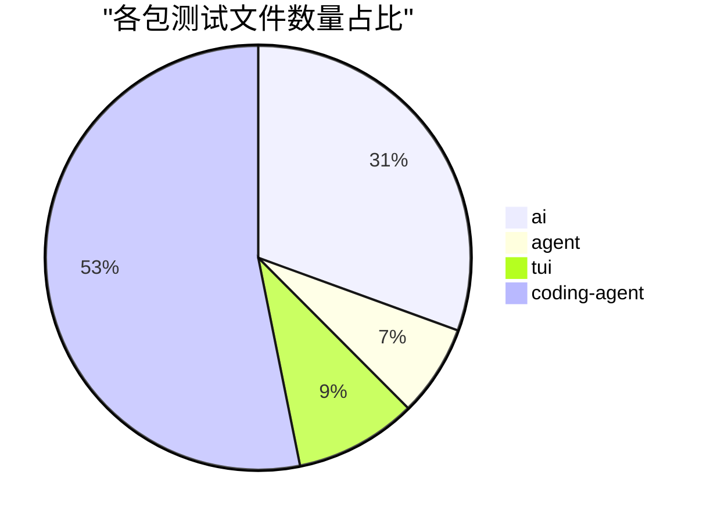
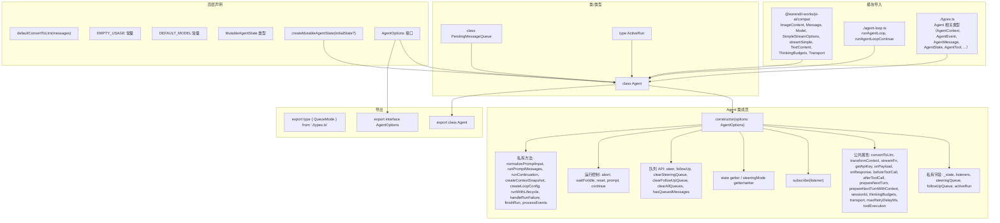
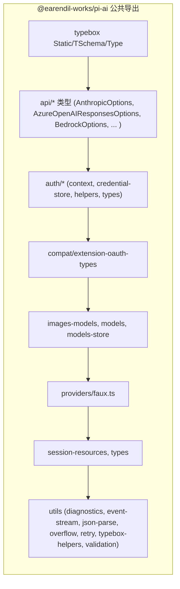

# pi monorepo 架构与工程分析图

> 基于 `/Volumes/extdisk-8t/workspace/01-repo/03-agent-harness-repo/pi` 静态扫描生成，仅使用仓库内 `package.json` 与源码文件信息，未安装依赖或运行长时间命令。

---

## 1. 顶层架构图



---

## 2. Package 依赖/调用交互图



### 关键跨包调用示例（从源码 import 扫描）

| 调用方 | 被调用方 | 说明 |
|--------|----------|------|
| `agent` | `ai` | `agent.ts` 使用 `streamSimple`/`Message`/`Model`；harness 各模块使用 `Model`、`Usage`、`ImageContent` 等 |
| `coding-agent` | `agent` | `sdk.ts` 使用 `Agent`；`session-manager.ts` 使用 `AgentMessage`/`uuidv7`；大量组件使用 `ThinkingLevel` |
| `coding-agent` | `ai` | `model-registry.ts` 使用 `Api`/`Model`；`interactive-mode.ts` 使用 `AuthEvent`/`AuthPrompt`/`compat` 类型；`bun/cli.ts` 使用 `bun-oauth` |
| `coding-agent` | `tui` | `startup-ui.ts` 使用 `ProcessTerminal`/`TUI`；`tools/*.ts` 使用 `Text`/`Container` 组件；`components` 目录大量 import TUI |
| `orchestrator` | `coding-agent` | `handler.ts`/`supervisor.ts`/`ipc/*.ts`/`rpc-process.ts` 均使用 `pi-coding-agent` 的 SDK/事件类型 |
| `orchestrator` | `ai` | `radius.ts` 使用 `OAuthCredential` |

---

## 3. 工程分析图

### 3.1 各包规模对比



### 3.2 测试覆盖比例



### 3.3 工程指标表

| 包 | src 文件数 | test 文件数 | 主要入口文件 | 说明 |
|----|-----------:|------------:|--------------|------|
| `@earendil-works/pi-ai` | 159 | 92 | `packages/ai/src/index.ts` | 统一 LLM API、Provider 工厂、OAuth |
| `@earendil-works/pi-agent-core` | 25 | 21 | `packages/agent/src/index.ts` | 通用 Agent 状态机与循环 |
| `@earendil-works/pi-tui` | 27 | 28 | `packages/tui/src/index.ts` | 差分渲染 TUI 组件 |
| `@earendil-works/pi-coding-agent` | 142 | 160 | `packages/coding-agent/src/index.ts` / `src/cli.ts` / `src/main.ts` | 编码 Agent CLI/SDK |
| `@earendil-works/pi-orchestrator` | 13 | 0 | `packages/orchestrator/src/index.ts` / `src/cli.ts` | 实验性编排进程 |

> 注：文件数按 `packages/*/src/**/*.ts` 与 `packages/*/test/**/*.ts` 统计，包含 `.test.ts` 与部分测试辅助脚本；未包含 `docs/`、`examples/` 与 `native/` 二进制资源。

---

## 4. 关键文件 AST 结构：packages/agent/src/agent.ts



### 结构摘要（文本树）

```text
packages/agent/src/agent.ts
├── imports
│   ├── @earendil-works/pi-ai/compat
│   ├── ./agent-loop.ts
│   └── ./types.ts
├── top-level
│   ├── defaultConvertToLlm()
│   ├── EMPTY_USAGE
│   ├── DEFAULT_MODEL
│   ├── type MutableAgentState
│   ├── createMutableAgentState()
│   └── interface AgentOptions
├── classes
│   ├── class PendingMessageQueue
│   │   ├── enqueue, hasItems, drain, clear
│   ├── type ActiveRun
│   └── class Agent
│       ├── private _state / listeners / steeringQueue / followUpQueue / activeRun
│       ├── public properties (convertToLlm, streamFn, hooks, etc.)
│       ├── constructor(options)
│       ├── subscribe(listener)
│       ├── state getter / steeringMode getter/setter
│       ├── queue APIs (steer, followUp, clear...)
│       ├── lifecycle (abort, waitForIdle, reset, prompt, continue)
│       └── private helpers (runPromptMessages, createLoopConfig, runWithLifecycle, processEvents, ...)
└── exports
    ├── type QueueMode
    ├── interface AgentOptions
    └── class Agent
```

---

## 5. 关键文件 AST 结构：packages/ai/src/index.ts（补充）



---

*生成时间：2026-07-17（基于仓库当前 HEAD 静态扫描）。*
