# pi monorepo 架构与调用关系图

> 基于 `/Volumes/extern-1T-hardisk/workspace/01-repo/03-agents/Turbo-pi` 当前 HEAD 静态分析生成（读取 `package.json`、源码 import 与关键实现文件）。
> 包含 4 类图：**架构图（§1）**、**模块划分图（§2）**、**Call Graph（§3）**、**模块职责描述（§4）**，附工程指标（§5）。

---

## 1. 顶层架构图

7 个包分四层：**模型接入层**（pi-ai）→ **运行时层**（pi-agent-core）→ **应用层**（pi-coding-agent / pi-tui）→ **周边系统**（orchestrator、agent-server、agent-gateway）。后两者不在 npm workspace 依赖链上，通过 HTTP/RPC 进程协议对接。

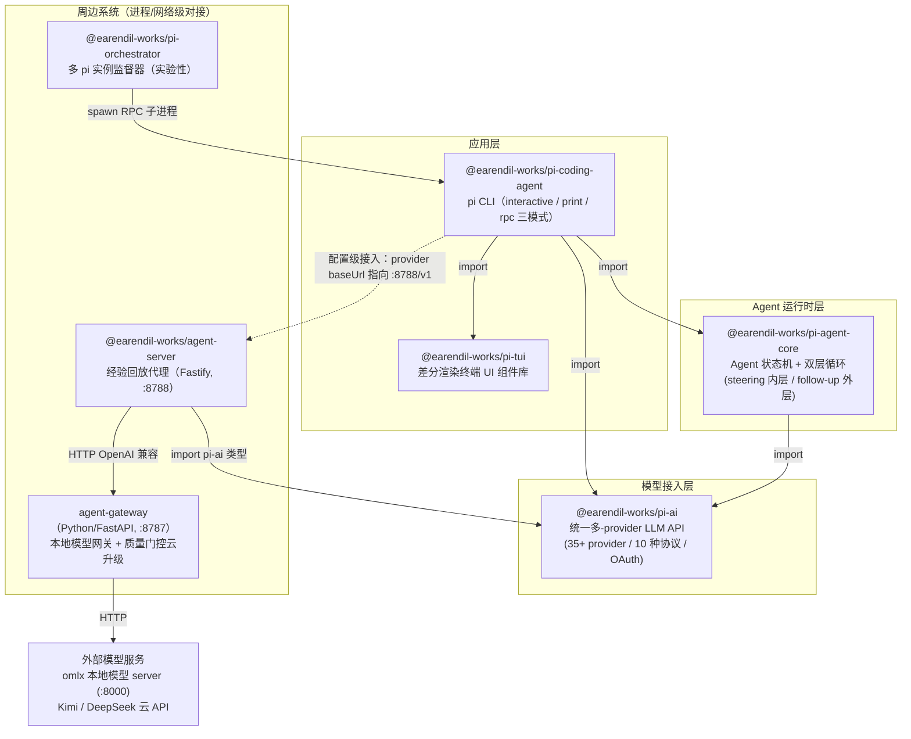

依赖关系确认（package.json / pyproject.toml）：

| 包 | 版本 | 仓内依赖 |
|---|---|---|
| `pi-ai` | 0.80.10 | 无 |
| `pi-agent-core` | 0.80.10 | `pi-ai` |
| `pi-tui` | 0.80.10 | 无 |
| `pi-coding-agent` | 0.80.10 | `pi-agent-core`, `pi-ai`, `pi-tui` |
| `pi-orchestrator` | 0.80.10 | `pi-coding-agent`（仅类型 + RPC 子进程协议） |
| `agent-server` | 0.1.0（私有） | `pi-ai`（仅类型） |
| `agent-gateway` | 0.1.0（Python，独立 uv 包） | 无（HTTP 被调用方） |

---

## 2. 模块划分图

### 2.1 pi-ai — 模型接入层内部模块

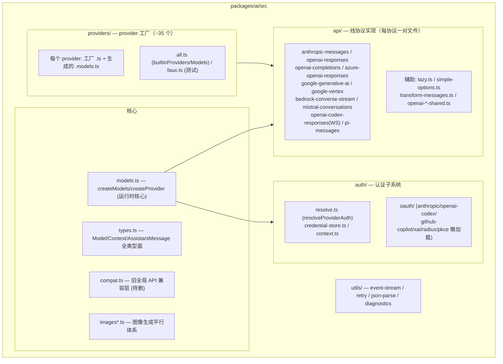

### 2.2 pi-agent-core — 运行时层内部模块

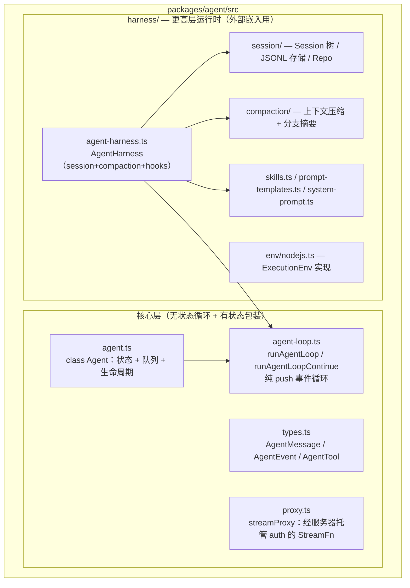

注：`Agent` 与 `AgentHarness` 是**平级替代**，都落点到同一个 `runAgentLoop`。coding-agent 走 `Agent` 路线（自带平行的 session/compaction 实现），harness 供外部 SDK 用户。

### 2.3 pi-coding-agent — 应用层内部模块

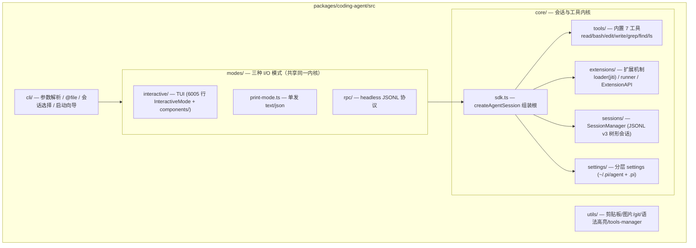

### 2.4 agent-server + agent-gateway — 经验回放闭环

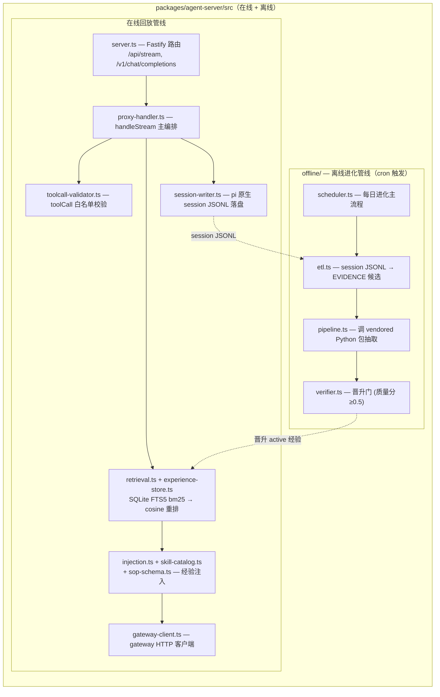

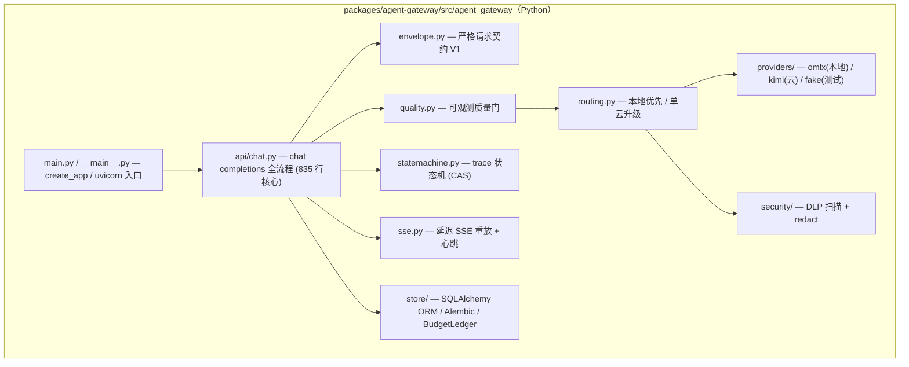

### 2.5 pi-tui / pi-orchestrator 内部模块

| 包 | 模块划分 |
|---|---|
| **pi-tui** (28 文件） | `tui.ts`/`terminal.ts`（差分渲染核心）、`components/`（box/editor/select-list/markdown 等）、`editor-component.ts`+`autocomplete.ts`+`keybindings.ts`+`kill-ring.ts`+`undo-stack.ts`（编辑器体系）、`fuzzy.ts`、`stdin-buffer.ts`、`terminal-image.ts` |
| **pi-orchestrator** (13 文件） | `cli.ts`（命令入口）→ `ipc/client.ts` → Unix socket → `ipc/server.ts`+`handler.ts` → `supervisor.ts`（单例，实例生命周期）→ `rpc-process.ts`（spawn pi RPC 子进程）；`serve.ts`（长驻宿主）、`radius.ts`（可选云 presence）、`storage.ts`（instances.json） |

---

## 3. Call Graph

### 3.1 跨包调用关系

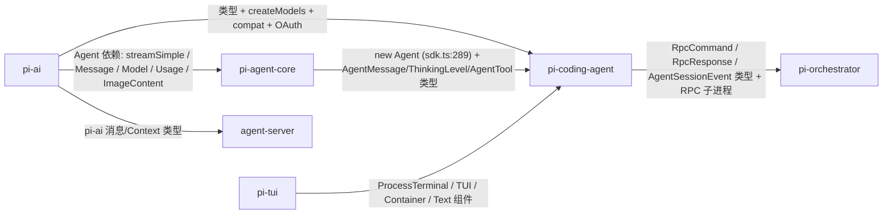

### 3.2 核心链路 ①：LLM 流式调用（pi-ai 内部）

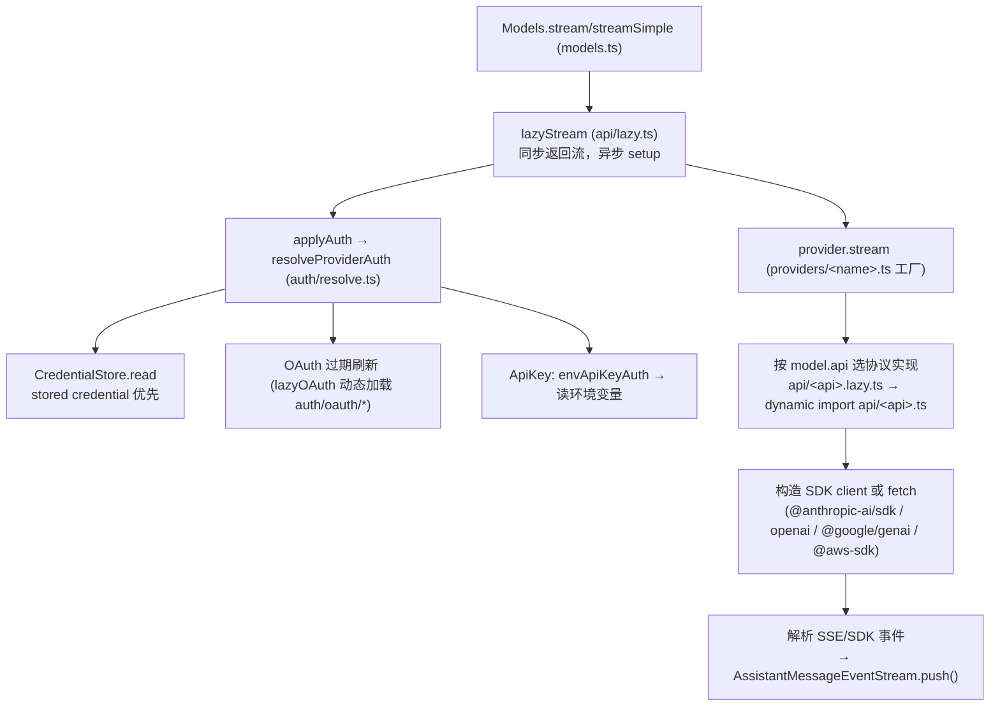

### 3.3 核心链路 ②：Agent 双层循环（pi-agent-core）

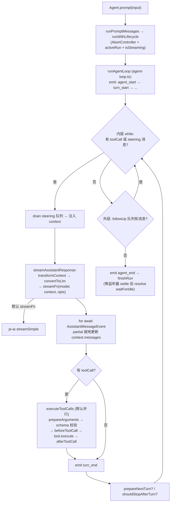

事件序列：`agent_start → (turn_start → message_start → message_update* → message_end → tool_execution_start/update/end* → turn_end)* → agent_end`。`Agent.processEvents` 先把事件 reduce 进 state，再逐个 await 订阅者。

### 3.4 核心链路 ③：pi CLI 启动与对话（pi-coding-agent）

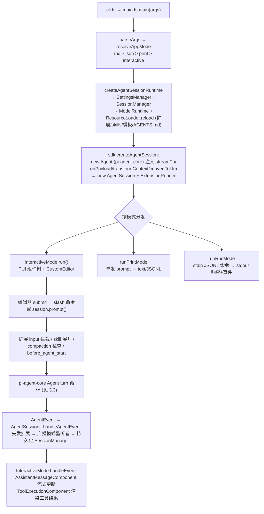

orchestrator 接入路径：`orchestrator spawn → rpc-process.ts → pi --mode rpc 子进程 → IPC socket 桥接 RPC 命令/事件`。

### 3.5 核心链路 ④：经验回放在线管线（agent-server → agent-gateway）

```mermaid
flowchart LR
  REQ["pi 客户端<br/>(OpenAI provider baseUrl=:8788)"] -->|"POST /api/stream 或 /v1/chat/completions"| HS["handleStream (proxy-handler.ts)"]
  HS --> Q["取最后一条 user 消息作 query"]
  Q --> R["retrieve: FTS5 bm25 top-24<br/>→ cosine 重排 top-8"]
  R --> B["buildInjection:<br/>EVIDENCE→Extra Info 块 / ABILITY→Method+Guard<br/>SKILL→system prompt / SOP→tool schema"]
  B --> OC["toOpenAIRequest (openai-compat.ts)"]
  OC --> GW2["GatewayClient.stream<br/>POST gateway:8787/v1/chat/completions"]
  GW2 --> QG["agent-gateway:<br/>envelope 校验 → 本地 omlx<br/>→ quality gate 判定"]
  QG -->|质量失败| ESC["升级流程: channel 出网许可<br/>→ DLP → 预算预留 → 云 provider<br/>(一次升级, 零自动重试)"]
  QG -->|通过| RESP
  ESC --> RESP["延迟 SSE 重放回传"]
  RESP --> V2["validateToolCallStream<br/>(toolCall 白名单, observe-only)"]
  V2 --> TEE["teeWithSessionClose:<br/>透传字节 + SessionWriter 落盘 pi 原生 JSONL"]
  TEE -.->|"离线进化管线消费"| OFF["offline/scheduler: ETL → Python 抽取<br/>→ verifier 晋升 → 回填经验库"]
  OFF -.-> R
```

---

## 4. 模块职责描述

### 4.1 包级职责

| 包 | 一句话职责 | 关键设计 |
|---|---|---|
| **pi-ai** | 统一多-provider LLM API：一个 `Models.stream/streamSimple` 入口屏蔽 35+ provider、10 种线协议 | 凭据解析（stored > OAuth 刷新 > env）与协议实现分离；协议懒加载；OAuth 经变量化 dynamic import 隔离 Node-only 代码；`compat.ts` 是待删的旧全局 API 兼容层 |
| **pi-agent-core** | 通用 Agent 运行时：无状态双层循环 + 有状态 `Agent` 包装 + 供外部嵌入的 `AgentHarness` | `streamFn` 是唯一 LLM 接入点（默认 pi-ai `streamSimple`，可换 `streamProxy`/自定义）；steering 内层队列（插话不打断工具执行）+ follow-up 外层队列；工具默认并行，任一声明 sequential 则整批降级 |
| **pi-tui** | 终端 UI 组件库：差分渲染 + 编辑器 + 键位绑定 | 无 LLM 语义，纯表现层 |
| **pi-coding-agent** | pi CLI：三种 I/O 模式共享同一会话内核 | 扩展机制（jiti 运行时加载 TS，拦截型事件覆盖 input/context/provider 请求/tool 调用）；JSONL v3 树形会话（分支/fork）；会话替换由 `AgentSessionRuntime` 统一处理，三模式逻辑对称 |
| **pi-orchestrator** | 多 pi 实例监督器：Unix socket IPC + spawn RPC 子进程 | 只管理进程生命周期与 RPC 透传，不解析模型流量；可选 Radius 云 presence |
| **agent-server** | 经验回放代理：转发前注入检索到的经验，全程落盘 pi 原生 session | 与 pi 代码零耦合（配置级接入）；session JSONL 故意写成 pi 原生格式以便直接回放/fork；在线回放 + 离线进化（cron 触发）闭环 |
| **agent-gateway** | 本地模型网关：OpenAI 兼容 API 路由到 omlx，质量门控失败升级单云 | 治理层定位：鉴权（channel key）/trace 状态机/原子预算预留/DLP 出网检查/幂等重放/取消传播；延迟 SSE 重放（上游永远非流式） |

### 4.2 关键文件职责速查

| 文件 | 职责 |
|---|---|
| `packages/ai/src/models.ts` | `createModels/createProvider` 运行时核心，`applyAuth` 注入凭据 |
| `packages/ai/src/auth/resolve.ts` | `resolveProviderAuth`：stored credential 优先，不静默回落 env |
| `packages/agent/src/agent-loop.ts` | 双层循环 + 事件发射 + 工具执行编排（792 行） |
| `packages/agent/src/agent.ts` | `Agent` 类：状态/队列/生命周期（575 行） |
| `packages/agent/src/harness/agent-harness.ts` | `AgentHarness`：session+compaction+hooks 组合根（1029 行） |
| `packages/coding-agent/src/main.ts` | 启动分发：参数 → runtime → 三模式 |
| `packages/coding-agent/src/core/sdk.ts` | `createAgentSession` 组装根；SDK 对外门面 |
| `packages/coding-agent/src/core/session/agent-session.ts` | `AgentSession`：事件桥接（扩展→UI→持久化）、工具 hooks、每 turn 刷新 |
| `packages/coding-agent/src/core/extensions/runner.ts` | `ExtensionRunner`：事件分发/聚合 + 注册表管理 |
| `packages/coding-agent/src/modes/interactive/interactive-mode.ts` | TUI 主类（6005 行）：组件树 + 事件渲染 |
| `packages/agent-server/src/proxy-handler.ts` | 在线回放管线主编排 `handleStream` |
| `packages/agent-server/src/experience-store.ts` | SQLite+FTS5 经验库（CJK 自定义分词） |
| `packages/agent-gateway/src/agent_gateway/api/chat.py` | chat completions 全流程（835 行核心） |
| `packages/agent-gateway/src/agent_gateway/quality.py` | 可观测质量门（结构非法/length/空输出/forced tool 未调用） |

---

## 5. 工程指标

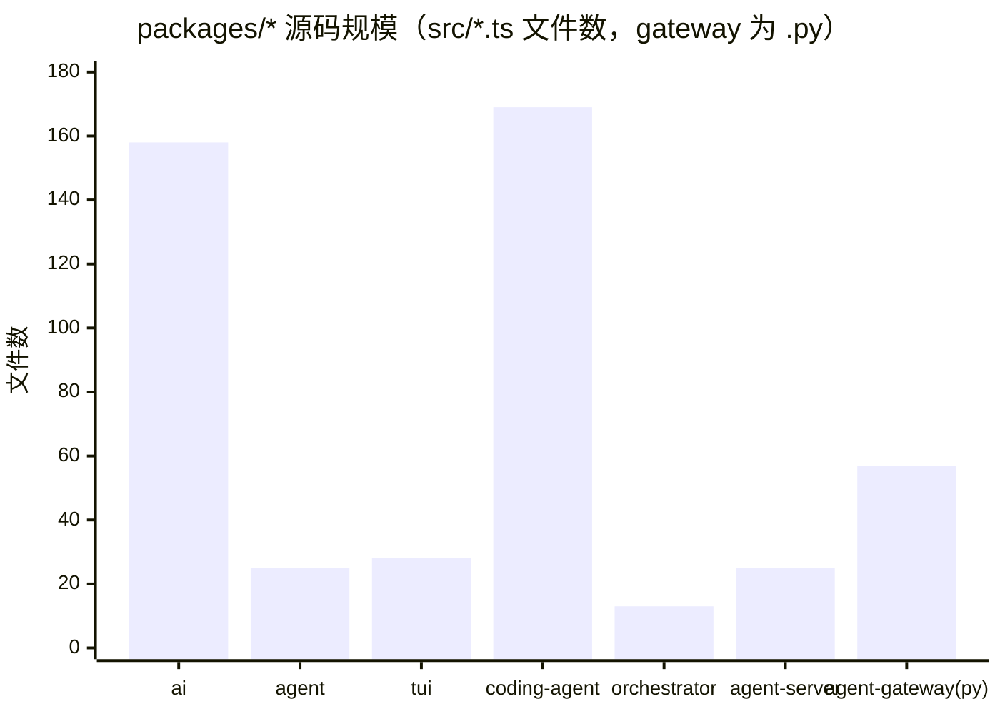

| 包 | src 文件数 | test 文件数 | 主入口 | 测试框架 |
|----|-----------:|------------:|--------|---------|
| `pi-ai` | 158 | 106 | `src/index.ts`（+子路径 exports） | Vitest |
| `pi-agent-core` | 25 | 20 | `src/index.ts`（+`./node`） | Vitest |
| `pi-tui` | 28 | 33 | `src/index.ts` | `node --test` |
| `pi-coding-agent` | 169 | 183 | `src/cli.ts` / `src/main.ts` / `src/index.ts`(SDK) | Vitest |
| `pi-orchestrator` | 13 | 0 | `src/cli.ts` / `src/serve.ts` | 无 |
| `agent-server` | 25 | 21 | `src/start.ts` | Vitest（需 Node 25.9.0） |
| `agent-gateway` | 57 (.py) | — | `src/agent_gateway/__main__.py` | pytest（uv） |

---

*生成时间：2026-07-24（基于仓库当前 HEAD 静态分析；替代 2026-07-17 旧版，新增 agent-server / agent-gateway 两个包）。*
